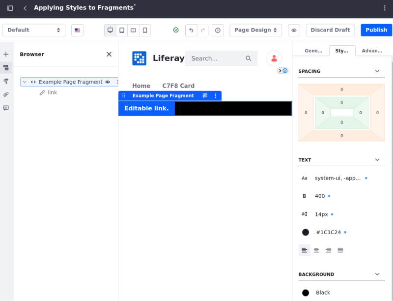
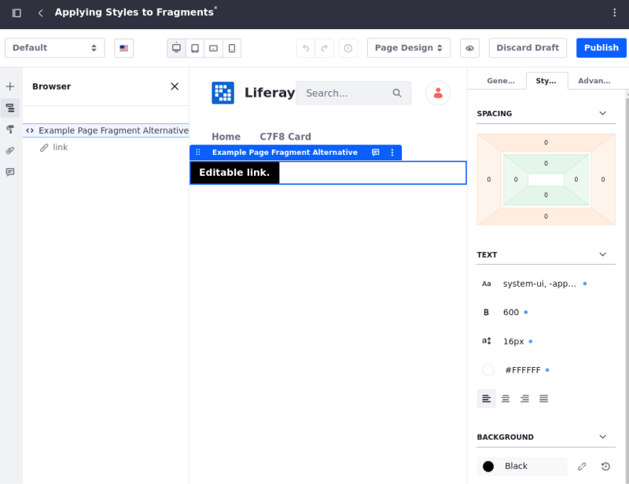

# Applying Styles to Fragments

When you add a Fragment to a page, you can use the sidebar menu to configure the Fragment, including [the *Styles* configuration tab](../../creating-pages/page-fragments-and-widgets/using-fragments/configuring-fragments.md#styles).


By default, all styles (including color, spacing, etc.) are applied to the entire Fragment. The elements contained in the Fragment inherit these changes if their CSS allows it; otherwise, the inner elements are ignored.

## Changing How Styles are Applied

{bdg-secondary}`Available Liferay 7.4 U31+ and GA31+`

You must change the Fragment's HTML configuration to change how styles apply to it. Add the `data-lfr-styles` attribute to an element contained in the Fragment to make any styles applied to them instead apply to that specific element. *Only one `data-lfr-styles` attribute is allowed per Fragment.*

For example, if you configure a simple custom Fragment with this HTML and apply a style change to it, it applies to the entire Fragment (by adding an outer `<div>` tag to enclose the HTML when it is rendered).

```html
<a class="btn btn-nm btn-primary" data-lfr-editable-id="link" data-lfr-editable-type="link">
    Editable link.
</a>
```

Changing the background color of this example Fragment to black applies that change to the hidden outer `<div>` that is created for styles normally. It looks like this in the UI:



However, if you add the `data-lfr-styles` attribute to one of the inner elements within the Fragment, then you can make any changes to the style apply to that specific element instead. You can use this to choose an element that makes more sense for those changes to apply to.

In the above example, you can add the attribute to the HTML tag for the button element:

```html
<a data-lfr-styles class="btn btn-nm btn-primary" data-lfr-editable-id="link" data-lfr-editable-type="link">
    Editable link.
</a>
```

This makes any changes to the style apply to that part of the Fragment. Now if you change the background color to black, it specifically changes the color of the chosen element:



```{note}
If you add the `data-lfr-styles` attribute to a Fragment, it does not affect instances of the Fragment already added to pages. See [Propagating Fragment Changes](../../creating-pages/page-fragments-and-widgets/using-fragments/propagating-fragment-changes.md) for more information.
```

```{warning}
You cannot use the `data-lfr-styles` attribute for tags that are contained within editable elements (using the `data-lfr-editable` or `lfr-editable` attributes). If you add `data-lfr-styles` to part of a Fragment contained in one of these editable tags, it is ignored.
```

You can add the `data-lfr-styles` attribute using your preferred method for editing Fragments:

* **Using the [Fragments Editor](./using-the-fragments-editor.md) in the UI**: make the change in the HTML window of the editor
* **Using the [Fragments Toolkit](./using-the-fragments-toolkit.md)**: make the change in the Fragment's `index.html` file

## Additional Information

* [Developing Fragments](./developing-fragments-intro.md)
* [Using the Fragments Editor](./using-the-fragments-editor.md)
* [Using the Fragments Toolkit](./using-the-fragments-toolkit.md)
* [Adding Configuration Options to Fragments](./adding-configuration-options-to-fragments.md)
* [Configuring Fragments](../../creating-pages/page-fragments-and-widgets/using-fragments/configuring-fragments.md)
