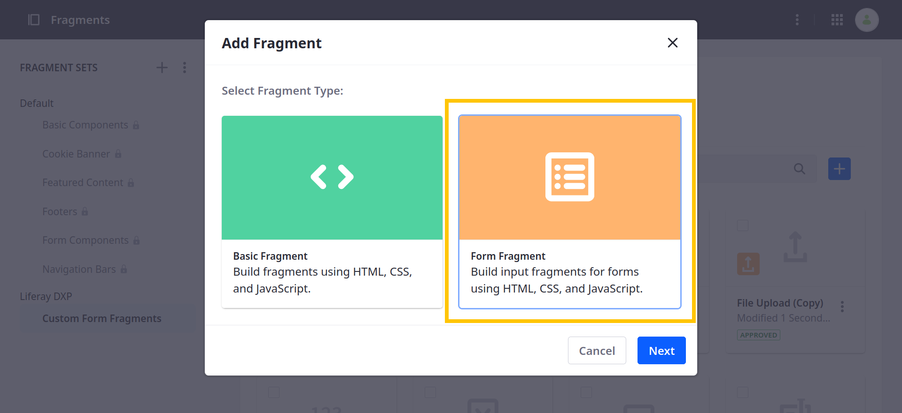
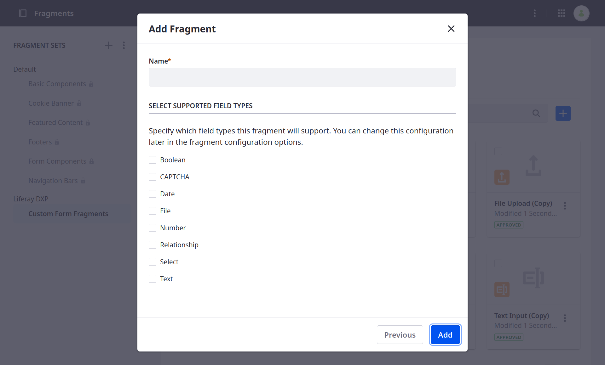
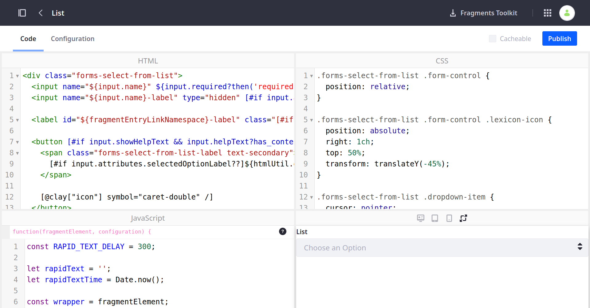
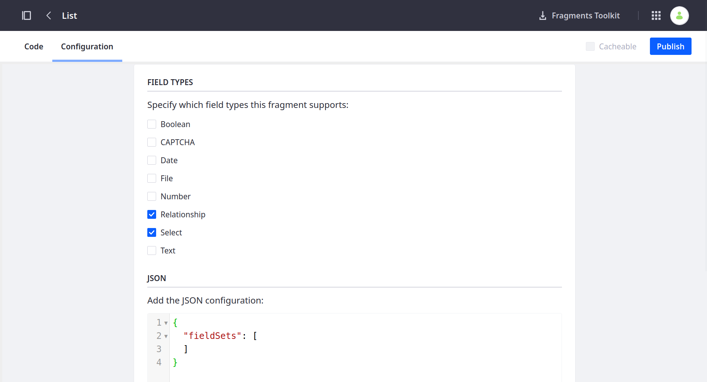
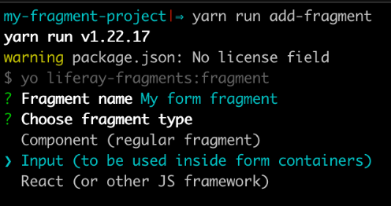

---
taxonomy-category-names:
- Development and Tooling
- Fragments
- Liferay Self-Hosted
- Liferay PaaS
- Liferay SaaS
uuid: e1341d2b-d8f6-485d-b8c3-f8f781202d25
---
# Creating Form Fragments

{bdg-secondary}`Liferay 7.4 U45+/GA45+`

The [form components fragments](../../creating-pages/page-fragments-and-widgets/using-fragments/default-fragments-reference.md) are for building your object's forms in a content page. If Liferay's form fragments don't satisfy your use case, create your own to achieve the desired design and functionality for your forms.

To create form fragments,

1. Open the *Site Menu* () and go to *Design* &rarr; *Fragments*.

1. Click *Plus* () to create a Fragment Set for organizing your form fragments.

1. Click *Add* (), select the *Form Fragment* type, and click *Next*.

   

1. Enter a name.

1. Select the field types to allow in the fragment.

   If you select CAPTCHA, you cannot select other field types. Otherwise, you can select any combination of fields.

   

1. Click *Add*. This creates a draft fragment and directs you to the fragment edit page.

1. In the Code tab, add HTML, CSS, and JavaScript for your fragment.

   

   ```{note}
   You can map the submit button fragment's text using [mapping settings](../../../site-building/creating-pages/page-fragments-and-widgets/using-fragments/configuring-fragments/fragment-sub-elements-reference.md#mapping-settings).

   To create a button with [link settings](../../../site-building/creating-pages/page-fragments-and-widgets/using-fragments/configuring-fragments/fragment-sub-elements-reference.md#link-settings) for redirection, add `type="button"` to the button fragment.
   ```

1. (Optional) In the Configuration tab, use JSON to configure the fragment and add options to it. See [Fragment Configuration Types Reference](../reference/fragments/fragment-configuration-types-reference.md) to learn more about different fragment configuration types.

   

1. Click *Publish*.

Now use your form fragment to build forms in content pages. See [Using Fragments to Build Forms](../../../liferay-development/objects/using-fragments-to-build-forms.md) for more information.

If using the Fragments Toolkit, you can select the fragment type when running `yarn run add-fragment`.



To specify the supported field types, add the `fieldTypes` property to `typeOptions` in the `fragment.json`. Enter the field types as an array:

```json
{
   "fragmentEntryKey": "numeric-input",
   "icon": "number",
   "type": "input",
   "typeOptions": {
      "fieldTypes": [
         "number",
         "text"
      ]
   }
}
```

After that, follow the same process as when creating a basic fragment. See [Using the Fragments Toolkit](./using-the-fragments-toolkit.md) for more information about creating and deploying basic fragments.

## Supported Field Types Reference

| Field Type    | Description                                          |
|:--------------|:-----------------------------------------------------|
| `boolean`     | Boolean field.                                       |
| `captcha`     | Users must verify they are human before submissions. |
| `date`        | Date field.                                          |
| `file`        | Adds support for attaching files.                    |
| `html`        | Adds a CKEditor for adding rich text.                |
| `multiselect` | Select from a list of checkboxes.                    |
| `number`      | Numeric fields.                                      |
| `relationship`| Define object relationships.                         |
| `select`      | Select options from drop-down lists.                 |
| `text`        | Adds support for text fields.                        |

## Using the `input` Variable with Form Fragments

Form fragments include the `input` variable for use with each fragment's JavaScript and FreeMarker code. This variable contains the properties for configuring the fragment.

## Input Variable Properties Reference

| Property       | Type      | Description                                                               |
|:---------------|:----------|:--------------------------------------------------------------------------|
| `fieldTypes`   | `string`  | Field type mapped to the input.                                           |
| `name`         | `string`  | Input's name. To create a fragment, the user must define this property.   |
| `required`     | `boolean` | Whether the input is required.                                            |
| `value`        | `string`  | Field's value.                                                            |
| `label`        | `string`  | Input's label.                                                            |
| `showLabel`    | `boolean` | Label visibility.                                                         |
| `errorMessage` | `string`  | Form submission errors.                                                   |
| `helpText`     | `string`  | UI help message for the form field. If undefined, this property is empty. |
| `showHelpText` | `boolean` | Help text visibility.                                                     |
| `attributes`   | `object`  | Options added to the fragment for specific input types.                   |

### Attributes for `file` Input

| Property                       | Type                    | Description                                                                                                                                                                               |
|:-------------------------------|:------------------------|:------------------------------------------------------------------------------------------------------------------------------------------------------------------------------------------|
| `allowedFileExtensions`        | `string`                | Allowed file extensions. If Show Supported File Info is enabled, the allowed extensions appear in the field's help text.                                                                  |
| `maxFileSize`                  | `number`                | Maximum upload size in megabytes. If Show Supported File Info is enabled, the maximum allowed size appears in the field's help text.                                                      |
| `selectFromDocumentLibrary`    | `boolean`               | Whether users can select files from the document library. This is set in the object's [attachment field](../../../liferay-development/objects/creating-and-managing-objects/fields.md). |
| `selectFromDocumentLibraryURL` | `string` or `undefined` | If `selectFromDocumentLibrary` is true, this property contains the URL for rendering the corresponding `ItemSelector`.                                                                    |

### Attributes for `number` Input

| Property   | Type                    | Description                                                                                                   |
|:-----------|:------------------------|:--------------------------------------------------------------------------------------------------------------|
| `dataType` | `integer` or `decimal`  | Choose integer or decimal numbers.                                                                            |
| `max`      | `number` or `undefined` | Maximum number allowed.                                                                                       |
| `min`      | `number` or `undefined` | Minimum number allowed.                                                                                       |
| `step`     | `string` or `undefined` | String value that can be used with the HTML input "step" attribute to indicate the maximum allowed precision. |

### Attributes for `relationship` Input

| Property                     | Type     | Description                                                                                                                                                           |
|:-----------------------------|:---------|:----------------------------------------------------------------------------------------------------------------------------------------------------------------------|
| `relationshipLabelFieldName` | `string` | Field name of the related object used as the label.                                                                                                                   |
| `relationshipValueFieldName` | `string` | Field name of the related object used as the value.                                                                                                                   |
| `relationshipURL`            | `string` | URL used to fetch options from the API. The API response uses Liferay's headless list format, including pagination. Pass additional parameters to query the response. |

### Attributes for `select` Input

| Property  | Type                                    | Description                |
|:----------|:----------------------------------------|:---------------------------|
| `options` | `Array<{label: string, value: string}>` | List of available options. |

## Related Topics

[Developing Page Fragments](../developing-page-fragments.md)

[Using Fragments to Build Forms](../../../liferay-development/objects/using-fragments-to-build-forms.md)
