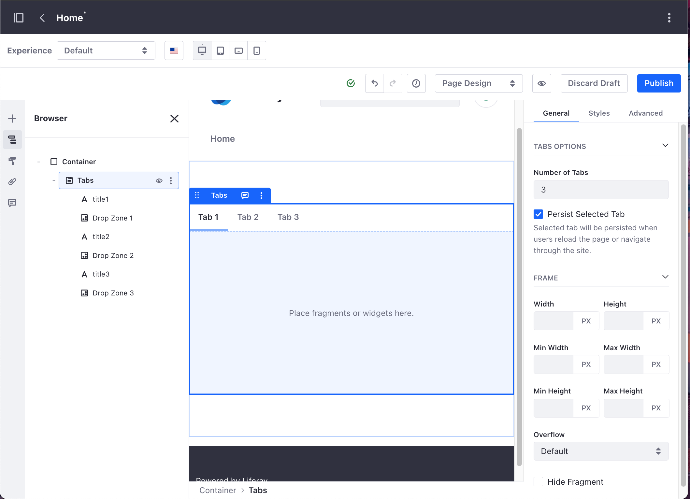

---
taxonomy-category-names:
- Development and Tooling
- Fragments
- Liferay Self-Hosted
- Liferay PaaS
- Liferay SaaS
uuid: ac5e5ddc-ee51-48a5-86ac-ac47e6a0ea0e
---
# Defining Fragment Drop Zones

Drop zones are integral to building your Content Pages. With them, you can create unique page layouts and dynamic displays by defining areas within fragments where users can drag and drop other fragments and widgets.

Follow these steps to define a drop zone:

1. Go to *Site Administration* &rarr; *Design* &rarr; *Fragments*.

1. Under Fragment Sets, select the set with the fragment you want to edit.

1. Click the fragment's *Actions* () button and select *Edit* to open the [Fragments Editor](./using-the-fragments-editor.md).

1. In the HTML code area, add the `<lfr-drop-zone></lfr-drop-zone>` label to define a drop zone within a fragment.

   ```{important}
   Drop zones cannot be added to editable elements within a fragment.
   ```

The following code excerpt shows how to use this label to define drop zones within a Tabs fragment:

   ```html
      <div class="tab-panel">
         [#list 0..configuration.numberOfTabs-1 as i]
         <div aria-labelledby="tab${i+1}-${fragmentEntryLinkNamespace}" class="d-none tab-panel-item" data-fragment-namespace="${fragmentEntryLinkNamespace}" id="tabPanel${i+1}-${fragmentEntryLinkNamespace}" role="tabpanel" tabindex="0">
            <lfr-drop-zone data-lfr-drop-zone-id="${i+1}" data-lfr-priority="${i+1}"></lfr-drop-zone>
         </div>
         [/#list]
      </div>
   ```

This image shows the result in the Content Page editor sidebar:



Once defined, you can drag and drop any fragment or widget into the drop zone.

## Fragment Drop Zone IDs

To ensure fragments remain in their designated drop zones, you can add drop zone IDs with the `data-lfr-drop-zone-id` attribute. When you reorder drop zones or insert new drop zones between existing ones, drop zone IDs ensure fragments stay in their original drop zones. 

If you delete and propagate a drop zone with a unique ID, the drop zone and its content are removed from the page. If you add a drop zone with the same ID back into the fragment, it only retrieves content from drafts that weren't published after the initial propagation. In published drafts, the drop zone is considered a new drop zone.

Drop zone IDs are not mandatory. Drop zones without IDs function the same and appear in the order they are specified. If you add drop zone IDs to an existing fragment and then save and propagate it, then beginning with the initial propagation, the IDs are added.

## Related Topics

- [Developing Fragments](./developing-fragments-intro.md)
- [Using the Fragments Editor](./using-the-fragments-editor.md)
- [Using the Fragments Toolkit](./using-the-fragments-toolkit.md)
- [Setting the Order of Elements in a Fragment](./setting-the-order-of-elements-in-a-fragment.md)
