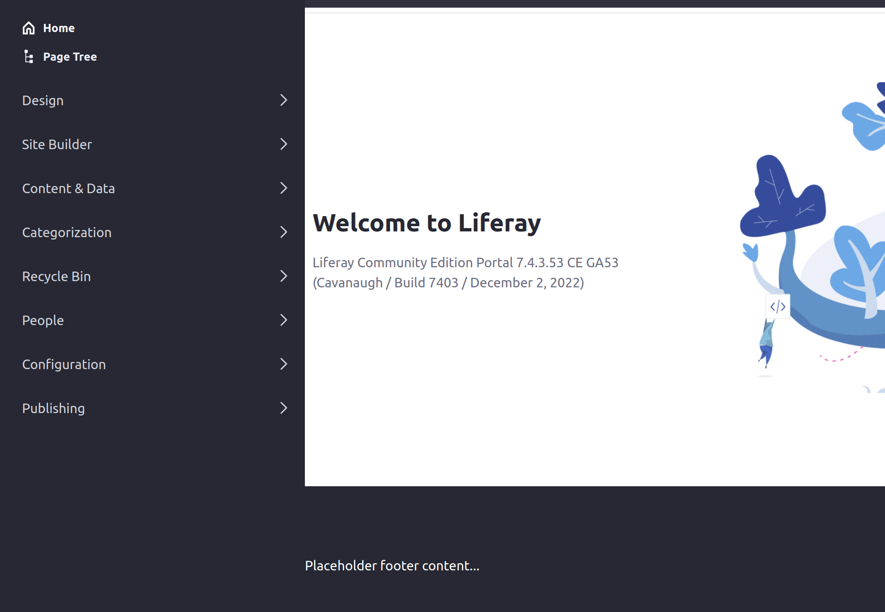

---
taxonomy-category-names:
- Development and Tooling
- Fragments
- Liferay Self-Hosted
- Liferay PaaS
- Liferay SaaS
uuid: 122b1300-ebfc-4bb7-adea-b334e0dfd221
---

# Using Custom Fields in Page Fragments

If you've added [custom fields](../../../system-administration/configuring-liferay/adding-custom-fields.md) to Liferay's users or pages, you can access them in fragments. To get the value of a page custom field, use

```ftl
layout.getExpandoBridge().getAttribute("ATTRIBUTE_NAME")
```

To use a page custom field in a fragment, first [add the custom field](../../../system-administration/configuring-liferay/adding-custom-fields.md), then add or edit a page fragment via the fragments editor, from the Site Menu &rarr; Fragments.

This example HTML uses the custom field `showFooter` to show or hide the placeholder `footer` element on a page:

```ftl
[#assign showFooter = layout.getExpandoBridge().getAttribute("showFooter")]

[#if showFooter]
    <footer class="bg-dark pb-8 pt-6 section-footer text-white">
        Placeholder footer content...
    </footer>
[/#if]
```

Toggling a page's `showFooter` value to true or false shows or hides the footer, respectively:



To access custom fields for users, use

```ftl
user.getExpandoBridge().getAttribute("ATTRIBUTE_NAME")
```

Guest users may not have a value for the custom field. In this case, attempting to retrieve a custom field value for a guest user causes an error when viewing the page. Make sure to consider guest user access when developing fragments with user custom fields.

You can add FreeMarker code like this to check whether the value exists before using it:

```ftl
[#if user.getExpandoBridge().getAttribute("showFooter")??]
    ...
[#/if]
```

## Related Topics

- [Adding Custom Fields to Users](../../../system-administration/configuring-liferay/adding-custom-fields.md)
- [Using the Fragments Editor](./using-the-fragments-editor.md)
