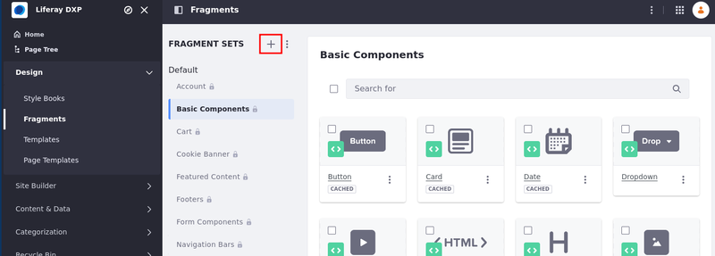
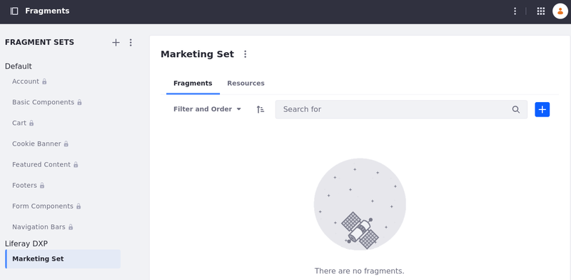
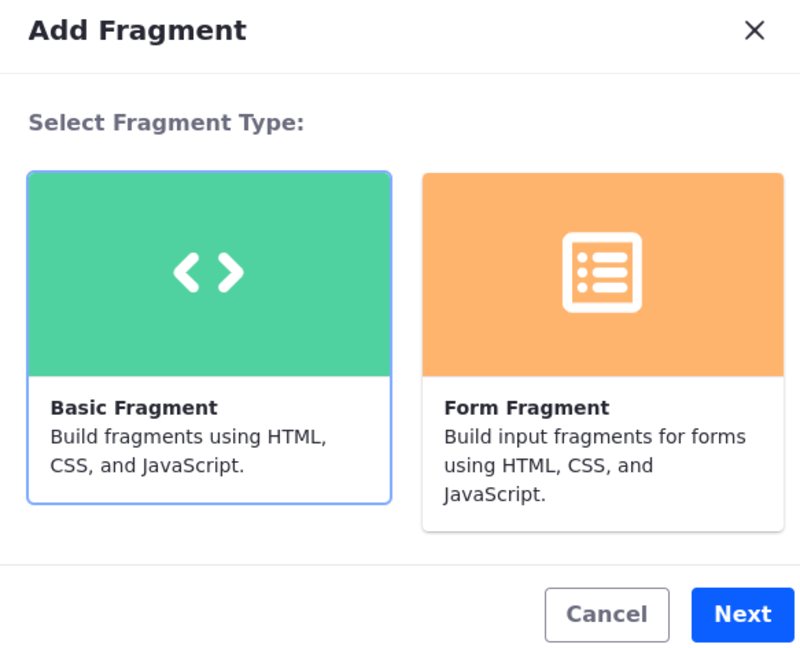
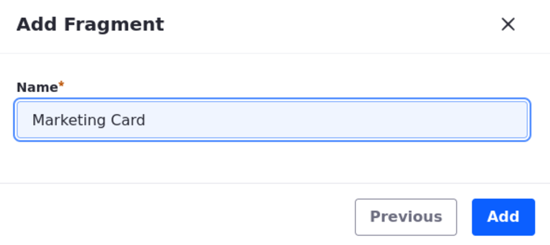

---
taxonomy-category-names:
- Development and Tooling
- Fragments
- Liferay Self-Hosted
- Liferay PaaS
- Liferay SaaS
uuid: 394bfac1-4f63-4799-bb0e-46e9c988512f
---

# Using the Fragments Editor

Liferay DXP includes a built-in [editor](../reference/fragments/page-fragment-editor-interface-reference.md) for developing content page fragments. To access the editor, open the *Site Menu* (  ) and navigate to *Design* &rarr; *Fragments*. From here, you can view, manage, and create fragments and fragment sets.

!!! note
    For Liferay DXP 7.4+, Fragment Collections are called Fragment Sets in the Liferay UI.

## Creating a Fragment Set

Before creating new fragments, you must create a new fragment set to contain them:

1. Open the *Site Menu* () and navigate to *Design* &rarr; *Fragments*.

   In Liferay DXP 7.1 and 7.2, open the *Product Menu*, and go to *Site* &rarr; *Site Builder* &rarr; *Page Fragments*.

1. Click *Add* (  ) next to Fragment Sets.

   

1. Enter a *name* and *description* for the new set.

   You can create sets that group fragments by functionality or by teams and departments, for example.

1. Click *Save*.

Once saved, you can add fragments to the set.

## Creating a New Fragment

!!! important
    To create a React fragment, instantiate a React component in a fragment using static JS imports. See the example code and its comments in the [Alternatives to the Fragments Toolkit](./using-the-fragments-toolkit.md#alternatives-to-the-fragments-toolkit) section.

1. Go to the desired fragment set and click *Add* () to create a new fragment.

   !!! note
       Before Liferay DXP 7.3, a fragment could either be a section or a component. In Liferay DXP 7.3+, all page fragments are components.

1. Choose a fragment type, either Basic or [Form](../developing-page-fragments/creating-form-fragments.md), and click *Next*.

1. Enter a name for the fragment and click *Add*.

1. In the Code tab, use the HTML, CSS, and JavaScript fields to add your fragment's resources. Here, you can also see a live preview of your fragment's appearance in different device contexts.

   Here are some HTML editing shortcuts:

   - Enter an open angle bracket (`<`) to access standard HTML tags and Liferay's fragment-specific tags.

   - Start an element attribute with `data` to access Liferay's [editable fragment attributes](../reference/fragments/fragment-specific-tags-reference.md).

   The example below adds a card component with editable text:

   ```html
   <div class="marketing-card-fragment-01">
      <div class="card">
         <data-lfr-editable id="01-card-image" type="image">
            
         </data-lfr-editable>
         <div class="card-body">
            <data-lfr-editable id="02-card-title" type="rich-text">
               <h5 class="card-title">Editable Card title</h5>
            </data-lfr-editable>
            <data-lfr-editable id="03-card-text" type="rich-text">
               <p class="card-text">Here is some editable text.</p>
            </data-lfr-editable>
            <data-lfr-editable id="04-card-link" type="link">
               <a href="#" class="btn btn-primary">Editable link</a>
            </data-lfr-editable>
         </div>
      </div>
   </div>
   ```

   ```css
   .marketing-card-fragment-01 .card img {
      max-width: 100%;
   }
   ```

   

1. In the Configuration tab, use the `JSON` field to add [configuration options](./adding-configuration-options-to-fragments.md) to a page fragment.

   

   !!! tip
       You can add a `configurationRole` value to any field set (alongside the `fields` object in the JSON) to specify which tab the associated fields appear in. Set the value as `styles` to make the fields appear in the Styles tab, or set it to `advanced` to make them appear in the Advanced tab (*only in Liferay DXP versions U23+ or GA23+*). If no `configurationRole` is set, then they appear in the General tab by default.

1. Click *Publish* to save your fragment and make it available for use in [content pages](../../creating-pages/understanding-pages.md#content-pages).

   

While developing a fragment, changes are saved automatically as a draft until your fragment is published. Once added to a set, you can copy, export, edit, and remove a fragment at any time in the fragments editor. See [Managing Fragments](../../creating-pages/page-fragments-and-widgets/using-fragments/managing-fragments.md) for more information on available actions for page fragments.

!!! note
    Since Liferay DXP 7.2 SP1+ and Liferay Portal 7.2 GA2+, you can create page fragments in the *Global* site to make them available for all sites. To expose this feature in the initial releases of these versions, you must create a `.config` file named `com.liferay.fragment.web.internal.configuration.FragmentGlobalPanelAppConfiguration.config` and add the `enabled=B"true"` property. Then copy it to your Liferay DXP instance's `osgi/configs` folder. Global page fragments are inherited by child sites and can only be edited from the Global site. Any resources the Global page fragments references from the Global site are copied to a site that leverages the page fragment.

## Related Topics

- [Using the Fragments Toolkit](./using-the-fragments-toolkit.md)
- [Adding Configuration Options to Fragments](./adding-configuration-options-to-fragments.md)
