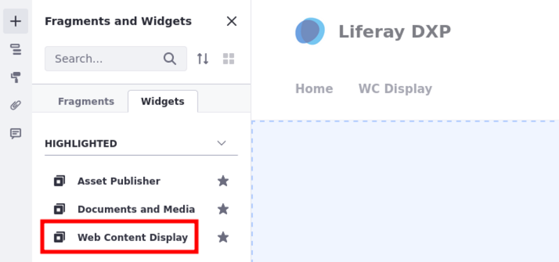
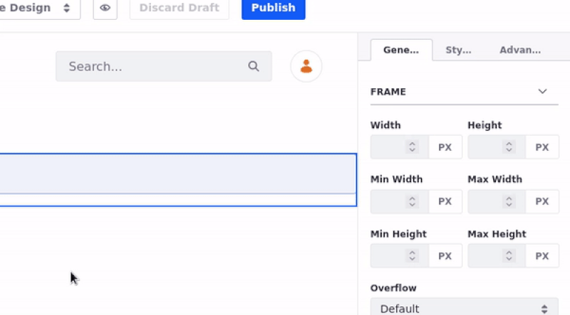
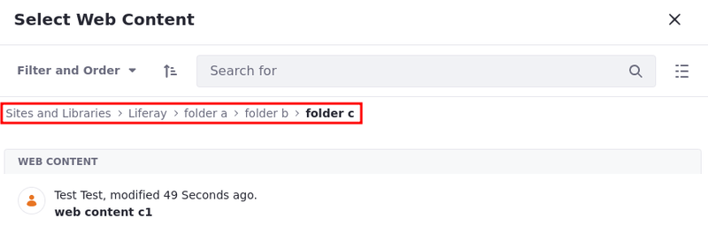
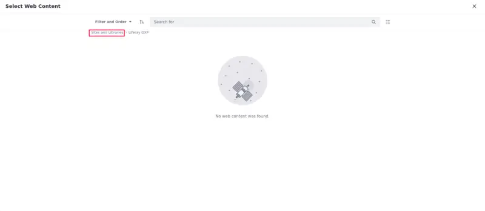

---
taxonomy-category-names:
- Sites
- Widgets
- Web Content and Structures
- Liferay Self-Hosted
- Liferay PaaS
- Liferay SaaS
uuid: a0ed0240-bce1-4e6c-97b9-bf75491b83e9
---
# Using the Web Content Display Widget

After you create a [web content article](../../../content-authoring-and-management/web-content/web-content-articles/adding-a-basic-web-content-article.md), the quickest way to display it is the web content display widget. Once a web content article is displayed, content updates appear immediately, unless you configure a [workflow](../../../process-automation/workflow/introduction-to-workflow.md) to review and approve the updates.

## Adding Web Content Display to a Page

1. Go to *Site Menu* (  ) and navigate to *Site Builder* &rarr; *Pages*.

1. Click *Actions* (  ) next to the page you want to edit and select *Edit* (alternatively, [create a new Content Page](../../creating-pages/adding-pages/adding-a-page-to-a-site.md).)

1. Click *Add* (  ) to open the Fragments and Widgets panel.

1. Under the *Content Management* category in the Widgets tab, drag the *Web Content Display* widget to a place on the page.

    

1. Click *Options* (  ) at the top right of the widget &rarr; *Configuration*.

    

1. In Web Content Display Configuration, click *Select* under the Setup tab.

1. In the Select Web Content dialog, click the web content you want to add.

   If you organize your content using folders, you can visualize all available content by navigating through the folders. Use the breadcrumbs above the folders and content sections to help your navigation.

   

   !!! tip
       You can search for all content (*) using the search bar. This returns a list with all the available folders and web content on the site.

1. Set up optional [web content display options](#web-content-display-setup-options).

1. Click *Save* and close the Web Content Display Configuration dialog.

1. If you want to publish the Content Page, click *Publish*.

## Using Scopes in the Web Content Display Widget

After adding a Web Content Display Widget to a page, you can set its scope to define the sites and libraries where the content available to be displayed in the widget can be found. For more information about scopes, see [Setting Widget Scopes](../../creating-pages/page-fragments-and-widgets/using-widgets/configuring-widgets/setting-widget-scopes.md)

1. Click *Options* (  ) at the top right of the widget &rarr; *Configuration*.

1. In Web Content Display Configuration, click *Scope* on the tab.

1. Click *Liferay DXP* to open the Scope menu. Here you can select the desired scope for the widget. Click *Save*.

1. Click *Setup* on the tab.

1. Click *Select* to open the Select Web Content Menu.

1. Click *Sites and Libraries* on the breadcrumb menu. 

The available content to be displayed is defined according to the selected scope.

!!! note
    For Liferay DXP 7.3 and earlier, selecting a scope for the Web Content Display Widget does not affect the available content to be displayed in the widget.

## Web Content Display Setup Options

When you have web content selected, you can configure other options in the web content display widget.

To access the widget's configuration, hover over the web content display widget and, from the widget's *Options* (  ), select *Configuration*. The configuration options appear under the Setup tab.

### Template

| Option | Description |
| :--- | :--- |
| Use default template | Uses the default template to display the widget. You can see the default template's name in use here. |
| Use a specified template | Select this option to display the widget using a different template. You must select the new template. |

### User Tools

| Option | Description |
| :--- | :--- |
| Translations | Shows additional translations for your content. If you have your content translated into different languages, use this option to show the desired translation. |
| Print | Provides a print dialog with a print-friendly version of the content. |
| Download as PDF, DOC, ODT, TXT | Downloads the selected widget content in the format of your choice. This option is only available after configuring the [OpenOffice or LibreOffice integration](#integrating-open-office-or-libre-office-with-the-web-content-display). |

### Content Metadata

| Option | Description |
| :--- | :--- |
| Related Assets | Set this option to show links to other related content. You configure the related content in the Related Assets property for your content (see the image below for an example on a basic web content asset.) |
| Ratings | Shows a clickable option where users can rate the content in different ways (likes, stars, thumbs up). To configure this rating option for different content types, see [Configuring Content Rating Type](../../../site-building/site-settings/site-content-configurations/configuring-content-rating-type.md). |
| Comments | Allows users to enter comments for the web content display widget's content. By default, guests can't leave comments. See [Enabling Comments for Guest](#enabling-comments-for-guests) to change the default option. |
| Comment Ratings | Shows a rating option for comments. |

### View Count Increment

Enable the *View Count Increment* option to add a view counter to this web content display widget.

## Additional Options for the Web Content Display Widget

In addition to the [setup options](#web-content-display-setup-options), you can configure additional settings in the web content display widget.

### Enabling Comments for Guests

By default, guests can't leave comments on web content. If you want to allow guests to comment on your web content article, follow these steps:

1. Open the [Global Menu](../../../getting-started/navigating-dxp.md) (  ) and navigate to *Control Panel* &rarr; *Users* &rarr; *Roles*.

1. Click the *Guest* role.

1. Click the *Define Permissions* column.

1. From the left menu, select *Site and Asset Library Administration* &rarr; *Content & Data* &rarr; *Web Content*.

1. Under the *Web Content Article* section, check *Add Discussion*.

1. Click *Save*.

### Editing Content from the Web Content Display Widget

You can edit published content directly from the web content display widget when you work with the content page in edit mode.

1. Click the web content display widget.

1. In the sidebar panel on the left, click *Page Content* (  ).

1. Click *Actions* (  ) for the content you want to edit and Select *Edit*

    

### Integrating OpenOffice or LibreOffice with the Web Content Display

If you [enable the OpenOffice / LibreOffice integration](../../../content-authoring-and-management/documents-and-media/devops/enabling-openoffice-libreoffice-integration.md) with your Liferay portal instance, you can enable document conversion for your content. With this integration, users can download the content in different formats. You must select the available formats under the [User Tools](#user-tools) configuration for the web content display Widget.

## Related Topics

- [Adding a Basic Web Content Article](../../../content-authoring-and-management/web-content/web-content-articles/adding-a-basic-web-content-article.md)
- [Setting Widget Scopes](../../creating-pages/page-fragments-and-widgets/using-widgets/configuring-widgets/setting-widget-scopes.md)
- [Using Content Pages](../../../site-building/creating-pages/using-content-pages.md)
- [Displaying Content on Display Pages Templates](../using-display-page-templates.md)
- [Displaying Assets](../using-the-asset-publisher-widget/displaying-assets-using-the-asset-publisher-widget.md)
