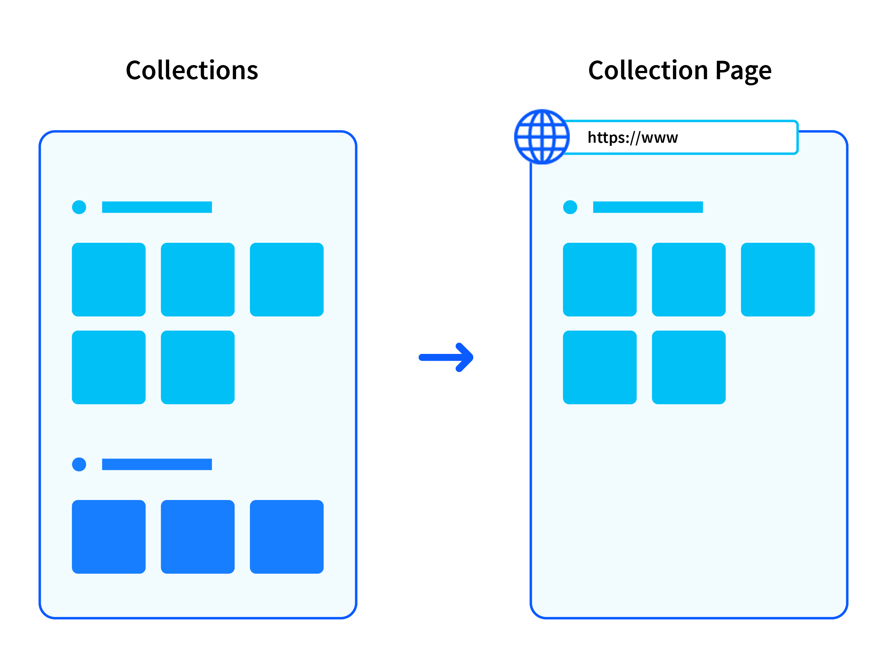
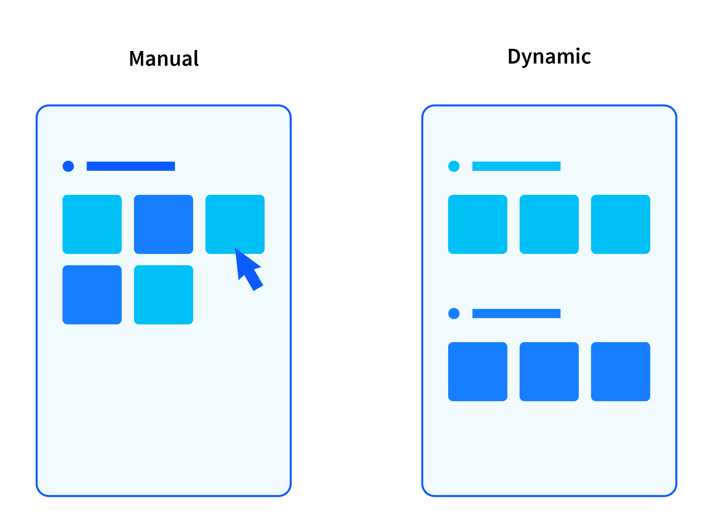
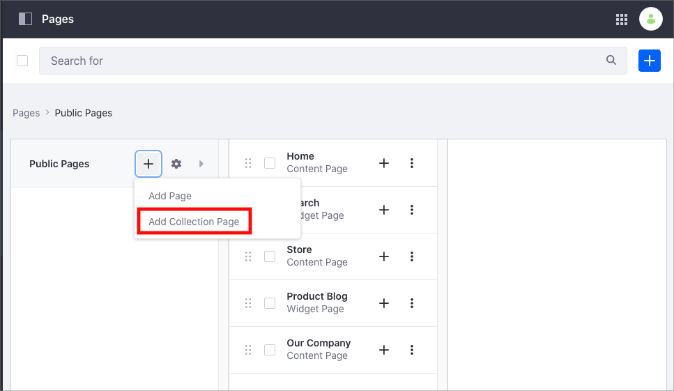
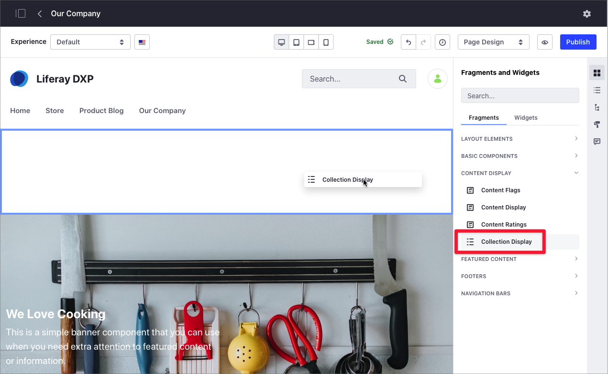

---
toc:
  - ./collections-and-collection-pages/creating-collections.md
  - ./collections-and-collection-pages/collection-providers.md
  - ./collections-and-collection-pages/displaying-collections.md
taxonomy-category-names:
- Sites
- Collections
- Collection Pages
- Liferay Self-Hosted
- Liferay PaaS
- Liferay SaaS
uuid: 190bc17e-ee9d-48bc-8770-0ea2d100318c
---

# Collections and Collection Pages

!!! note
    This information applies to Liferay DXP 7.3+. In previous Liferay versions, collections were called content sets. For information on content sets, see [Liferay DXP 7.2](#liferay-dxp-72).

Collections are sets of content items that you can use to group and filter information. Collections can include many different types of content or just one specific type of content. You can then display them on a [collection page](./collections-and-collection-pages/displaying-collections.md#displaying-collections-on-a-collection-page), which you can present in your desired format using page fragments.



Consider the following example. You have a kitchenware store and you plan to create a new section in your product web page with customer success stories. You want this section to show new success stories automatically as these stories are published. In this case, you can create a collection that groups all your success stories with a collection page that shows the collection's content. In addition to collection pages, you can show this collection in other content pages using a [Collection Display fragment](./collections-and-collection-pages/displaying-collections.md#displaying-collections-on-a-collection-page).

There are two types of collections in Liferay:

- **Manual Collection**

   You select and maintain the items that are part of the collection manually. The items in a manual collection do not change automatically.

   For example, you create a manual collection named *Promotions*, which includes several promotional web content articles on your public website. After you select the items in the collection, you must add new promotional content manually to keep the collection up-to-date.

- **Dynamic Collection**

   You define the type of items in the collection, along with criteria for these items. The collection's items can change based on the criteria you define. A dynamic collection is useful when you want to make sure the content is up-to-date with new items matching the criteria.

   For example, for the kitchenware store, you create a collection including all blog posts with the *porcelain* tag (this tag represents your criteria). The dynamic collection includes all the new blog posts with the *porcelain* tag automatically.



For information about how to create manual or dynamic collections, see [Creating Collections](./collections-and-collection-pages/creating-collections.md).

## Displaying Collections

You can display collections using a [collection page](./collections-and-collection-pages/displaying-collections.md#displaying-collections-on-a-collection-page) or a [Collection Display fragment](./collections-and-collection-pages/displaying-collections.md#adding-a-collection-display-fragment-to-a-page).

A collection page is a type of page linked to a collection. Collection pages ease the task of showing and customizing collections. For example, you can quickly add new items to your collection using a collection page.



A Collection Display fragment is a type of fragment that shows a collection. You can use this fragment to show your collection on any content page, page template, or display page.



For more information, see [Displaying Collections](./collections-and-collection-pages/displaying-collections.md).

## Customizing Collections

You can associate a Liferay segment with your collection to display different collection items based on the [segment configuration](../personalizing-site-experience/segmentation/creating-and-managing-user-segments.md).

Consider the following example. You want to increase sales in your kitchenware store by offering exclusive promotions to registered users. You create a collection including promotions for registered users and news about your products. You want everyone to see the news about your products, but you want to restrict the promotions to registered users. You can create a new segment for registered users and link the segment to a new *Personalized Variation* that filters the promotional content.

For information, read [Personalizing Collections](../personalizing-site-experience/experience-personalization/personalizing-collections.md).

## Converting Asset Publisher Configurations to Collections

You can create collections directly or from an [Asset Publisher widget](./using-the-asset-publisher-widget/displaying-assets-using-the-asset-publisher-widget.md). The Asset Publisher option is useful when you want to use your customization as a collection in other pages. For more information, read [Creating Collections](./collections-and-collection-pages/creating-collections.mdd#creating-a-collection-from-an-asset-publisher).

## Liferay DXP 7.2

### Managing Content Sets

A content set is exactly what it sounds like: a set of content items. In short, an administrator can defines a list of content, and then that list can be displayed. The way that the content set is displayed is determined by the method that is used to display it. For example, if the content set is being used by a smartwatch app, it could be displayed as a simple list of titles, and selecting a title would cause the full article to display on a connected mobile device. The same content set could be displayed in a web browser with the full content of each article.

```{note}
In previous versions of Liferay DXP, you used the Asset Publisher to define and display either static lists of assets or dynamic lists based on criteria like tags, categories, or asset type. In Liferay DXP, content sets take the core idea of defining different types of asset lists and expand on it. Content lists are created outside of the context of a specific application or widget and can be used and re-used across different channels and applications.
```

### Creating and Displaying Content Sets

Content sets are created through the Site Administration interface. All the features for creating and managing content sets are contained here. They are displayed using Liferay's widgets or your own custom applications. Read our
guides for information on [Creating Content Sets](./creating-collections.md#creating-content-sets) and
[Displaying Content Sets](./displaying-collections.md#displaying-content-sets).

### Content Set Personalization

Content sets can have variations driven by Liferay DXP's personalization engine. After you create a content set, if you have at least one user segment created, you can create a personalized experience of the content set for that segment. To learn to harness the power of experience personalization for content sets, see [Content Set Personalization](../../../site-building/personalizing-site-experience/experience-personalization/personalizing-collections.md#content-set-personalization).

### Converting Asset Publisher Configurations to Content Sets

You may have already gone through a great deal of work to create a perfect, curated list of content through the Asset Publisher, but now you want to display that list elsewhere without duplicating your work. You can do that with content sets. Read the [Converting Asset Publisher Configuration to Content Sets](./creating-collections.md#converting-asset-publisher-configurations-to-content-sets) article to learn more.

## Related Information

- [Creating Collections](./collections-and-collection-pages/creating-collections.md)
- [Displaying Collections](./collections-and-collection-pages/displaying-collections.md)
- [Personalizing Collections](../personalizing-site-experience/experience-personalization/personalizing-collections.md)
