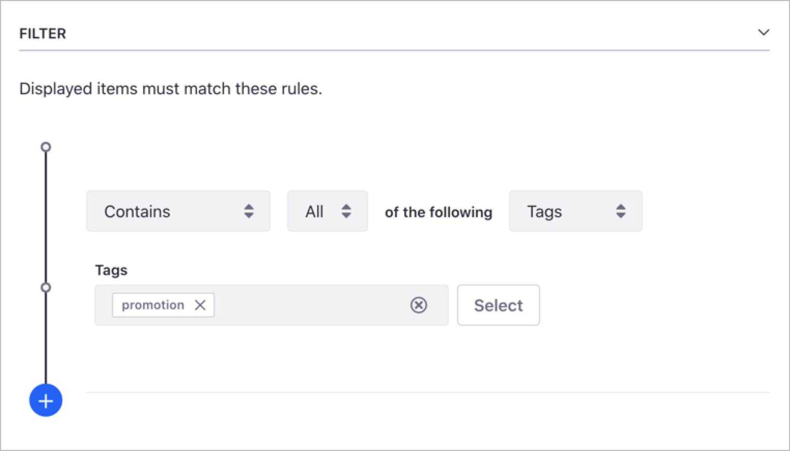
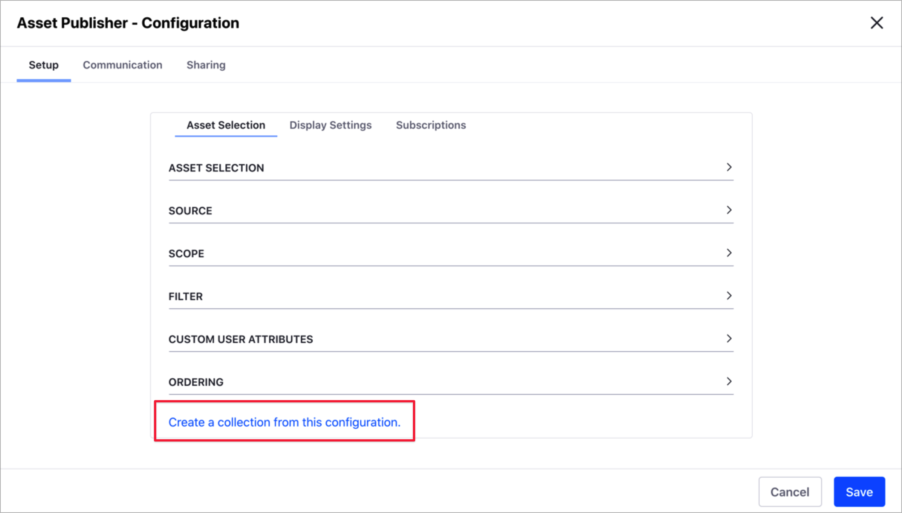

---
toc:
   - ./creating-collections/creating-collections-for-liferay-72-and-earlier-versions.md
taxonomy-category-names:
- Sites
- Collections
- Liferay Self-Hosted
- Liferay PaaS
- Liferay SaaS
uuid: 651a3ecc-7ffe-48af-903e-29e46036c510
---

# Creating Collections

!!! note
    This information applies to Liferay DXP 7.3+. For previous Liferay DXP versions, see [Creating Collections for Liferay 7.2 and Earlier Versions](./creating-collections/creating-collections-for-liferay-72-and-earlier-versions.md).

You can create *Manual* or *Dynamic* Collections. For information about the different types of collections, see [Collections and Collection Pages](../collections-and-collection-pages.md).

## Creating a Manual Collection

1. Open the *Site Menu* (), expand *Site Builder*, and go to *Collections*.

1. Click *New* and select *Manual Collection*.

1. Add a *Title* for your manual collection and click *Save*.

1. In the *Item Type* drop-down menu, select the item type you want to include in the collection.

   - If you want to include only one item type

      1. Select the type under *Single Item Type*.

      1. Optionally, if your *Item Type* includes a subtype, select this in the *Item Subtype* drop-down menu.

      1. Click *Save*.

      

   - If you want to include more than one item type

      1. Select *Select More Than One* under *Multiple Item Types*.

      1. In the dual list box, add or remove the item types you want to include in your collection.

      

1. Click *Save*.

1. Click *Select* next to *Collection Items* and select one of your item types.

   

1. In the selection dialog, check the items you want to include.

1. Click *Add*.

1. If your manual collection includes more than one item type, repeat steps 6 to 8 for the other types.

!!! note
    Documents and media folders and web content folders can be added to a collection. However, the content is not displayed when the folder is published on a collections page or in an Asset Publisher widget. Even if these assets are added to a collection, they can only be viewed separately.

## Creating a Dynamic Collection

1. Open the *Site Menu* (), expand *Site Builder*, and go to *Collections*.

1. Click *New* and select *Dynamic Collection*.

1. Add a *Title* for your dynamic collection and click *Save*.

1. In the *Item Type* drop-down menu, select the item type you want to include in the collection.

   - If you want to include only one item type,

      1. Select the type under *Single Item Type*.

      1. Optionally, if your *Item Type* includes a subtype, select this in the *Item Subtype* drop-down menu.

      1. To filter you *Item Subtype* by a specific field, enable the *Filter by Field* switch, click *Select*, choose the field, and click *Apply*.

      1. Click *Save*.

   - If you want to include more than one item type,

      1. Select *Select Types* under *Multiple Item Types*

      1. In the dual list box, add or remove the item types you want to include in your collection.

1. Configure the criteria for your dynamic collection, based on *Scope*, *Filter*, *Content Recommendation*, or *Ordering*.

   **Scope:** Define the source of items in your dynamic collection. By default, the source is the current site.

   **Filter:** Configure the rules for the items in the dynamic collection. For example, you may want to include only items with the "promotion" tag.

   

   !!! tip
       You can add multiple rules to your filter by clicking the Add button. The final content in the dynamic collection is the result of adding all the rules.

   **Ordering:** Items in the collection appear using the order criteria you define here.

1. Click *Save*.

## Creating a Collection from an Asset Publisher

You can create a new collection from an [Asset Publisher widget](../../../site-building/displaying-content/using-the-asset-publisher-widget/displaying-assets-using-the-asset-publisher-widget.md). This is useful when you have an Asset Publisher customization that you want to use as a collection in other pages.

1. Open the *Site Menu* (), expand *Site Builder*, and go to *Pages*.

1. Click *Actions* () for the page that contains the Asset Publisher and select *Edit*.

1. Hover over the *Asset Publisher*, click *Options* () in the widget's menu, and select *Configuration*.

1. In the *Asset Publisher - Configuration* dialog, click the *Setup* tab &rarr; *Asset Selection*.

1. Scroll down and click *Create a Collection from this Configuration*.

   

1. Enter the *Title* for your Collection and click *Save*.

1. Close the *Asset Publisher - Configuration* dialog.

1. Find your new collection in *Site Menu* &rarr; *Site Builder* &rarr; *Collections*.

## Related Topics

- [About Collections and Collection Pages](../collections-and-collection-pages.md)
- [Displaying Collections](./displaying-collections.md)
- [Personalizing Collections](../../../site-building/personalizing-site-experience/experience-personalization/personalizing-collections.md)
