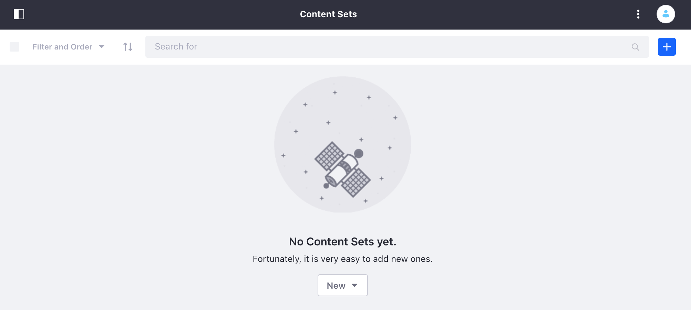
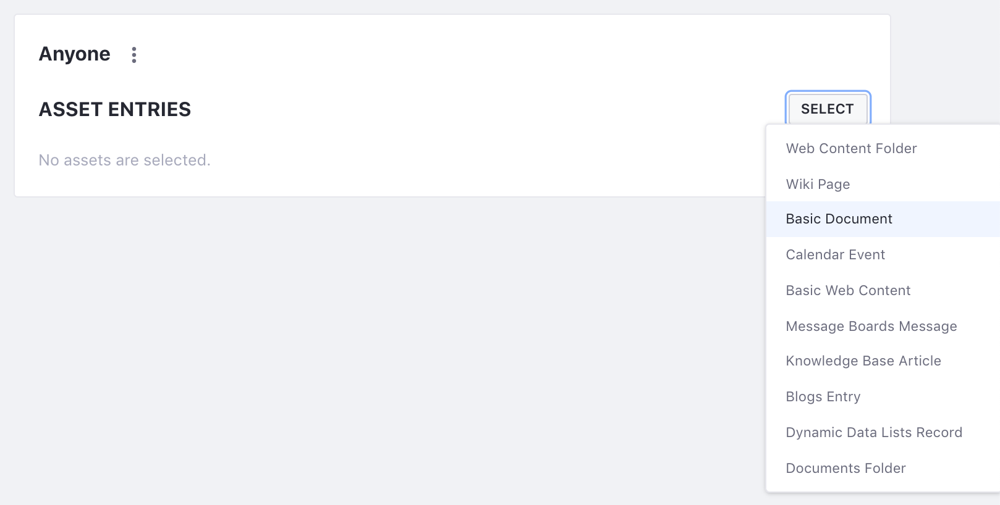
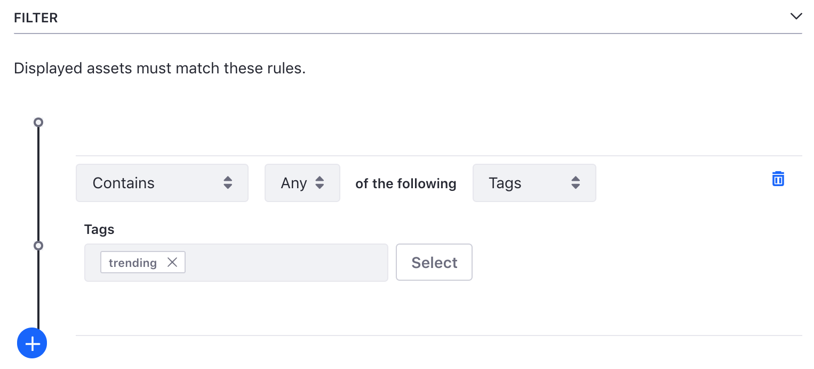
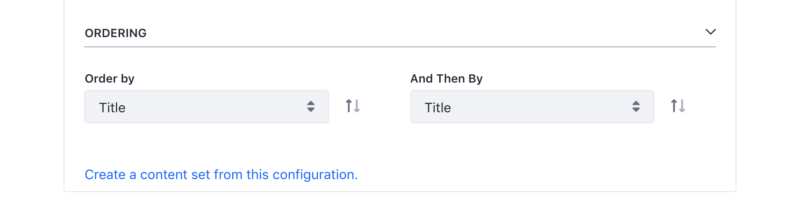
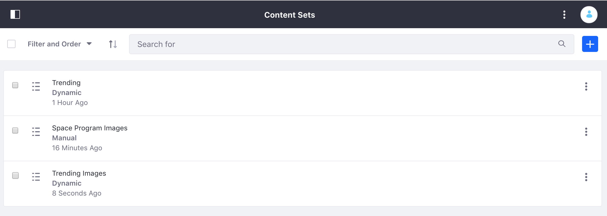

---
taxonomy-category-names:
- Sites
- Collections
- Liferay Self-Hosted
- Liferay PaaS
- Liferay SaaS
uuid: 2e5fcd6b-a242-428d-a666-65befd95385d
---

# Creating Collections for Liferay 7.2 and Earlier Versions

!!! note
    In versions before Liferay DXP 7.3+, collections were called content sets.

You can create Content Sets through the Content Sets interface in Site Administration. Content Sets can use either Manual or Dynamic selection. You can create any number of Content Sets and display them through the Asset Publisher or custom applications. Content Sets can also have [personalized variations](../../../personalizing-site-experience/experience-personalization/personalizing-collections.md#content-set-personalization) that provide different experiences for different users based on criteria that you specify. Criteria management is shared with the Asset Publisher. For more information on each option, see [Selecting Assets in the Asset Publisher](../../using-the-asset-publisher-widget/displaying-assets-using-the-asset-publisher-widget.md#selecting-assets-in-the-asset-publisher-widget).

## Creating a Manual Content Set

To demonstrate the creation of a Manual Content Set, create a Content Set that contains images to be displayed on the front page of the fictitious Space Program website. To prepare for this exercise, upload some appropriate images to *Documents and Media* to use for the Content Set.

1. Go to *Site Administration* &rarr; *Content & Data* and select *Content Sets*.

   

1. Click *Add* () and select *Manual Selection*.

1. Name your Content Set *Space Program Images*.

On the next screen, you can select the assets to include in the Content Set.

1. Click *Select* &rarr; *Basic Document*.

   

1. Now, check the boxes for each image that you want to add and click *Add*.

Now this Content Set can be displayed anywhere on the site where it was created. You can add or remove items from the set, and it will automatically update it wherever it is displayed.

## Creating a Dynamic Content Set

To demonstrate the creation of a Dynamic Content Set, create a Content Set that contains a number of varied assets that are tagged as "trending." In order for this to work, you will need some number of existing assets with the appropriate tag.

1. From the *Content Sets* page, click *Add* () &rarr; *Dynamic Selection*.

1. Enter *Trending* for the name and click *Save*.

With Dynamic Content Sets, you can choose the *Source*, *Scope*, *Filter*, and *Ordering* for the items in the set.

1. Leave *Source* as *Any* and *Scope* as *Current Site*

1. Open *Filter*, make sure it is set to *Contains Any of the following Tags*, and then enter "trending" in the *Tags* box.

   

1. Open *Ordering* and set it to *Order By*: *Publish Date*, *And Then By*: *Title*.

1. Click *Save*.

This will create a Content Set which will contain any items that are currently tagged as *trending* and any future items with the *trending* tag will be added to the Content Set automatically.

Now that you have your Content Sets created, you can
[display them on a page](../displaying-collections/displaying-collections-for-liferay-72-and-earlier-versions.md#displaying-content-sets).

## Converting Asset Publisher Configurations to Content Sets

In the previous two guides in this section, you've seen [Creating Content Sets](#creating-a-manual-content-set)
and [Displaying Content Sets](../displaying-collections/displaying-collections-for-liferay-72-and-earlier-versions.md) demonstrated. Next, try out converting an existing Asset Publisher configuration to a Content Set.

In this case, you have an Asset Publisher on a page, which is configured to display images tagged as *trending* in reverse alphabetical order by title. This might not be too hard to reproduce in the *Content Set* creator, but it's even easier to create the Content Set definition directly from the Asset Publisher.

1. Go to () &rarr; *Configuration* for the Asset Publisher.

1. Click *Create a content set from this configuration*.

   

1. Enter the title and click *Save*.

And as quickly as that you have a new Content Set that you can use with Asset Publishers anywhere on the site.

Great! You converted your Asset Publisher configuration to a Content Set.

## Related Information

- [Collections and Collection Pages](../collections-and-collection-pages-for-liferay-72-and-earlier-versions.md)
- [Displaying Collections](../displaying-collections/displaying-collections-for-liferay-72-and-earlier-versions.md)
- [Personalizing Collections](../../../personalizing-site-experience/experience-personalization/personalizing-collections.md)
