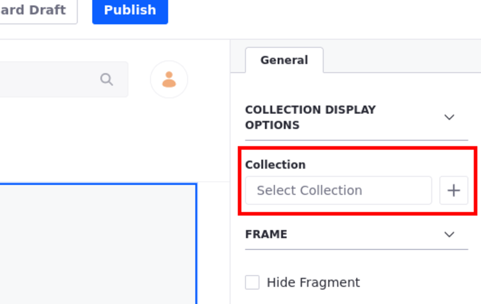
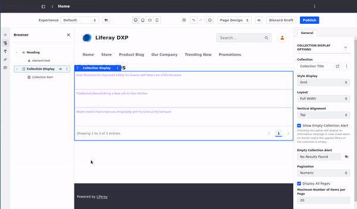
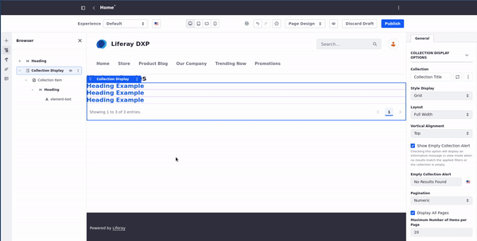
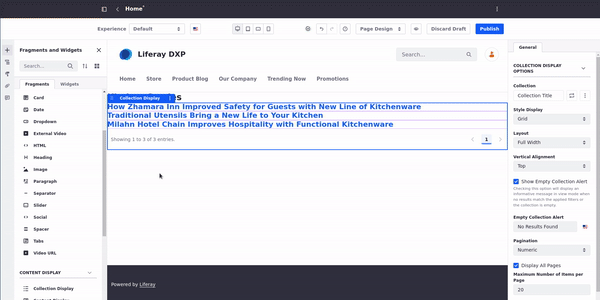

---
taxonomy-category-names:
- Sites
- Collections
- Collection Pages
- Fragments
- Liferay Self-Hosted
- Liferay PaaS
- Liferay SaaS
uuid: 54108c82-b29d-4dcc-8734-ea3d941f4328
---
# Displaying Collections

{bdg-secondary}`Liferay Portal 7.4 GA6+, DXP 7.3 GA1+`

You can display a collection by adding a collection page, or a collection display fragment. For more information about these display options, see [About Collections and Collection Pages](../../../site-building/displaying-content/collections-and-collection-pages.md#displaying-collections).

By default, any user can see a collection's content. However, you can [personalize how users see this content using segments](../../../site-building/displaying-content/collections-and-collection-pages.md#customizing-collections).

```{note}
You must [create a collection](../../../site-building/displaying-content/collections-and-collection-pages/creating-collections.md) before displaying it on a page.
```

## Displaying Collections on a Page

The two easiest ways to display a collection are to add a collection page or to add a collection display fragment to an existing page.

### Displaying Collections on a Collection Page

A collection page links a page to a collection. Collection pages include [collection display fragments](#adding-a-collection-display-fragment-to-a-page) as part of the page.

Follow these steps to add a collection page:

1. Open the *Site Menu* (  ) and go to *Site Builder* &rarr; *Pages*.

1. Click *New Page* (  ) and select *Collection Page*.

   

1. From the Collections tab, select one of your collections or click *Add* (  ) to [create a new collection](../../../site-building/displaying-content/collections-and-collection-pages/creating-collections.md).

1. Select the *Master Page* you want to use.

1. Enter the name of your collection page and click *Add*.

1. To show the collection, [map its content to page elements](#mapping-components-to-display-a-collections-assets).

```{important}
You cannot create a child page under a collection page.
```

You now have a collection page displaying your chosen collection, within a collection display fragment.

### Adding a Collection Display Fragment to a Page

A collection display fragment shows a collection in a content page. It can be configured to display a collection in any style or layout.


To add an existing collection to a collection display fragment,

1. [Create a new page](../../creating-pages/adding-pages/adding-a-page-to-a-site.md) or [start editing a content page](../../creating-pages/using-content-pages/adding-elements-to-content-pages.md).

1. Click *Add* (  ) to open the Fragments and Widgets panel.

1. Under the Content Display category in the Fragments tab, drag the *Collection Display* fragment to a place on the page.

1. Click on the *Collection Display* fragment to show the configuration in the Selection panel.

1. Under the General tab, click the *Collection* field to map the selected collection to the fragment:

   

The collection display fragment is now on the page and displaying the selected collection.

```{important}
When adding a Collection Display Fragment to a page, only collections that can be mapped to editable fragments are available (Blog Entries, Documents, Knowledge Base Articles, Web Content Articles, and Custom Object Entries).
```

## Configuring a Collection Display Fragment

Whether you added a collection display fragment manually or via a collection page, you can configure it by [editing the page](../../creating-pages/using-content-pages/adding-elements-to-content-pages.md) and selecting the fragment.

Selecting a collection display fragment divides it into sections for each asset in the collection. New options appear under the fragment's general configuration after you've selected a collection:

**Style Display**: Choose the style used to format the assets in the list (e.g., grid or bulleted list styles). In versions earlier than 7.4 GA23 or U23, this configuration is called List Style.

**Layout**: Choose the number of columns in which to display the assets.

**Show Gutter**: Check the box to show the gutter (spacing) between columns. This option only appears when you choose the Grid style with a column layout (in versions 7.4 GA23+ or U23+).

**Show Empty Collection Alert**: Check the box to display an alert message when no results match the applied filters or the collection is empty.

**Empty Collection Alert**: If *Show Empty Collection Alert* is enabled, choose the displayed alert message. This message is localizable.

**Vertical Alignment**: Choose how to align the items: top, middle, or bottom of each row. This option only appears when you choose the *Grid* style (in versions 7.4 GA23+ or U23+).

**List item style**: Choose a style to format each asset. This option applies only to some list styles.

**Max number of items**: Select the maximum number of assets the fragment can display at a time.


Publish the page when you're ready for the assets in the collection to be displayed as configured.

```{tip}
In Liferay 7.4 GA23+ or U23+, if you have chosen the Grid style for a collection display fragment, you can configure the layout setting individually for each type of device. Click the device viewport buttons at the top of the screen to set this setting for each device. The tablet setting defaults to the same as the desktop's setting, and the portrait and landscape phone settings default to 1 column.
```

<!-- Add reference to developer tutorials to add more options for the List styles/List item styles when available -->

### Mapping Components to Display a Collection's Assets

You can also configure the item style (how each asset is individually displayed) in the fragment by mapping display components to them.

Map these elements to the assets in the collection display fragment by dragging them into the cells of the fragment.

```{note}
Depending on the option you chose for a collection display fragment's list style, you may not be able to drag components into the fragment. If you cannot drag components into the fragment, you can choose a different list style or select a different option under List Item Style.
```

1. In the page editor, click the *Collection Display* representing your collection.

1. In the tools sidebar, click *Fragments and Widgets* ().

1. From the Fragments and Widgets sidebar panel, drag and drop the components you want to use to show the collection items.

   

   ```{note}
   If the collection display contains more than one item, you can drag the fragment or widget to any of them. The rest of the items in your collection use the same layout settings automatically.
   ```

1. Double-click the *fragment* or *widget* on the collection display to access its mapping options.

1. In the Mapping column, select the *field* that you want to map to your collection.

   

1. Add more fragments or widgets as necessary and map the content to the content fields.

   

1. Click *Publish*.

## Paginating Display Items

{bdg-secondary}`7.4+`

You can paginate the collection items using the pagination configuration. This option provides two important advantages:

* It is easier to show collections with a large number of items. Instead of showing all the items in the collection, you can decide how many items to show at once, while allowing users to move back and forward through the list of items in the collection.

* Breaking the visible list of items into smaller groups reduces the server overhead, improving the server response time and user experience.

```{note}
In Liferay 7.4 versions earlier than U18 and GA18, fewer pagination options are available. In these versions, you can still enable pagination and choose the maximum number of items to display at once, but you cannot change the number of pages shown in the pagination menu.
```

To paginate the display items in the collection display,

1. Click *Edit* (  ) on the content page with the collection display.

1. Click *Browser* (  ) to open the Browser panel.

1. Under the Elements Browser, select the collection display fragment you want to paginate. The chosen fragment must be configured to display an existing collection.

1. In the General Settings, choose the pagination options:

   **Pagination**: None (no pagination), Numeric, or Simple (Previous/Next controls).

   **Display All Pages**: Check the box to display the numbers or controls for every page in the pagination menu. If no pagination type is selected, this option becomes Display All Collection Items instead.

   **Maximum Number of Pages to Display**: The maximum number of pages shown in the pagination menu. This option only appears if the Display All Pages checkbox is not selected.

   **Maximum Number of Items per Page**: The maximum number of items from the collection to display per page, if pagination is enabled. If no pagination type is selected, this option becomes Maximum Number of Items to Display instead.

   

If you enable pagination, the total number of pages available depends on both the total number of items in the collection and the setting for Maximum Number of Items per Page.

```{note}
By default, the collection display fragment displays up to 20 items at a time in edit mode. You can change this limit by navigating to *Control Panel* &rarr; *Instance Settings* &rarr; *Pages* &rarr; *Page Editor*, and changing the number in the *Maximum Number of Items in Edit mode* field. Displaying more than 20 items at once in edit mode, may negatively impact performance. This setting does not affect what users see on the page in View mode.
```

## Viewing Collections Usage Throughout the Site

You can find usage statistics for the collections on your site.

1. Open the *Site Menu* (  ) and navigate to *Site Builder* &rarr; *Collections*.

1. Under the Collections tab, click *Actions* () &rarr; *View Usages* next to the Collection you want to review. 


## Liferay DXP 7.2

### Displaying Content Sets

Content sets are primarily displayed through the Asset Publisher. It is currently the only method to display them out-of-the-box, but you can develop your own external applications or widgets to utilize content sets. In [Creating Content Sets](../../../site-building/displaying-content/collections-and-collection-pages/creating-collections.md#creating-content-sets) you created two content sets. Now display them on a page.

#### Configuring the Asset Publisher for Content Sets

To display the content sets, start with a blank page, and then add the necessary asset publishers and configure them to display the content sets.

1. Create a new home page for your site as a widget page with a 1 column layout. If you're using a fresh Liferay DXP bundle, you can just remove the Hello World widget from the sample Home page.

1. Open the *Add* menu and add two *Content Management* &rarr; *Asset Publishers* to the page stacked vertically.

1. Click Options (  ) &rarr; *Configuration* for the top asset publisher.

1. Under Asset Selection choose *Content Set*.

   

1. Open the *Select Content Set* and click *Select*.

1. Select the *Space Program Images* content set.

1. Click *Save*.

Now the images appear at the top of the page. You can manage the way the content is displayed---like what metadata appears---or even create a widget template to style the content, but the displayed items and the order in which they appear are determined by the content set.

Now configure the bottom asset publisher with the other content set.

1. Click Options () &rarr; *Configuration* for the bottom asset publisher.

1. Under Asset Selection choose *Content Set*.

1. Open *Select Content Set* and click *Select*.

1. Click on the *Trending* content set.

   

1. Click *Save*.

Again, you can manage various display settings, but the displayed items and their order are determined by the content set criteria.


#### Adding Items to an Existing Content Set

To demonstrate the management of both static and dynamic content sets, upload a new image, tag it, and add it to the static set manually.

1. Upload a new image and, under Categorization, tag it as *trending*.

1. The image is added to the top of the Trending content list.

   

1. To add it to the manual set, go back to *Site Menu* and navigate to *Content & Data* &rarr; *Site Builder*.

1. Click on *Space Program Images* or select  &rarr; *Edit* next to Space Program Images.

1. Next to Asset Entries, click *Select* &rarr; *Basic Document*.

1. Select the new image and click *Add*.

1. Navigate back to the home page to see your image added to the list.

Content sets provide one place to define content and other assets to be displayed all over your site. Their reusability also means less repeated work involved in getting great content delivered to your users.

## Related Topics

[Creating Collections](../../../site-building/displaying-content/collections-and-collection-pages/creating-collections.md)
[Collections and Collection Pages](../../../site-building/displaying-content/collections-and-collection-pages.md)
[Personalizing Collections](../../personalizing-site-experience/experience-personalization/personalizing-collections.md)
