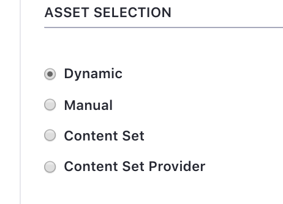
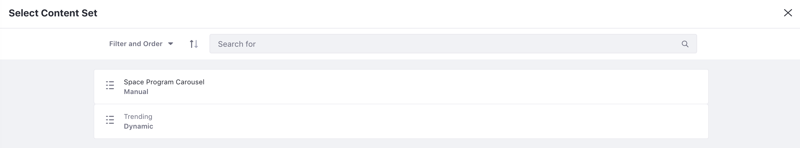
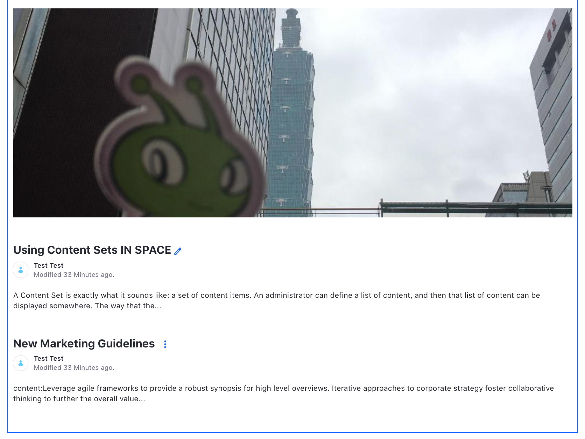
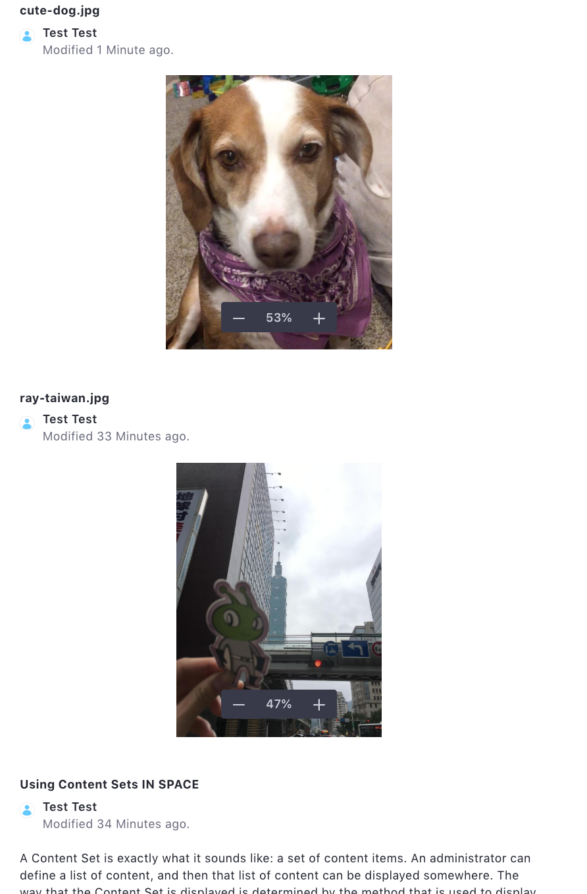

---
taxonomy-category-names:
- Sites
- Collections
- Collection Pages
- Fragments
- Liferay Self-Hosted
- Liferay PaaS
- Liferay SaaS
uuid: d28b4371-c37f-4d50-b4c0-8d62eb84c78d
---

# Displaying Collections for Liferay 7.2 and Earlier Versions

!!! note
    In versions before Liferay DXP 7.3+, collections were called content sets.

Content sets are primarily displayed through the Asset Publisher. It is currently the only method to display them out-of-the-box, but you can develop your own external applications or widgets to utilize content sets. In [Creating Content Sets](../creating-collections/creating-collections-for-liferay-72-and-earlier-versions.md) you created two content sets. Now display them on a page.

#### Configuring the Asset Publisher for Content Sets

To display the content sets, start with a blank page, and then add the necessary asset publishers and configure them to display the content sets.

1. Create a new home page for your site as a widget page with a 1 column layout. If you're using a fresh Liferay DXP bundle, you can just remove the Hello World widget from the sample Home page.

1. Open the *Add* menu and add two *Content Management* &rarr; *Asset Publishers* to the page stacked vertically.

1. Click Options () &rarr; *Configuration* for the top asset publisher.

1. Under Asset Selection choose *Content Set*.

   

1. Open the *Select Content Set* and click *Select*.

1. Select the *Space Program Images* content set.

1. Click *Save*.

Now the images appear at the top of the page. You can manage the way the content is displayed---like what metadata appears---or even create a widget template to style the content, but the displayed items and the order in which they appear are determined by the content set.

Now configure the bottom asset publisher with the other content set.

1. Click Options () &rarr; *Configuration* for the bottom asset publisher.

1. Under Asset Selection choose *Content Set*.

1. Open *Select Content Set* and click *Select*.

1. Click on the *Trending* content set.

   

1. Click *Save*.

Again, you can manage various display settings, but the displayed items and their order are determined by the content set criteria.

#### Adding Items to an Existing Content Set

To demonstrate the management of both static and dynamic content sets, upload a new image, tag it, and add it to the static set manually.

1. Upload a new image and, under Categorization, tag it as *trending*.

1. The image is added to the top of the Trending content list.

   

1. To add it to the manual set, go back to *Site Menu* and navigate to *Content & Data* &rarr; *Site Builder*.

1. Click on *Space Program Images* or select  &rarr; *Edit* next to Space Program Images.

1. Next to Asset Entries, click *Select* &rarr; *Basic Document*.

1. Select the new image and click *Add*.

1. Navigate back to the home page to see your image added to the list.

Content sets provide one place to define content and other assets to be displayed all over your site. Their reusability also means less repeated work involved in getting great content delivered to your users.

## Related Topics

- [Creating Collections](../creating-collections/creating-collections-for-liferay-72-and-earlier-versions.md)
- [Collections and Collection Pages](../collections-and-collection-pages-for-liferay-72-and-earlier-versions.md)
- [Personalizing Collections](../../../personalizing-site-experience/experience-personalization/personalizing-collections.md)
