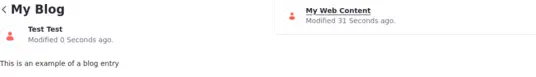

---
taxonomy-category-names:
- Sites
- Widgets
- Web Content and Structures
- Liferay Self-Hosted
- Liferay PaaS
- Liferay SaaS
uuid: ee58e0f2-05fb-46aa-b058-90e7b7dcf21c
---

# Defining Content Relationships

When creating new content, you can define relationships between assets even if they don't share any tags and aren't in the same category. The Related Assets option puts related content at your users' fingertips.

Before creating a relationship, you must create a web content article:

1. Go to *Product Menu*() &rarr; *Web Content*.

1. Click *New*, then *Basic Web Content*.

1. Give your new article a name and a short description.

Now, create relationships to this content.

 1. Go to *Product Menu* () &rarr; *Blogs*.

 1. Click *New*, give your new blog entry a title, and fill in the *Content* field.

1. Now define the relationship with the article you created. Expand the *Related Assets* menu.

1. Click *Select*. From here you can choose from any asset category that Liferay provides.

1. Click *Basic Web Content*. The content you created previously appears.

1. Check the box next the web content, then click *Done*.

1. The relationship is now established! Click *Publish*.

## Using the Related Assets Widget

Once relationships are created, you can display them with the Related Assets Widget. By default, the Related Assets widget shows assets related to the asset displayed in the Asset Publisher. If you don’t want to show every related asset, you can configure what content relationships to display.

1. [Create a new page](../creating-pages/adding-pages/adding-a-page-to-a-site.md) or [start editing](../creating-pages/using-content-pages/adding-elements-to-content-pages.md) one.

1. In the Fragments and Widgets sidebar, look for the *Asset Publisher* widget. Drag and drop it into the page.

1. In your widget, click *Options* () in the upper right corner of the Asset Publisher widget and select *Configuration*.

1. Configure the widget to display the blog entry created previously. If you need more information, see [Using the Asset Publisher Widget](../../../../../dxp/latest/en/site-building/displaying-content/using-the-asset-publisher-widget.md)

1. Now, look for the *Related Assets* widget and drag and drop it into the page, next to the Asset Publisher widget.

1. Click *Options* () in the upper right corner of the Related Assets widget and select *Configuration*.

1. Under the Asset Selection tab, set the type of asset(s) to display using the Asset Type menu. The default value is set to Any.

1. You can narrow the scope of the app to display any single category of asset type or select multiple assets from the menu.

   Filter options set minimum requirements for displaying assets by their categories, tags, and custom fields. Ordering and Grouping organizes assets using the same criteria. Display settings customize how the widget shows assets: by title, in a table, by abstract, or full content. You can convert assets to different document types like ODT, PDF, and RTF. You can choose to show metadata fields such as author, modification date, tags, and view count. You can even enable RSS subscriptions and customize their display settings.

1. When you’re finished setting the Source and Filter options, click *Save*.

1. Click *Publish*. The assets related to the entry appear when you click it.

## Related Topics

- [Using the Asset Publisher Widget](./using-the-asset-publisher-widget.md)
- [Configuring Widgets](../creating-pages/page-fragments-and-widgets/using-widgets/configuring-widgets.md)
