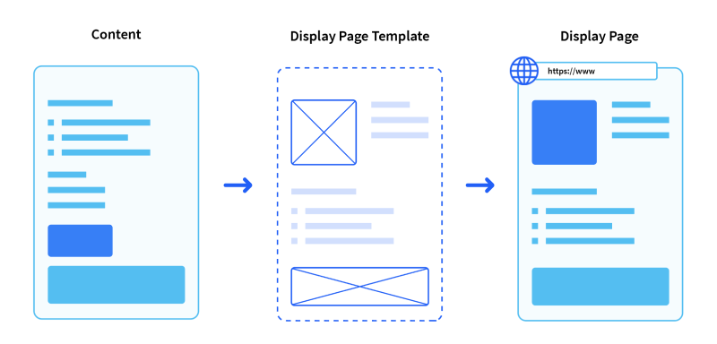
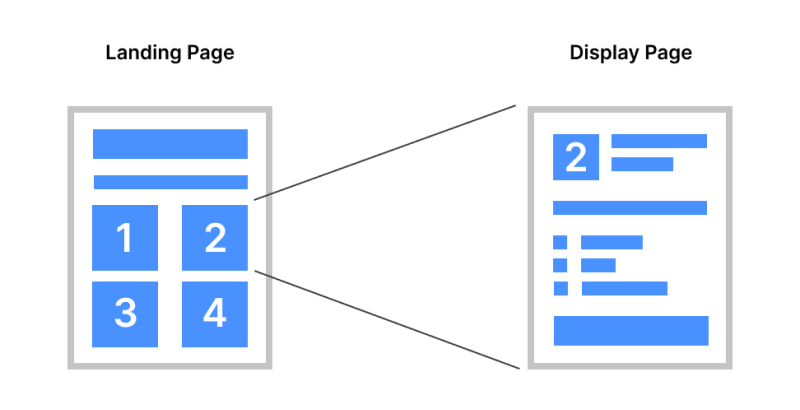

---
toc:
    - ./using-display-page-templates.md
    - ./using-display-page-templates/creating-and-managing-display-page-templates.md
    - ./using-display-page-templates/publishing-content-with-display-pages.md
    - ./using-display-page-templates/displaying-categories-using-display-pages.md
    - ./using-display-page-templates/using-multiple-display-page-templates-to-create-multi-step-applications.md
    - ./using-display-page-templates/configuring-seo-and-open-graph.md
taxonomy-category-names:
- Sites
- Display Page Templates
- Liferay Self-Hosted
- Liferay PaaS
- Liferay SaaS
uuid: 978aa7cb-c3e3-4895-91bd-ff8a779cc230
---

# Using Display Page Templates

{bdg-secondary}`Liferay DXP/Portal 7.3+`

_Display page templates_ define structures for displaying content at a dedicated URL. When you create or upload content items, Liferay generates a unique friendly URL for accessing it. However, you can only use this URL to view the content if you first define a template for displaying it.

When creating a display page template, you begin by selecting a content type (e.g., web content article, document, blog entry). This determines which content items can use the template for rendering their display pages. You can then design the template using the same UI and design elements as content pages. This means you can use page [fragments](../creating-pages/page-fragments-and-widgets/using-fragments.md) and [widgets](../creating-pages/using-content-pages/using-widgets-on-a-content-page.md) to build dynamic displays that map to content fields and integrate additional functionality. Additionally, you can define [SEO settings](./using-display-page-templates/configuring-seo-and-open-graph.md) to improve your pages' search ranking.

After designing the template, you can make it the default template for displaying its content type or manually configure only some of your content items to use it. Once set, users can view the content item's display page by visiting its friendly URL. The content is rendered dynamically according to your template design.

Display page templates currently support the following content types:

-   [Blog Entries](../../content-authoring-and-management/blogs/getting-started-with-blogs.md)
-   [Categories](../../content-authoring-and-management/tags-and-categories/defining-categories-and-vocabularies-for-content.md) {bdg-secondary}`7.4+`
-   [Custom Objects](../../liferay-development/objects/displaying-object-entries.md) {bdg-secondary}`7.4+`
-   [Documents](../../content-authoring-and-management/documents-and-media/publishing-and-sharing/publishing-documents.md)
-   [Web Content Articles](../../content-authoring-and-management/web-content/web-content-articles/adding-a-basic-web-content-article.md)
-   [Calendar Event Fields](../../collaboration-and-social/calendar/mapping-calendar-event-fields-to-display-page-templates.md)

!!! tip
    Use display page templates for designing layouts that you want to reuse for multiple content items.

These templates are ideal for displaying a list of elements in a consistent way, like business case studies, product or service options, job listings, web articles, and more. For example, on an insurance business website, you may want to list the available options. Individual web content articles describe each option. You want a landing page where site visitors can choose an option to see the corresponding insurance details from the articles.

To achieve this goal, you can create a single display page template that maps your web content article fields to fragments in your template. Each article can use the same template. Then, you can link each insurance option in your landing page to the corresponding article's friendly URL. When site visitors click an option, the display page is populated dynamically with information from your web content articles and rendered according to your template design.

If a content type has multiple display page templates created for it, you can [map links to any of the available templates](./using-display-page-templates/using-multiple-display-page-templates-to-create-multi-step-applications.md) for that asset type. When mapping a link to its display page, you can choose the default option or any of the other available display page templates, allowing for greater customization and flexibility in how your content is displayed.

::::{grid} 2
:gutter: 3 3 3 3

:::{grid-item-card} Creating and Managing Display Page Templates
:link: ./using-display-page-templates/creating-and-managing-display-page-templates.md
:::

:::{grid-item-card} Publishing Content with Display Pages
:link: ./using-display-page-templates/publishing-content-with-display-pages.md
:::

:::{grid-item-card} Displaying Categories Using Display Pages
:link: ./using-display-page-templates/displaying-categories-using-display-pages.md
:::

:::{grid-item-card} Using Multiple Display Page Templates to Create Multi-Step Applications
:link: ./using-display-page-templates/using-multiple-display-page-templates-to-create-multi-step-applications.md
:::

:::{grid-item-card} Configuring SEO and Open Graph
:link: ./using-display-page-templates/configuring-seo-and-open-graph.md
:::
::::
