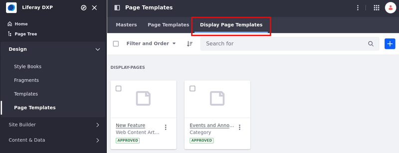
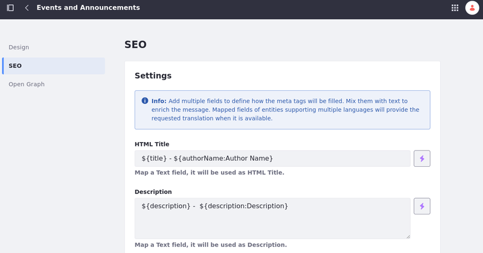
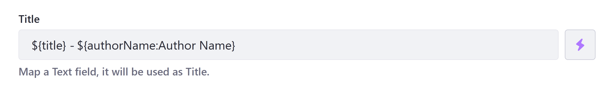
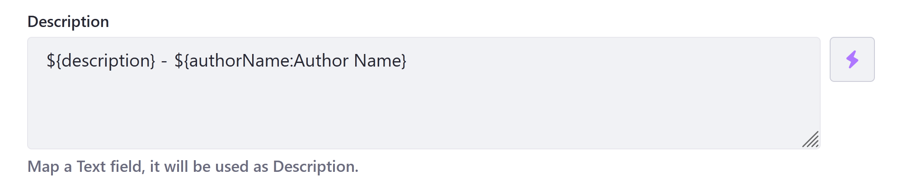
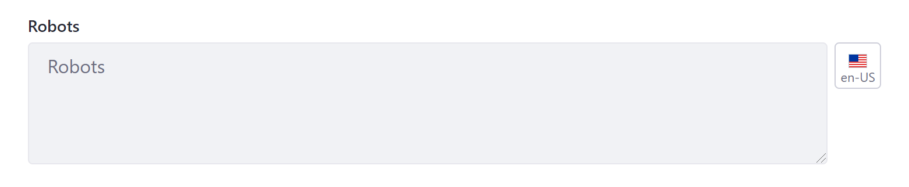
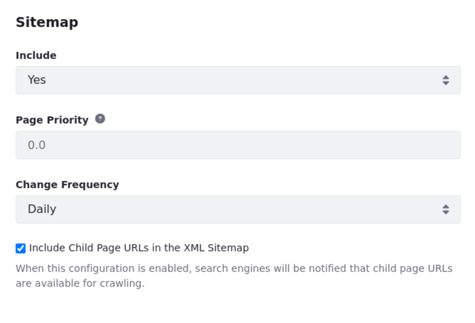
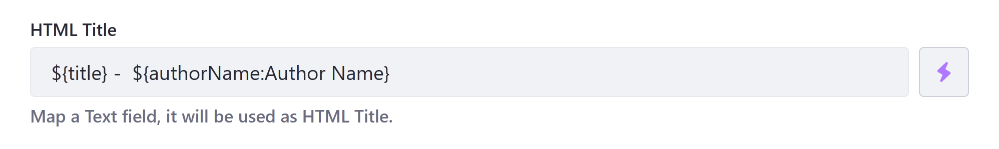
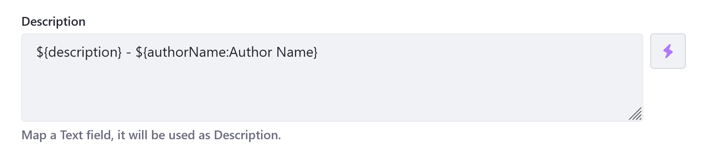
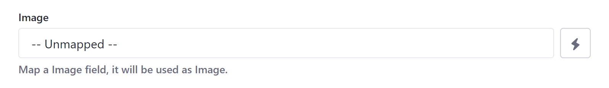
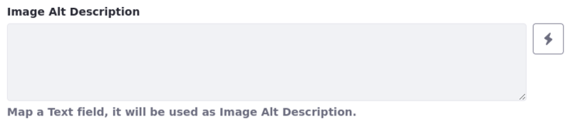

---
taxonomy-category-names:
- Sites
- Display Page Templates
- SEO
- Liferay Self-Hosted
- Liferay PaaS
- Liferay SaaS
uuid: 7a0e16df-8768-499c-aa23-f033f973ee70
---

# Configuring SEO and Open Graph Settings for Display Page Templates

{bdg-secondary}`Available: Liferay DXP/Portal 7.3+`

Display page templates are custom layouts that display individual content items at a dedicated URL. These layouts use both fragments and widgets and can be created for web content articles, documents, blog entries, and more. Each template has its own SEO and Open Graph settings that can be filled manually or dynamically.

To configure SEO and Open Graph settings for a display page template,

1. Open the *Site Menu* (), navigate to *Design* &rarr; *Page Templates*, and click on the *Display Page Templates* tab.

   !!! note
      You can also configure SEO and Open Graph for other types of pages (e.g., content pages). To do that, navigate to *Site Builder* &rarr; *Pages* and click *Actions* () next to the page you want to configure &rarr; *Configure*. Skip the next step and continue the tutorial normally.

   

1. Click *Actions* () for the desired template and select *Edit*. When editing the template, click *Options* () on the application bar and click *Configure* ().

1. Go to the [SEO](#seo-settings-reference) or [Open Graph](#open-graph-settings-reference) tab and enter the desired configuration.

   

1. Click *Save*.

   !!! important
       Unsaved changes are lost when navigating between the SEO and Open Graph tabs.

When configuring SEO and Open Graph settings, you can enter values directly and use field mapping to add values dynamically. Available mapping options depend on the template's content type and subtype. To map a field, click *field selector* () and select from available fields. As of Liferay DXP 7.4 U1 and Portal 7.4 GA5, fields added this way are represented as `${}` placeholders with two parts: a field reference ID and field label (`${fieldReferenceID:Field Label}`).

For earlier versions, mapping placeholders only include the field reference ID (e.g., `${title}`, `${authorName}`, `${Text84981642}`).

Liferay provides the field label value for clarity on the administrative side, since field reference IDs in custom web content and document structures are not human-readable (e.g., `${Text84981642:Contributors}`). The label is not displayed to end users and does not affect mapping, so users can edit it as desired. Mapping only depends on the placeholder's field reference ID.

!!! note
    Liferay provides translations for mapped fields when possible. However, text provided outside of mapped fields is not translated.

## SEO Settings Reference

Search engine optimization (SEO) refers to the methods used to improve your page's ranking in a search engine results page (SERP). With display page templates, you can configure your content's display pages for SEO.

### HTML Title

The HTML Title field defines a display page's `<title>` tag. This title is used by search engines to rank your page and serves as the page's heading in search engine results. By default, display page templates map this field to `${title}`. You can edit this value directly and use the field selector to include additional mappings (e.g., `${title} - ${authorName:Author Name}`).

The recommended length for an *HTML title* is under 60 characters.

!!! tip
    It is best practice to update the SEO and Open Graph titles together.



### Description

The Description field defines a display page's description `<meta>` tag. Search engines use this description to rank your page, and it appears in search engine results as a preview of your page. By default, display page templates map this field to `${description}`. You can edit this value directly and use the field selector to include additional mappings (e.g., `${description} - ${authorName:Author Name}`).

The recommended length for a page's description is under 155 characters.

!!! tip
    It is best practice to update the SEO and Open Graph descriptions together.



### Robots

The Robots field configures the `<meta name="robots">` tag for a display page. This tag controls how search engines crawl and index the page. You can specify values such as `noindex` to prevent the page from being indexed, or `nofollow` to prevent search engines from following links on the page. Learn more about the robots meta tag in [Robots meta tag, data-nosnippet, and X-Robots-Tag specifications](https://developers.google.com/search/docs/crawling-indexing/robots-meta-tag).

Here's how the robots field appears in the HTML code when you specify those values:

```html
<meta name="robots" content="noindex, nofollow">
```

You can also localize this field using the Language Flag.



### Sitemap

Determine whether to include a display page in your `sitemap.xml` file and set its Priority and Change Frequency fields. They inform search engines whether to crawl and index the display page, how it should be prioritized relative to other site pages, and how frequently it is updated.

{bdg-secondary}`Liferay DXP 2024.Q2+/Portal 7.4 GA120+` Enable/disable indexing child pages on XML maps by checking/unchecking the Include Child Page URLs in the XML Sitemap box. Read [Configuring XML Sitemaps](../../site-settings/managing-site-urls/configuring-xml-sitemaps.md) to learn more.



## Open Graph Settings Reference

{bdg-secondary}`Available: Liferay DXP/Portal 7.3+`

[Open Graph](https://ogp.me/) is an internet protocol that standardizes previews of site content when shared in application contexts that support it, such as Facebook, Slack, and Twitter. It does this by embedding structured data in page headers as `<meta>` tags, similar to [RDFa](https://en.wikipedia.org/wiki/RDFa).

With Liferay DXP, you can create display page templates that dynamically configure a page's Open Graph `<meta>` tags. Values defined here override default values defined at the [site](../../site-settings/configuring-open-graph-for-sites.md) level.

!!! note
    Open Graph `<meta>` tags are only included in page headers to unauthenticated users. They are not included when the user is logged in.

### Title

The Title field defines a display page's `og:title` property, which defines the title displayed for your content in rich previews. By default, this field is mapped to `${title}`. You can edit this value directly and use the field selector to include additional mappings (e.g., `${title} - ${authorName:Author Name}`).

!!! tip
    It is best practice to update the SEO and Open Graph titles together.



### Description

The Description field defines a display page's `og:description` property which determines the description displayed for your content in rich previews. By default, this field is mapped to `${description}`. You can edit this value and use the field selector to include additional mappings (e.g., `${description} - ${authorName:Author Name}`).

!!! tip
    It is best practice to update the SEO and Open Graph descriptions together.



### Image

The Image field defines a display page's `og:image` properties, which configures the image displayed for your content in rich previews. In addition to the basic image tag, DXP automatically adds many structured properties that determine how your selected image appears. The Image field defines the following `<meta>` tags.

```html
<meta property="og:image" content="http://example.com/ogp.jpg" />
<meta property="og:image:secure_url" content="https://secure.example.com/ogp.jpg" />
<meta property="og:image:type" content="image/jpeg" />
<meta property="og:image:width" content="400" />
<meta property="og:image:height" content="300" />
```

By default, this field is unmapped in display page templates. This means the template defaults to the image set at site level, unless you select a different image field.



### Image Alt Description

The Image Alt Description field defines a display page's `og:image:alt` property, which determines the alt text read by screen readers for your displayed content's `og:image` property.

```html
<meta property="og:image:alt" content="This is an example." />
```

By default, this field is unmapped in display page templates. This means the template defaults to the alt text set at the site level, unless you select a different text field.



## Related Topics

- [Configuring Your Page's Friendly URL](../../creating-pages/page-settings/configuring-your-pages-friendly-url.md)
- [Configuring Open Graph for Sites](../../site-settings/configuring-open-graph-for-sites.md)
