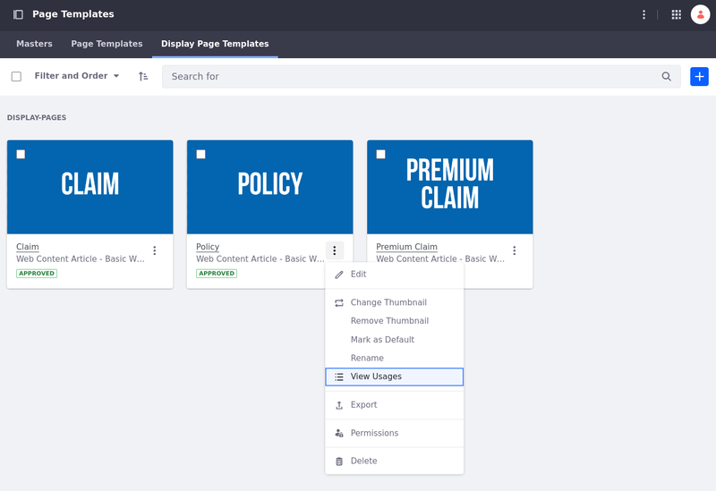

# Creating and Managing Display Page Templates

{bdg-secondary}`Available Liferay DXP/Portal 7.3+`

Display page templates define structures for displaying content at a dedicated friendly URL. These templates currently support the following content types:

* [Blog Entries](../../../content-authoring-and-management/blogs/getting-started-with-blogs.md)
* [Categories](../../../content-authoring-and-management/tags-and-categories/defining-categories-and-vocabularies-for-content.md) {bdg-secondary}`Available 7.4+`
* [Custom Objects](../../../building-applications/objects/displaying-object-entries.md) {bdg-secondary}`Available 7.4+`
* [Documents](../../../content-authoring-and-management/documents-and-media/publishing-and-sharing/publishing-documents.md)
* [Web Content Articles](../../../content-authoring-and-management/web-content/web-content-articles/adding-a-basic-web-content-article.md)

See [Using Display Page Templates](../using-display-page-templates.md) to learn more.

## Creating a Display Page Template

1. Open the *Site Menu* () and click *Design* &rarr; *Page Templates*.

1. Click the *Display Page Templates* tab.

   

1. Click the *Add* button ().

1. Enter a *Name* for your template and select a *Content Type* and *Subtype*, if applicable. Then click *Save*.

   

1. Design the template using the same interface and page elements as [content pages](../../creating-pages/using-content-pages/content-page-editor-ui-reference.md).

   ```{important}
   Display page templates inherit the design and theme of public pages. This remains true even if there is no public page created for that particular site.
   ```

    

1. Once you've added page elements, you can [map](../../creating-pages/page-fragments-and-widgets/using-fragments/configuring-fragments/fragment-sub-elements-reference.md#mapping-settings) them to content structure fields (e.g., title, description) by double-clicking on an editable field. Mapped fields are outlined in purple.

   ```{tip}
   You can use mapped fields when configuring SEO and Open Graph settings for a display page template. See [Configuring SEO and Open Graph](./configuring-seo-and-open-graph.md) for more information.
   ```

    

1. Before publishing, you can preview your editable fields mappings with existing content using the [preview function](#preview-the-display-page-template-content-mappings) (available 7.4+).

1. When finished, click *Publish* to save your work.

You can now use the template to [display your content](./publishing-content-with-display-pages.md).

### Preview the Display Page Template Content Mappings

{bdg-secondary}`Available 7.4+`

While editing, Liferay provides two ways to preview display page templates with content items.

From the Application Menu, you can click the *Preview With* drop-down menu and choose a content item. If no item appears, click *Select Other Item* and browse for the desired content. This dynamically populates the template with content data according to your field mapping.

 

Alternatively, from the display page template editor, click the *Actions* menu() button and choose *Preview in a New Tab*.

 

## Viewing Display Page Template Usage

{bdg-secondary}`Available 7.4+`

You can manage the different display page templates using the *Actions* menu (). From here, the *View Usages* option provides a list of content that uses a specific display page template other than the default template. This option is not available for default templates.


Before you delete a display page template that is in use, you have two ways to unassign the display page template from the content:

* Assign to Default: Your content is unassigned from the current display page template and assigned to the default display page template for the content type and subtype (if applicable.)
* Unassign: Your content is not assigned to any display page template.

Follow these steps to view your display page template usage and unassign your content:

1. Open the *Site Menu* () and go to *Design* &rarr; *Page Templates*.

1. Click the *Display Page Templates* tab.

1. Click the display page template's *Actions* menu () and select *View Usages*.

1. Select one or more elements from the list of content using the display page template.

1. Click the *Actions* menu () in the top-right corner and select *Assign to Default* or *Unassign*.

1. Click *OK*.

If you assign your content to a new display page template, make sure the content appears as expected. To preview and display your content, see [Publishing Content with Display Pages](./publishing-content-with-display-pages.md).

## Related Topics

* [Publishing Content with Display Pages](./publishing-content-with-display-pages.md)
* [Configuring SEO and Open Graph](./configuring-seo-and-open-graph.md)
* [Using Content Pages](./../../creating-pages/using-content-pages.md)
* [Adding Elements to Content Pages](../../creating-pages/using-content-pages/adding-elements-to-content-pages.md)
