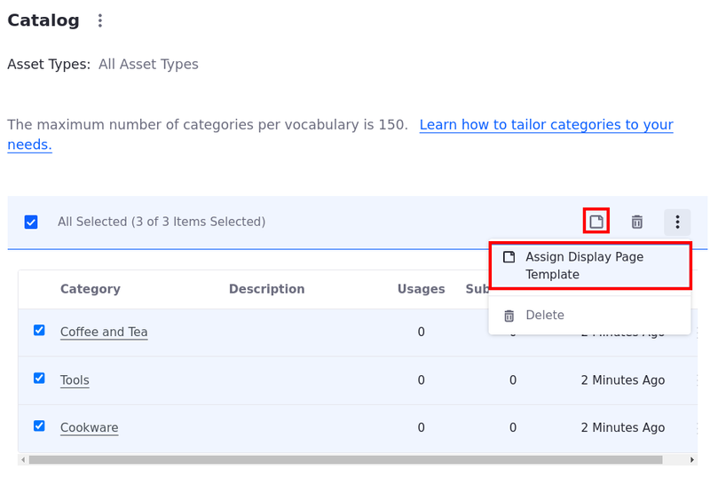
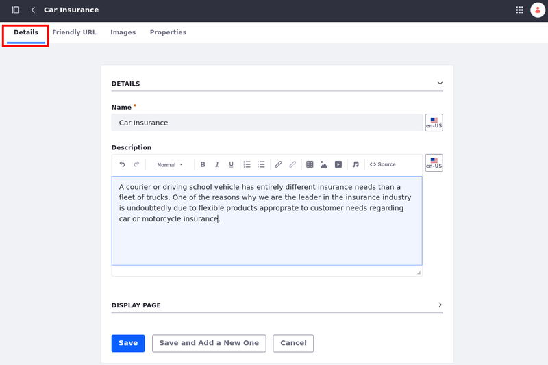
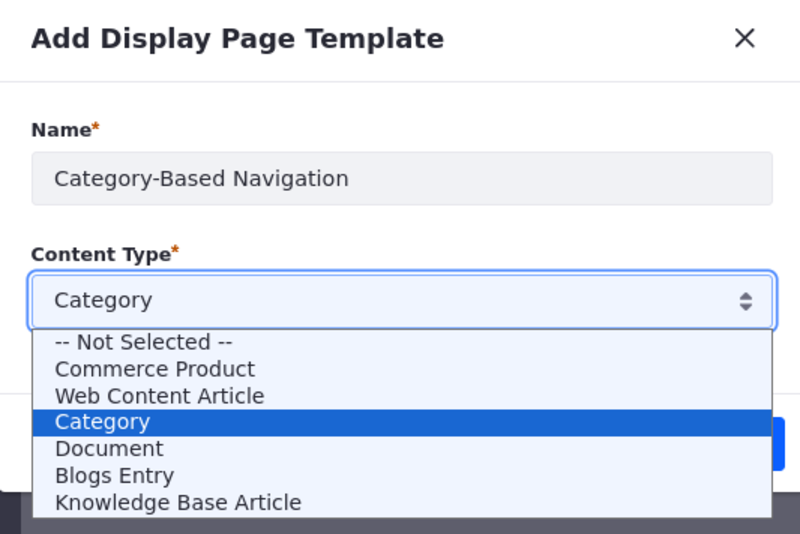
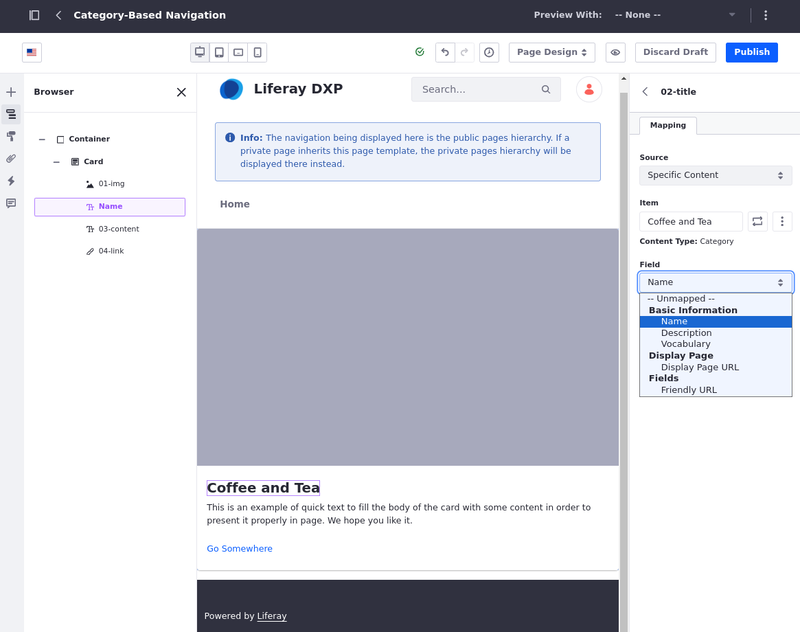
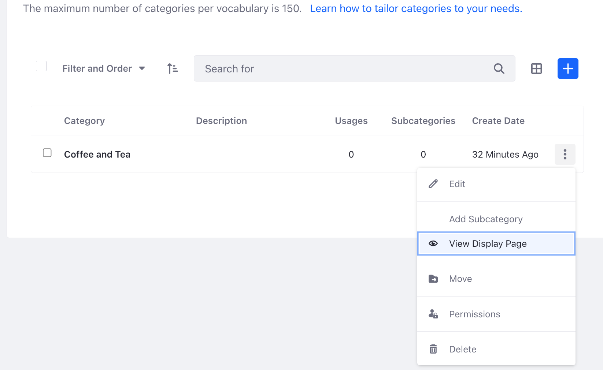
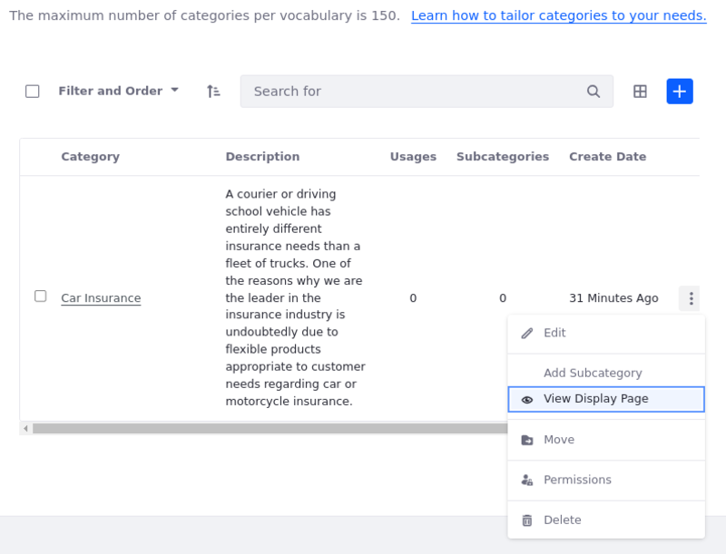
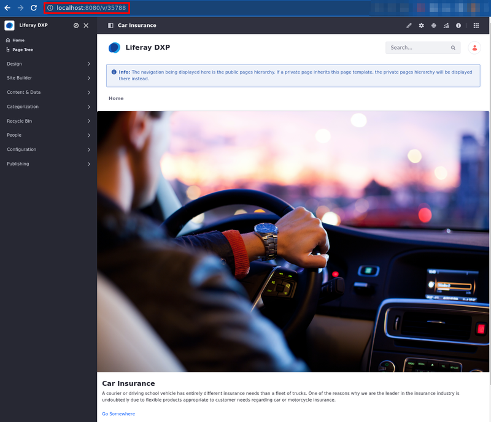

---
taxonomy-category-names:
- Sites
- Display Page Templates
- Categories and Tags
- Liferay Self-Hosted
- Liferay PaaS
- Liferay SaaS
uuid: 2849d9bf-58a7-491b-9d34-df14fe15388e
---
# Displaying Categories using Display Pages

{bdg-secondary}`Available: Liferay DXP/Portal 7.4+.`

Using a display page template, you can render web content, documents, and blog entries in a [display page](../../../site-building/displaying-content/using-display-page-templates/publishing-content-with-display-pages.md). Starting with Liferay DXP 7.4, you can also render categories on a display page. This can be useful if you want to showcase multiple products or services you [organized using categories](../../../content-authoring-and-management/tags-and-categories/organizing-content-with-categories-and-tags.md). Because display pages are ideal for showing a catalog of elements in a consistent way, you can use category-based display pages to provide users a consistent experience when browsing your products or services catalog.

## Displaying Categories in Display Pages

You render categories in a display page the same way you render other types of display page content:

- [Create a display page template](../../creating-pages/using-content-pages/adding-elements-to-content-pages.md) for categories and set this template as the default one.
- Select the display page template of your choice when you [create or edit the category](../../../content-authoring-and-management/tags-and-categories/defining-categories-and-vocabularies-for-content.md).

You can also assign a display page template to multiple categories at once.

1. Open the *Site Menu* () and navigate to *Categorization* &rarr; *Categories*.

1. Check the categories you want to update and click *Page* () or, from the top Actions menu () menu, select *Assign Display Page Template*.



## Example: Using Category-Based Navigation on a Display Page

This step-by-step example shows you how to use categories in combination with a display page template to display the services of a fictional insurance company.

1. [Create and edit the categories you want to display](#step-1-creating-and-editing-the-categories).

1. [Create the display page template](#step-2-creating-the-display-page-template).

1. [Edit and publish the display page template](#step-3-edit-and-publish-the-display-page-template).

```{warning}
The following example shows how to modify a default display page template. To avoid disruptions in your production site, complete this procedure on a test site.
```

### Step 1: Creating and Editing the Categories

[Create the categories](../../../content-authoring-and-management/tags-and-categories/defining-categories-and-vocabularies-for-content.md#creating-categories) if they do not exist yet, and include the information you want to map on the display page. This example creates two new categories with a description and a picture, each category corresponding to a different service.

1. Open the *Site Menu* () and navigate to *Categorization* &rarr; *Categories*.

1. [Create a new vocabulary](../../../content-authoring-and-management/tags-and-categories/defining-categories-and-vocabularies-for-content.md#defining-vocabularies) named Vehicle Ownership.

1. [Create a new category](../../../content-authoring-and-management/tags-and-categories/defining-categories-and-vocabularies-for-content.md#defining-categories) named Car Insurance. Click *Save*.

1. In the categories application, click *Actions* () for your new category and select *Edit*.

1. Click the *Images* tab and click *Add* () to add an image for the category.

1. Click the *Details* tab and add a description of this category.

   

1. Click *Save*.

### Step 2: Creating the Display Page Template

Starting with Liferay DXP 7.4, the display page template includes an option to use categories as the content type.

1. Open the *Site Menu* () and navigate to *Design* &rarr; *Page Templates*.

1. Click *Display Page Templates* and click *Add* ().

1. Select the master page template you want to use for this display page template.

   ```{tip}
   Every page or page template requires a master page template. To learn more, read [Master Page Templates](../../creating-pages/defining-headers-and-footers/master-page-templates.md).
   ```

1. Enter the *Name* of your display page template and in the Content Type drop-down menu, select *Category*.

   

1. Click *Save*.

### Step 3: Edit and publish the Display Page Template

After you create the display page template, you can edit the components mappings and layout.

```{tip}
The display page template editor works like the content page editor. See [Adding Elements to Content Pages](../../creating-pages/using-content-pages/adding-elements-to-content-pages.md) for more information.
```

This example shows how to map the category fields using a [card fragment](../../creating-pages/page-fragments-and-widgets/using-fragments/default-fragments-reference.md).

1. Drag and drop a container fragment to the default drop zone.

1. On top of the container fragment, drag and drop a new card fragment.

1. Click the *Browser* () button and then click the card's title to open the mapping options.

1. In the Mapping tab, click the *Source* drop-down menu and select *Specific Content*

1. Click *Item* and select the category you want to map.

1. Click the *Field* drop-down menu and select *Name* to map your category's name to the card's title.

   

1. Repeat the same mapping process for the card description. This list summarizes the card fragment to category field mappings in the example:

   - Title &rarr; Name
   - Content &rarr; Description
   - Image &rarr; Main Image

1. Click *Publish*.

1. Under the Display Page Templates list, click *Actions* () for the new display page template and choose *Mark as Default*.

   

1. Open the *Site Menu* (), navigate to *Categorization* &rarr; *Categories*, and select the vocabulary with the categories from [step 1](#step-1-creating-and-editing-the-categories).

1. On any category, click *Actions* () and select *View Display Page*.

   

The display page uses your display page template mappings to show the category fields. The display page URL is unique for the selected category.



## Related Topics

[Creating and Managing Display Page Templates](./creating-and-managing-display-page-templates.md)

[Publishing Content With Display Pages](./publishing-content-with-display-pages.md)

[Defining Categories and Vocabularies for Content](../../../content-authoring-and-management/tags-and-categories/defining-categories-and-vocabularies-for-content.md).
