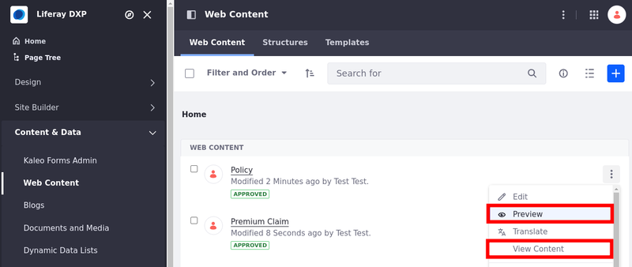
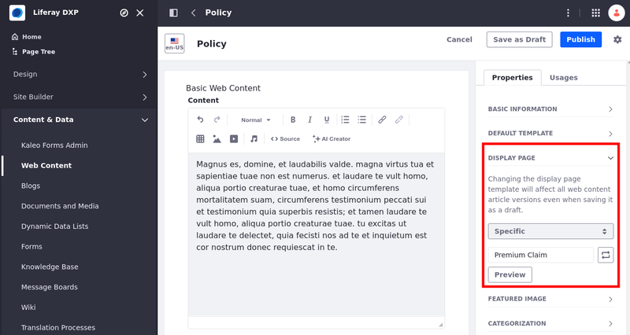
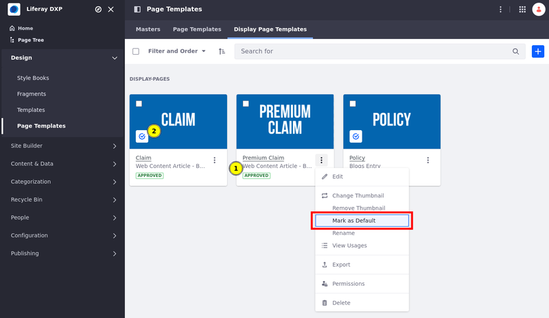
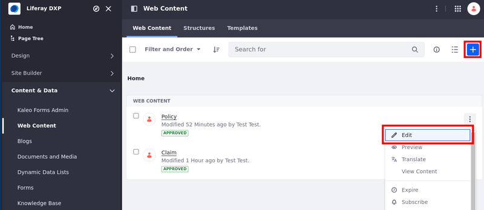
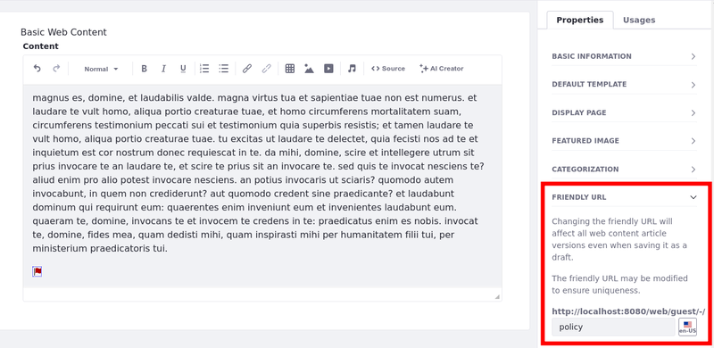

# Publishing Content With Display Pages

You can use display page templates to create reusable dynamic designs for displaying content items at their friendly URLs. After [designing the template](./creating-and-managing-display-page-templates.md), you can make it the default template for displaying its content type, or manually configure only some of your content items to use it. Once set, users can view the content item's display page by visiting its friendly URL. The content is rendered dynamically according to your template design and mappings. See [Using Display Page Templates](../using-display-page-templates.md) for more information.

```{note}
Even though you can create multiple display page templates for the same content type, you can select only one default template. To use an alternative template as the default, you must assign the template to content items individually.
```

## Setting a Default Display Page Template

Follow these steps to set the default display page template for a type of content:

1. Open the *Site Menu* () and click *Design* &rarr; *Page Templates*.

1. Click the *Display Page Templates* tab.

1. Click the *Actions* button () for the desired template and select *Mark as Default*

   ```{tip}
   Each template's content type is listed under its name (A). The blue check (B) indicates which templates are marked as default.
   ```

   

## Setting a Display Page Template for Individual Content Items

Follow these steps to use a display page template for displaying content items:

1. Open the *Site Menu* () and go to the desired application (e.g., Web Content, Blogs, Categories).

1. Begin editing or creating a content item.

   

1. In the Properties tab, expand the *Display Page Template* section, click the drop-down menu, and select *Specific Display Page Template*.

   ```{note}
   If you don't choose a specific display page template, your content is published using the [default one](#setting-a-default-display-page-template) for the content type.
   ```

   

1. Click *Select*, choose the desired template, and click *Done*.

   You can preview what the display page looks like with the *Preview* button located next to the selected display page template.

1. (Optional) In the Properties tab, expand the *Friendly URL* panel and modify the friendly URL. This determines the URL for displaying your content item using the display page template.

   ```{note}
   For Liferay 7.4 U34+/GA34+, the Display Page Template framework takes into account an asset's friendly URL history. This means all URLs saved in the file's URL history redirect automatically to the file's current URL. The friendly URL history is supported for both [documents](../../../content-authoring-and-management/documents-and-media/uploading-and-managing/configuring-document-urls.md) and [blogs](../../../content-authoring-and-management/blogs/displaying-blogs.md).
   ```

   

1. Click *Publish*.

Once set, Liferay uses the template to display the content item at its unique friendly URL. If desired, you can preview your content's display page at any time by clicking the content's *Actions* button () and selecting *Preview* or *View Content*

*Preview* displays the content in the display page template context, while *View Content* redirects you to the content item's friendly URL.



## Additional Information

* [Using Display Page Templates](../using-display-page-templates.md)
* [Creating and Managing Display Page Templates](./creating-and-managing-display-page-templates.md)
