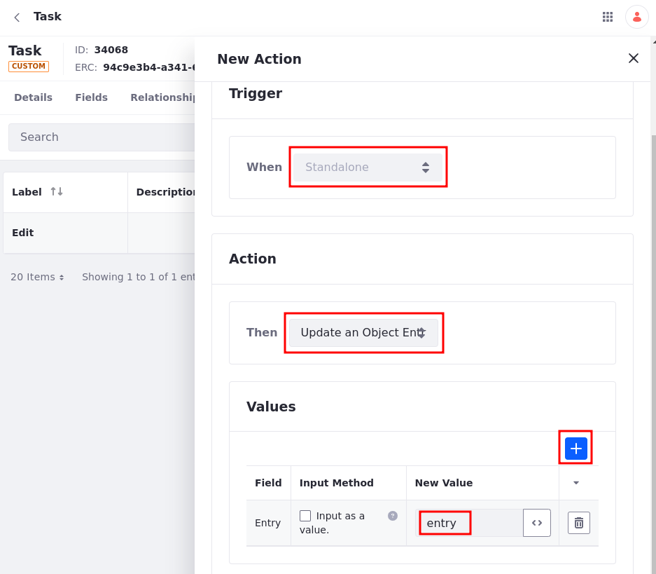
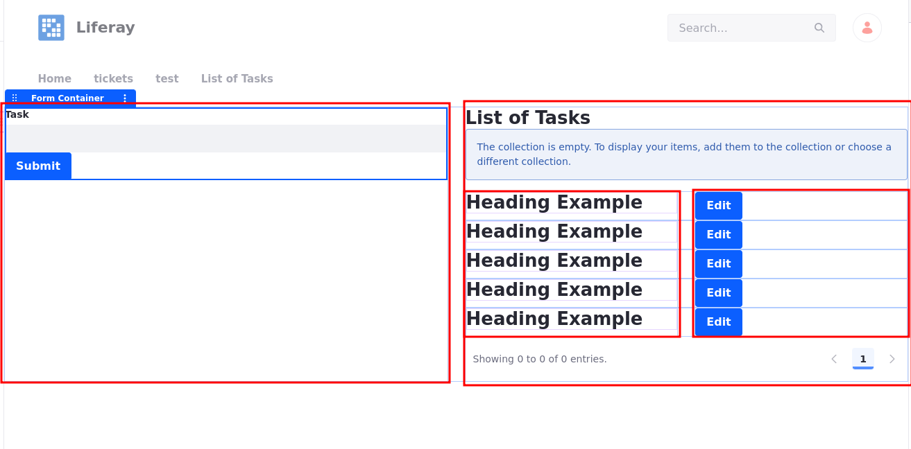
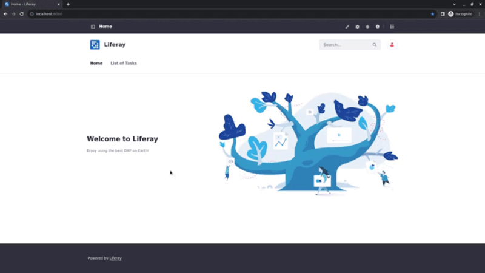
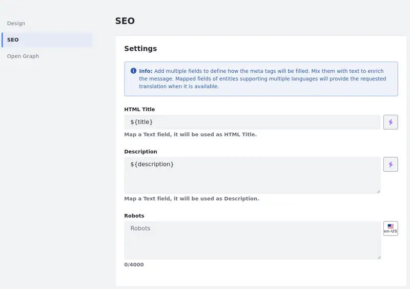
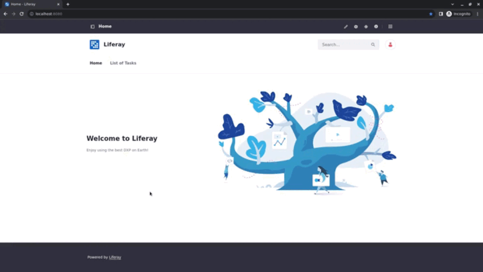

---
taxonomy-category-names:
- Sites
- Display Page Templates
- Objects
- Liferay Self-Hosted
- Liferay PaaS
- Liferay SaaS
uuid: 8b2517e5-e747-49f4-b389-a3b3b1f66d0b
---
# Using Multiple Display Page Templates to Create Multi-Step Applications

{bdg-secondary}`Liferay 2023.Q4+/GA102+`

Display page templates display content at a dedicated URL. To use this URL and view the content, you have to first define a template to display it.

Generally, a default display page template is set for a specific content type. You can, however, associate multiple display page templates with the same content type and map any of those options to links. This means users can create applications (e.g., [forms mapped from custom objects](../../../liferay-development/objects/using-fragments-to-build-forms.md)) with multiple steps. By using multiple display templates, you can create forms with multiple steps, because each step is linked to a different display page template.

Using display page templates, objects, and Form Container fragments, you can create a page that allows users to add an object entry and edit it in a different page. To do that, it is necessary to create a [custom object](#tasks-custom-object), a [display page template](#edit-display-page-template) to edit the object entry, and a [content page](#content-page-to-display-the-application) where the user can enter a new object entry and view a list of existing object entries.

## Tasks Custom Object

1. [Create a custom object](../../../liferay-development/objects/creating-and-managing-objects/creating-objects.md) and label it *Task*.

1. Click on the *Task* object.

1. Under the Fields tab, add a text-type Field labeled *Description*.

1. Under the Actions tab, add an *Action* and label it *Edit*.

1. Under Action Builder, select *Standalone* as the Trigger.

   This option allows the [action to be mapped to a button](../../../liferay-development/objects/creating-and-managing-objects/actions/using-manual-actions.md#mapping-buttons-to-object-actions-in-content-pages).

1. Select *Update an Object Entry* as the Action.

   This option updates the object entry using a selected value whenever the trigger is activated.

1. Click *Add* in Values and choose the *Description* field. Under New Value, enter *description* (the name of our field). This replaces the object entry's Description field value with the new value.

   

1. Add an *Error Message* and click *Save*.

1. Under the Details tab, select a *Scope* for the object and click *Publish* at the top right corner.

Your object is now published, and it can be used to generate a form using a Form Container fragment in the content page or the display page template.

## Content Page to Display the Application

1. [Create a content page](../../creating-pages/adding-pages/adding-a-page-to-a-site.md). Use the Blank template and name the page *List of Tasks*.

1. Add a *Grid* fragment to the page. Click on it and set the *Number of Modules* to *two* on the right panel.

1. In the Fragments and Widgets sidebar, look for the Form Container fragment. Drag and drop it on the left grid module, click *None*, and map it to the Task object.

   On the left grid module, users can add a new entry to the object.

1. Click on the *Form Container* fragment and set the Success Interaction to *Stay in Page*.

   Once users add an entry to the object, the page is updated but nothing else happens.

1. Add a *Heading* fragment to the right grid module. To edit it, double click on it. Enter *List of Tasks* as the heading.

1. Add a *Collection Display* fragment to the right grid module under the Heading. Click on the fragment. Under the General tab, click on *Collection*.

   On the right grid module, users can see a list of Tasks.

1. Under the Collection Providers tab, select *Tasks*.

   The Collection Provider displays the entries in Tasks in any way you design it.

1. Add a *Grid* to the Collection Provider and set the *Number of Modules* to *two* on the right panel.

   

1. Add a *Heading* fragment to the left grid module in your collection display and click on it twice. Under the Mapping tab, choose Description as the field.

   This action maps the text added to the Description field as the Heading content.

1. Add a *Button* fragment to the right grid module in your collection display and click on the text twice to edit it. Change the text to *Edit*.

1. Publish the page

Although you can view the page, add an object entry, and see the list of tasks updated, it is still incomplete. The [Edit display page template](#edit-display-page-template) needs to be created and you need to map the Edit button to the page in order to direct the user to the Edit display page template.

## Edit Display Page Template

1. Create a [display page template](./creating-and-managing-display-page-templates.md), name it *Edit*, and select *Task* as the content type.

   The display page template is now associated with the Task object.

1. In the Fragments and Widgets sidebar, look for the Form Container fragment. Drag and drop it into the page, click *None*, and map it to the Task object.

   A form is generated automatically using the fields from the selected object definition.

   !!! warning
       Form fields from master page templates are not populated on display pages. If you add a form container linked to an object in the display page's master page, it is not possible to visualize the form fields related to the object.

1. Select the Form Container. Set its Success Interaction to *Go to Page*, and select the List of Tasks page.

   Once the form is submitted, the List of Tasks page appears.

1. Click the *Submit* button twice. Under Field, select the *Edit* action.

   When users click the submit button, the List of Tasks page appears, and they also activate the Edit action that replaces the previous Description value with the newly added one.

!!! tip
    Form Container fragments enabled in display page templates. You can also edit the Form Container fragment and use only a subset of input fragments. Then, when the object entry is updated, only the available fields are updated.

    Edit the fragments as you see fit and save the Form Container fragment as a composition to be used in both content pages and display pages.

## SEO Considerations About the Display Page Templates

If the display page is marked as default,

   - The `Sitemap.xml` configuration is enabled, and customers can customize it according to their requirements (there's no breaking change).

   - When the default display page is mapped as a specific display page, a `<link> `element is added with the attribute `rel="canonical"` to the `<head>` section, pointing to the URL of the asset as the canonical page.

These changes are made automatically if the display page is not marked as default:

   - The display page is not indexed in the `Sitemap.xml`.

   - Robots configuration is disabled.

   - The value `"noindex, nofollow"` is set in the Robots configuration.

   - When another page has a link to the display page template, add the attribute `rel="nofollow"` to the `<a>` tag on the template.

   - If a display page marked as default exists for the same object, a `<link>` element is added with the attribute `rel="canonical"` to the `<head>` section, pointing to the default display page template as the canonical page.

## Resulting Application

Before using the resulting application,

1. In your List of Tasks content page, click on the *Edit* button twice.

1. Under the Link tab, choose *Mapped URL* under Link and choose the *Edit* display page template.

   When users click the Edit button, they are directed to the Edit display page template, where they can edit the entry and resubmit the form, returning to the List of Tasks content page.

1. Publish the List of Tasks page.

Now you can access the List of Tasks page and test the application. Add a task description on the left side of the page. The page updates, and you can see the new task description on the right in your collection display.

If you click on the Edit button, you are directed to the Edit display page where you can edit the entry. When you click submit, you are directed back to the List of Tasks page.

!!! tip
    You can create a display page template as an initial step and configure the Form Container's Success Interaction to Go to Entry Display Page, pointing to the next display page template. This creates a chained multi-step form.

## Related Topics

- [Using Fragments to Build Forms](../../../liferay-development/objects/using-fragments-to-build-forms.md)
- [Creating Objects](../../../liferay-development/objects/creating-and-managing-objects/creating-objects.md)
- [Adding a Page to a Site](../../creating-pages/adding-pages/adding-a-page-to-a-site.md)
- [Creating and Managing Display Page Templates](./creating-and-managing-display-page-templates.md)
