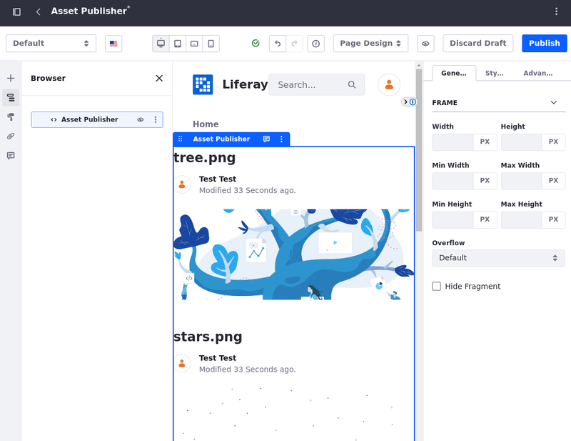

---
toc:
  - ./using-the-asset-publisher-widget/displaying-assets-using-the-asset-publisher-widget.md
  - ./using-the-asset-publisher-widget/configuring-asset-publisher-display-settings.md
  - ./using-the-asset-publisher-widget/configuring-asset-publisher-subscriptions.md
taxonomy-category-names:
- Sites
- Widgets
- Liferay Self-Hosted
- Liferay PaaS
- Liferay SaaS
uuid: d38499d6-3744-4a02-b9ec-d9ce239048c9
---

# Using the Asset Publisher Widget

The Asset Display widget is a tool for [displaying individual pieces of content](./using-the-asset-publisher-widget/displaying-assets-using-the-asset-publisher-widget.md) from various sources like blogs, web content, and documents. You can use it to highlight specific assets on pages, making it ideal for featuring important announcements, articles, or media files.

Users can configure the Asset Publisher widget to display a chosen asset by [selecting the content type and specific item](./using-the-asset-publisher-widget/displaying-assets-using-the-asset-publisher-widget.md#selecting-assets-in-the-asset-publisher-widget) from a list. The widget supports various content types and offers options to [customize display settings](./using-the-asset-publisher-widget/configuring-asset-publisher-display-settings.md), such as showing metadata or enabling comments, ensuring the content appears as desired.

Enhance your content display by creating [collections](./collections-and-collection-pages/about-collections-and-collection-pages.md) and setting [experiences](../personalizing-site-experience/experience-personalization/creating-and-managing-experiences.md) aimed at different audiences. This way, you can [dynamically change the content](./using-the-asset-publisher-widget/displaying-assets-using-the-asset-publisher-widget.md#displaying-content-dinamically-using-experiences) displayed in the Asset Publisher widget based on the experience in place.

By leveraging the Asset Publisher widget's capabilities, you can create dynamic, engaging, and customized content displays that cater to the specific needs of your audience.
