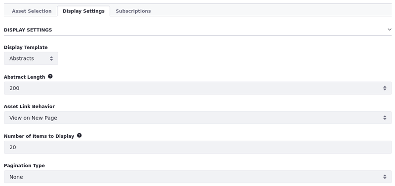
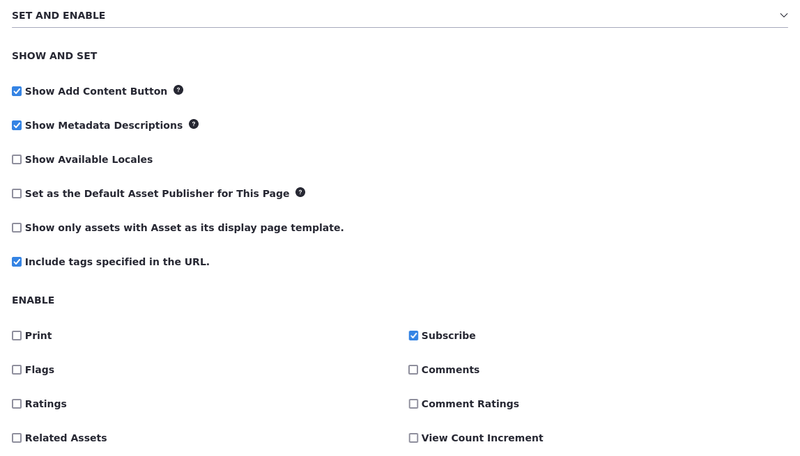
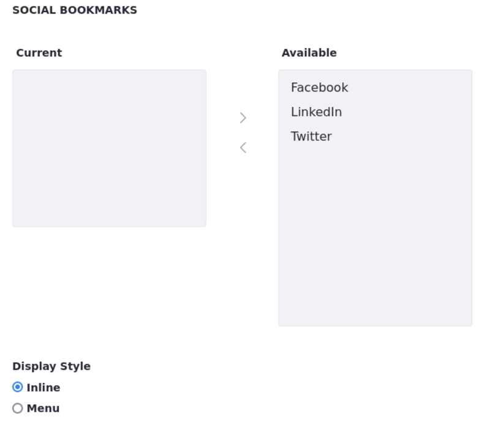
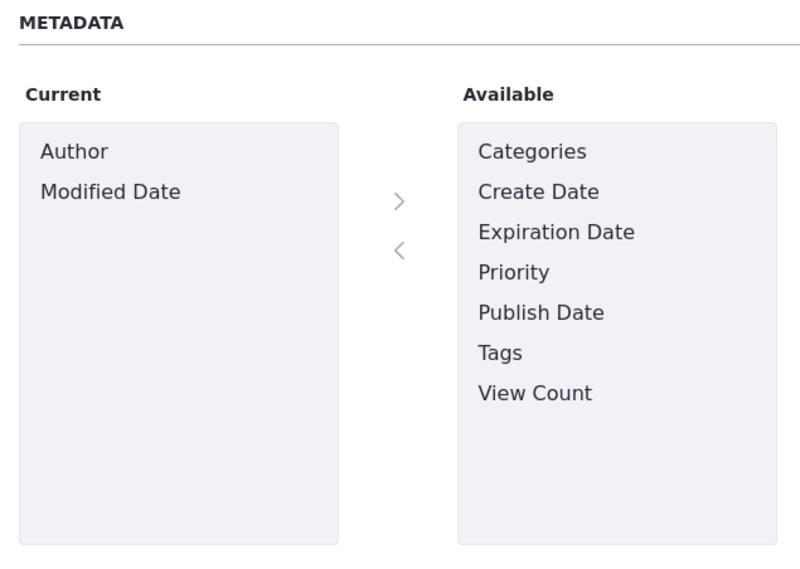

---
taxonomy-category-names:
    - Sites
    - Widgets
    - Liferay Self-Hosted
    - Liferay PaaS
    - Liferay SaaS
uuid: 9f1cbdb2-18da-4237-aef5-f72d57311d41
---

# Configuring the Asset Publisher Display Settings

When using an Asset Publisher widget, you can configure several display settings to specify how users view your content.

1. Create a [new page](../../creating-pages/adding-pages/adding-a-page-to-a-site.md) or [edit an existing one](../../creating-pages/using-content-pages/adding-elements-to-content-pages.md)

1. While editing the page, look at the Fragments and Widgets tab on the left of the page editor and search for the *Asset Publisher* widget.

1. Drag and drop the *Asset Publisher* widget into the editing area.

1. [Select your assets](./displaying-assets-using-the-asset-publisher-widget.md#selecting-assets-in-the-asset-publisher-widget).

1. Hover over the Asset Publisher and click *Options* () in the widget's menu &rarr; *Configuration*.

1. Follow the [Asset Publisher Display Configuration Reference](#asset-publisher-display-configuration-reference) and configure your widget.

1. Click *Save* to apply your display settings.

Now, users can view the Asset Publisher widget displayed in the page as you configured it.

!!! warning
    Instance Scoped Objects can't be displayed with Asset Publisher.

## Asset Publisher Display Configuration Reference

You can customize how assets are presented to users, ensuring they appear in the most effective way. Here are the display settings and other configurable options.

### Display Settings

These templates are in every site by default:

| Display Template | Scope    | Description                                                                                                                                                                                                                                                                       |
| :--------------- | :------- | :-------------------------------------------------------------------------------------------------------------------------------------------------------------------------------------------------------------------------------------------------------------------------------- |
| Abstracts        | instance | Displays the first 200-500 characters of the content, defined by the Abstract Length field. This is the default display template.                                                                                                                                                 |
| Table            | instance | Displays the content in an HTML table which can be styled by a theme developer.                                                                                                                                                                                                   |
| Title List       | instance | Displays the content's title as defined by the user who entered it.                                                                                                                                                                                                               |
| Full Content     | instance | Displays the entire content of the entry.                                                                                                                                                                                                                                         |
| Map              | global   | Displays [geo-localized assets](../../site-settings/site-content-configurations/configuring-geolocation-for-assets.md) in either a Google Map or an Open Street Map provider. The map provider can be configured in Instance Settings, and Site Settings in the Advanced section. |
| Rich Summary     | global   | Displays a summary view of each asset along with a Read More link to the article's full content.                                                                                                                                                                                  |

These are the remaining settings for the Display Settings section:

| Setting                    | Description                                                                                                                                                                                                                                                                                                                                                                                  |
| :------------------------- | :------------------------------------------------------------------------------------------------------------------------------------------------------------------------------------------------------------------------------------------------------------------------------------------------------------------------------------------------------------------------------------------- |
| Abstract Length            | Select the number of characters to display for abstracts. The default is `200`. Note this option is only available for the Abstracts display template.                                                                                                                                                                                                                                       |
| Asset Link Behavior        | The default value is View On New Page, which looks for a page where the asset is being displayed (e.g. Content Display widget, Display Page Template, or an Asset Publisher which manually selects the asset). The Show Full Content value displays the full asset in the current Asset Publisher.                                                                                           |
| Number of Items to Display | The maximum number of assets that can be displayed. If pagination is enabled, this number represents the maximum number of assets that can be displayed per page. If no value is given, the default value is `20`. It is recommended to set the number of assets below `200` to improve performance.                                                                                         |
| Pagination Type            | The type of UI to display for pagination. Three options are available: *None* displays no pagination controls; *Simple* adds Previous and Next buttons for browsing through pages of assets; *Regular* adds more options and information including First and Last buttons, a drop-down selector for pages, the number of items per page, and the total number of results (assets displayed). |

!!! note
    If two Asset Publishers are on the same page, and one is configured with the Dynamic Asset Selection and View on New Page, and the other with the Manual Asset Selection, clicking on the dynamic Asset Publisher directs users to the manual Asset Publisher, where the asset is being displayed. As a result, users are redirected to the same page.

    However, when there is only one dynamic Asset Publisher with the View on New Page configuration and the asset is not being displayed anywhere, the Asset Link Behavior changes to Show Full Content, which displays the full asset in the Asset Publisher widget itself.

### Set and Enable Options

Many of these options, such as printing, flags, ratings, comments, comment ratings, and social bookmarks work the same way they do in other applications.

| Setting                                                                   | Description                                                                                                                                                                                                                                                                                                                                                           |
| :------------------------------------------------------------------------ | :-------------------------------------------------------------------------------------------------------------------------------------------------------------------------------------------------------------------------------------------------------------------------------------------------------------------------------------------------------------------- |
| Show Add Content Button                                                   | When selected, an Add New button appears, and users can add new assets directly from the Asset Publisher application. This is checked by default.                                                                                                                                                                                                                     |
| Show Metadata Descriptions                                                | Enables metadata descriptions such as Content Related to... or Content with tag... to display with the published assets.                                                                                                                                                                                                                                              |
| Show Available Locales                                                    | Since content can be localized, you can have different versions of it based on locale. Enabling this option shows the available locales, so users can view the content in their languages.                                                                                                                                                                            |
| Set as the Default Asset Publisher for This Page                          | The Asset Publisher app is an instanceable app. Multiple Asset Publishers can be added to a page and each has an independent configuration. The default Asset Publisher for a page is the one used to display content associated with the page. This setting is not available for Asset Publisher in display page template.                                           |
| Show only assets with asset publisher widget as its display page template | Display assets that only exist for the specified display page template.                                                                                                                                                                                                                                                                                               |
| Include tags specified in the URL                                         | Incorporate tags specified in the URL.                                                                                                                                                                                                                                                                                                                                |
| Enable ...                                                                | Enable/disable these options for displayed assets. The Print option adds a Print link to the full view of an asset. Clicking *Print* opens a new browser window with a print view of the asset. Enabling flags, related assets, ratings, comments, comment ratings, or social bookmarks add links to the corresponding social features to the full view of the asset. |
| Social Bookmarks                                                          | Specify which social media links to display by moving the bookmark from the Available box to the Current box.                                                                                                                                                                                                                                                         |
| Display Style                                                             | Specify one of two display styles for the selected social media links. Inline shows icons for the selected sites in a line. Menu shows a Share button with a drop-down menu containing selected sites as options.                                                                                                                                                 |

!!! tip
    An alternate way to add flags, comments, and ratings to a page is through the Page Flags, Page Comments, and Page Ratings applications. Add the applications in the appropriate location near the asset that should have feedback.

### Metadata

This section specifies what metadata to display with the asset entry. Move metadata from the Available box to the Current box to include it.

### Grouping

The Grouping section specifies dividing the displayed assets into groups. You can group assets by type or by [vocabulary](../../../content-authoring-and-management/tags-and-categories/defining-categories-and-vocabularies-for-content.md).

For example, suppose you have a vocabulary called Membership Type with two categories: Premium and Regular. If you group assets by Membership Type, all assets with the Premium category appear in one group and all assets with the Regular category appear in another group. Grouping rules are applied before any [ordering rules](./displaying-assets-using-the-asset-publisher-widget.md#dynamic). The ordering rules are applied separately to each group of assets.

## Related Topics

- [Displaying Assets Using the Asset Publisher Widget](./displaying-assets-using-the-asset-publisher-widget.md)
- [Geo-Localized Assets](../../site-settings/site-content-configurations/configuring-geolocation-for-assets.md)
