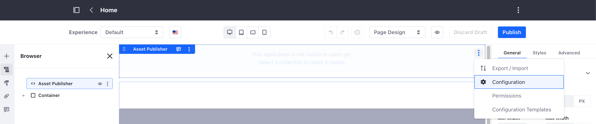
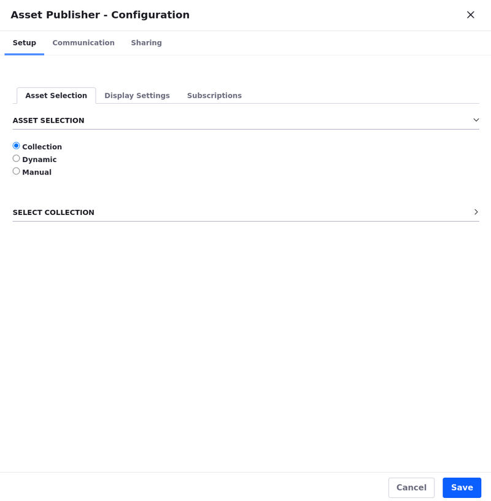
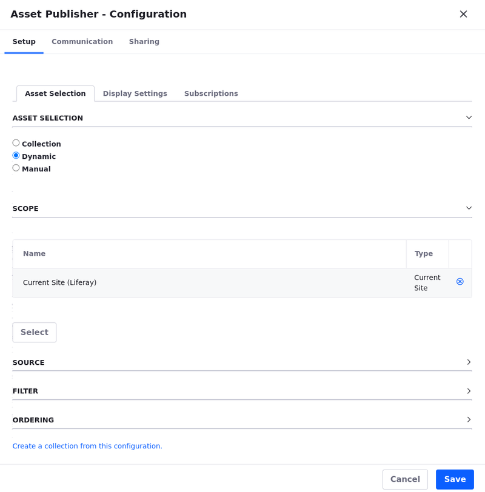
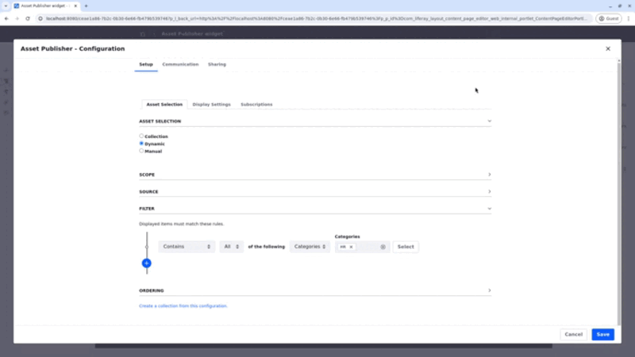

---
taxonomy-category-names:
- Sites
- Widgets
- Liferay Self-Hosted
- Liferay PaaS
- Liferay SaaS
uuid: bda599ab-3cb9-44a5-b346-7faf990a4497
---

# Displaying Assets Using the Asset Publisher Widget

As you create web content, remember that pieces of content are assets like message board entries and blog posts. The most common type of asset is the [web content](../../../content-authoring-and-management/web-content/web-content-articles/adding-a-basic-web-content-article.md).
The Asset Publisher widget supports these asset types by default:

- Blogs Entry
- Bookmarks Entry
- Bookmarks Folder
- Calendar Event
- Basic Document
- Google Drive Shortcut
- Documents Folder
- Dynamic Data Lists Record
- Knowledge Base Article
- Message Boards Message
- Basic Web Content
- Web Content Folder
- Wiki Page

!!! note
    Starting with Liferay DXP 7.2, developers can use the [Info Framework](https://help.liferay.com/hc/en-us/articles/360029067251-Introduction-to-The-Info-Framework) to display assets from [Information Lists](https://help.liferay.com/hc/en-us/articles/360029067271-Creating-an-Information-List-Provider).

The easiest way to configure an Asset Publisher to display the desired assets is to use a [collection](../../../content-authoring-and-management/collections-and-collection-pages.md) that suits your needs. Whether your collection is assigned assets manually or dynamically, the Asset Publisher widget automatically loads assets in the order the collection defines. In Liferay DXP 7.4 U10+ or GA14, Asset Publishers use the collection configuration by default.

!!! warning
    Asset Publisher can't display instance-scoped objects.

## Selecting Assets in the Asset Publisher Widget

You can configure the Asset Publisher widget to select assets dynamically based on specific criteria, or manually, specifying exactly what assets to display. You can also display assets from [collections](../../../site-building/displaying-content/collections-and-collection-pages/about-collections-and-collection-pages.md).

!!! note
    On Liferay 7.2 and below, collections are referred to as [content sets](../../../site-building/displaying-content/collections-and-collection-pages/about-collections-and-collection-pages.md#liferay-dxp-7-2).

1. Create a [new page](../../creating-pages/adding-pages/adding-a-page-to-a-site.md) or [edit an existing one](../../creating-pages/using-content-pages/adding-elements-to-content-pages.md)

1. While editing the page, look at the Fragments and Widgets tab on the left of the page editor and search for the *Asset Publisher* widget.

1. Drag and drop the *Asset Publisher* widget into the editing area.

1. Click *Actions* () at the top-right corner of the Asset Publisher widget.

   

1. Select *Configuration* to display the Configuration dialog.

   

1. Under [Asset Selection](#asset-selection-options), select the assets you want to show in your widget.

1. Under [Display Settings](./configuring-asset-publisher-display-settings.md), configure how to display your content.

1. Under [Subscriptions](./configuring-asset-publisher-subscriptions.md), configure email subscriptions and RSS feed subscriptions.

1. Once you select your assets and configure the widget, click *Save*.

!!! note
    While you can set permissions for asset publishers, you cannot directly control which roles see the *Add* icon. To achieve this level of permission, customization is required.

## Asset Selection Options

The Asset Publisher widget uses one of these methods to select assets for display:

- [Collection](#collection)
- [Dynamic](#dynamic)
- [Manual](#manual)

### Collection

Choose from your previously saved collections or collection providers. To learn more about collections, see [About Collections and Collection Pages](../../../site-building/displaying-content/collections-and-collection-pages/about-collections-and-collection-pages.md).

1. Under Select Collection, click *Select*.

1. Select either the *Collections* or *Collections Providers* tab.

1. Choose one of your existing collections or collection providers.

1. Click *Save*.

!!! note
    Developers can use collection providers to create specific collections with more advanced criteria. To learn more, read the information about [Creating an Information List Provider](https://help.liferay.com/hc/en-us/articles/360029067271-Creating-an-Information-List-Provider) in the [Info Framework](https://help.liferay.com/hc/en-us/articles/360029067251-Introduction-to-The-Info-Framework) developer documentation.

### Dynamic

Include assets in the Asset Publisher widget automatically based on your choice of criteria.

1. In the Scope section, choose to display assets from an individual site or other sites.

1. In the Source section, use the Asset Type drop-down menu to select your assets. Select a specific asset type or *Select More Than One* to choose from different types.

   With some options (e.g. Web Content Article and Document) selecting a subtype (e.g. Web Content Article Structures and Document Type) is required. You can choose any subtype or select more than one subtype.

1. In the Filter section, define the rules for the assets in your Asset Publisher widget. You can define rules based on [categories](../../../content-authoring-and-management/tags-and-categories/defining-categories-and-vocabularies-for-content.md), [tags](../../../content-authoring-and-management/tags-and-categories/tagging-content-and-managing-tags.md), or keywords.

   You can choose filters for items such as Contain/Do Not Contain All or Any of the following Categories, Keywords, or Tags and, then specify the categories, keywords, or tags.

1. Before `Liferay DXP 2024.Q1+/Portal 7.4 GA112+`, include a Custom User Attribute if you have defined one.

   The assets appear only if they match the included custom user profile attributes.

   The Custom User Attribute option within the Asset Publisher widget is deprecated as of `Liferay DXP 2024.Q1+/Portal 7.4 GA112+`. Instead, try [Displaying Content Dynamically Using Experiences](#displaying-content-dinamically-using-experiences).

1. In the Ordering section, choose the presentation order of assets in the Asset Publisher widget.

   Select a primary and a secondary field to order the assets by. You can also choose to order the assets in ascending or descending order.

   !!! warning
       When selecting web content articles as the asset type and ordering by a localized web content structure field, all assets' field values should be localized when other languages are applied to the site. Only translated assets are ordered when another language is applied.

1. (Optional) Click *Create a collection from this configuration*, enter a title, and click *Save* to save the configuration as a new [collection](../../../site-building/displaying-content/collections-and-collection-pages/about-collections-and-collection-pages.md).

### Manual

Set parameters and manually filter specific assets:

1. In the Scope section, choose to display assets from an individual site or other sites.

1. In the Asset Entries section, use the Select button to filter for specific types of assets.

!!! warning
    You can only select approved or scheduled web content.

1. For the type of asset you select, check the assets you want to include.

   

1. Click *Add*.

1. (Optional) Click *Create a collection from this configuration*, enter a title, and click *Save* to save the configuration as a new [collection](../../../site-building/displaying-content/collections-and-collection-pages/about-collections-and-collection-pages.md).

## Displaying Content Dynamically Using Experiences

Once the Asset Publisher widget is ready to display content, you can create personalized experiences for different groups of users by customizing the content displayed in the Asset Publisher widget for each group. See [Content Page Personalization](../../personalizing-site-experience/experience-personalization/content-page-personalization.md) to learn more about personalizing experiences.

<!-- !!! note
    Before `Liferay DXP 2024.Q1+/Portal 7.4 GA112+`, you could use Custom User Attributes to show customized content to groups of users with matching custom user profile attributes. However, this option was [deprecated](../../../installation-and-upgrades/upgrading-liferay/reference/maintenance-mode-and-deprecations-in-7-4.md) as of `Liferay DXP 2024.Q1+/Portal 7.4 GA112+`.

Replace the step mentioning the custom user attributes for this note once the deprecation is complete. Eric. -->

With the Asset Publisher widget and collections in place, create an [experience](../../personalizing-site-experience/experience-personalization/creating-and-managing-experiences.md) to display content dynamically based on an audience.

1. Open the Select Experience modal by clicking *Default* next to the language flag on the top left of your page. [Create a new experience](../../personalizing-site-experience/experience-personalization/creating-and-managing-experiences.md) or select an existing one.

   If you have an experience in place, skip the next step.

1. Name the experience, select the target *Audience*, and click *Save*.

   If there's no audience in place, click *New Segment* to create one. Read [Creating Segments](../../personalizing-site-experience/segmentation/creating-and-managing-user-segments.md) to learn more.

   After creating the experience, it appears in the Select Experience modal.

1. Arrange the experiences and prioritize the desired one by moving it upwards using the arrows. Activate the experience by moving it above the Default experience. Read [Understanding How Experiences Work](../../personalizing-site-experience/experience-personalization/content-page-personalization.md#understanding-how-experiences-work) to learn more.

1. After selecting an experience, configure and edit the page, including the Asset Publisher widget and the content displayed in the widget. This version of the page appears when the selected experience is active.

Below, two experiences have been created: `Content for HR Employees` and `Content for IT Employees`. Each shows different categorized content to different audiences. You can also see the Default experience that shows all available content.

Create multiple experiences to showcase different content variations using the Asset Publisher widget.

## Related Topics

- [Configuring the Asset Publisher Display Settings](./configuring-asset-publisher-display-settings.md)
- [Configuring Asset Publisher Subscriptions](./configuring-asset-publisher-subscriptions.md)
