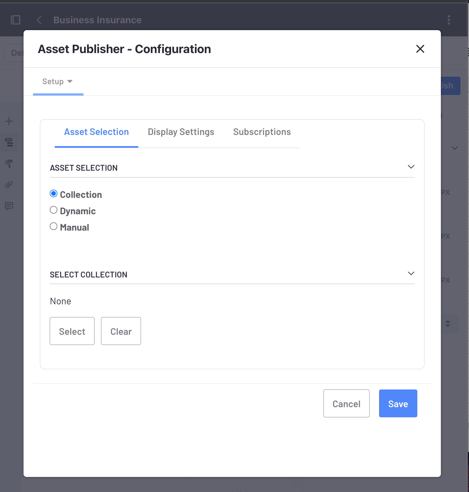
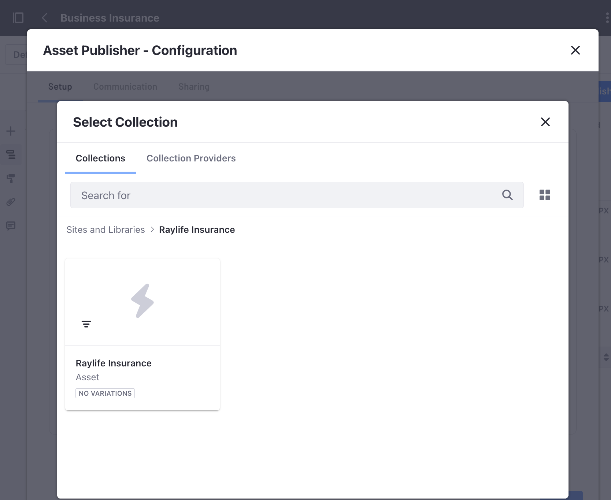

---
taxonomy-category-names:
- Sites
- Widgets
- Liferay Self-Hosted
- Liferay PaaS
- Liferay SaaS
uuid: 8aba958f-0074-4664-bacd-fb45d164632e
---
# Selecting Assets in the Asset Publisher Widget

You can configure the Asset Publisher widget to select assets dynamically based on specific criteria, or manually, specifying exactly what assets to display. You can also display assets from [collections](../../../site-building/displaying-content/collections-and-collection-pages/about-collections-and-collection-pages.md).

```{note}
On Liferay 7.2 and below, collections are referred to as [content sets](../../../site-building/displaying-content/collections-and-collection-pages/about-collections-and-collection-pages.md#liferay-dxp-7-2).
```

1. Create a [new page](../../creating-pages/adding-pages/adding-a-page-to-a-site.md) or [edit an existing one](../../creating-pages/using-content-pages/adding-elements-to-content-pages.md)

1. Click *Add* (  ) to open the Fragments and Widgets panel.

1. Under the Content Display category in the Widgets tab, drag the *Asset Publisher* widget to a place on the page.

1. Click *Actions* () at the top-right corner of the Asset Publisher widget.

   

1. Select *Configuration* to display the Configuration dialog.

   Under Asset Selection, select how you want to filter your assets. For a description of these options, see [Asset Selection Options](#asset-selection-options).

   

1. Optionally, when [Dynamic](#dynamic) and [Manual](#manual) Asset Selection options are selected, a new collection can be created by clicking *Create a collection from this configuration*. This saves the configuration as a new [collection](../../../site-building/displaying-content/collections-and-collection-pages/about-collections-and-collection-pages.md).

1. Once you select your assets and configure the widget, click *Save*.

## Asset Selection Options

You can use different options to select the assets in the Asset Publisher dialog's Asset Selection section:

- [Collection](#collection)
- [Dynamic](#dynamic)
- [Manual](#manual)

### Collection

Select this option to choose from your previously saved collections or collection providers. To learn more about collections, read [About Collections and Collection Pages](../../../site-building/displaying-content/collections-and-collection-pages/about-collections-and-collection-pages.md).

 1. Under Select Collection, click *Select*.

 1. Select either the *Collections* or *Collections Providers* tab

 1. Choose one of your existing collections or collection providers.

 1. Click *Save*.

 

```{note}
Developers can use collection providers to create specific collections with more advanced criteria. To learn more, read the information about [Creating an Information List Provider](https://help.liferay.com/hc/en-us/articles/360029067271-Creating-an-Information-List-Provider) in the [Info Framework](https://help.liferay.com/hc/en-us/articles/360029067251-Introduction-to-The-Info-Framework) developer documentation.
```

### Dynamic

Using the Dynamic asset selection, you can include assets in the Asset Publisher widget automatically, based on different criteria.

  1. In the Source section, use the Asset Type drop-down menu to select your assets. Select a specific asset type or *Select More Than One* to choose from different types.

  1. In the Scope section, choose to display assets from an individual site or other sites.

  1. In the Filter section, define the rules for the assets in your Asset Publisher widget. You can define rules based on [categories](../../../content-authoring-and-management/tags-and-categories/defining-categories-and-vocabularies-for-content.md), [tags](../../../content-authoring-and-management/tags-and-categories/tagging-content-and-managing-tags.md), or keywords.

  1. Include a Custom User Attribute if you have defined one.

  1. In the Ordering section, choose the presentation order of assets in the Asset Publisher widget.



### Manual

Here you can set parameters and manually filter specific assets:

 1. In the Scope section, choose to display assets from an individual site or other sites.

 1. In the Asset Entries section, use the Select button to filter for specific types of assets.

 1. For the type of asset you select, check the assets you want to include.

 1. Click *Add*.

 

 ```{note}
 A new collection is created based on your selection.
 ```

## Related Topics

- [Displaying Assets Using the Asset Publisher Widget](./displaying-assets-using-the-asset-publisher-widget.md)
- [Configuring the Asset Publisher Display Settings](./configuring-asset-publisher-display-settings.md)
- [About Collections and Collection Pages](../../../site-building/displaying-content/collections-and-collection-pages/about-collections-and-collection-pages.md)
