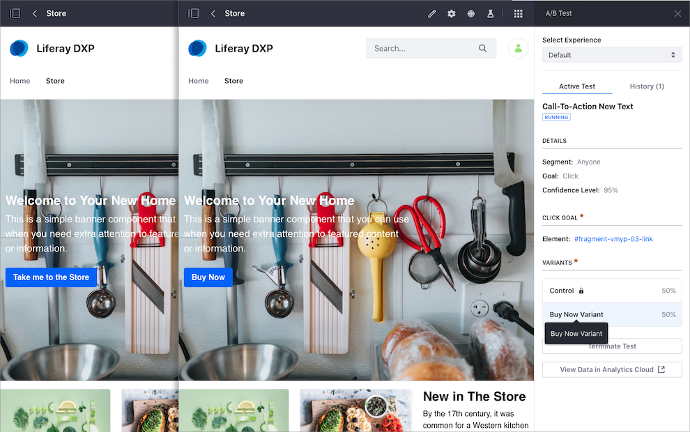

---
toc:
  - ./ab-testing/verifying-ab-test-requirements.md
  - ./ab-testing/creating-ab-tests.md
  - ./ab-testing/running-and-monitoring-ab-tests.md
  - ./ab-testing/reviewing-ab-test-results-and-publishing-test-variants.md
taxonomy-category-names:
- Personalization
- A/B Testing
- Liferay Self-Hosted
- Liferay PaaS
- Liferay SaaS
uuid: e644dfdd-84a1-427d-a286-9daa1e03eaa2
---
# A/B Testing

{bdg-secondary}`Liferay DXP 7.2 SP1+`

With A/B Testing, you can determine the most effective version of your content by testing variations on different users. The majority of visitors see the current content and design of your page, while a select group sees an alternative *Variant*. You can then test the performance of the current page and the variant to determine which version performs better for a given goal, such as *bounce rate* or *clickthrough*.

Consider the following example. A bank's marketing team creates a Content Page advertising a new credit card. The page has been published for a few weeks, but a redesign might help to promote the new credit card better. The marketing team uses A/B Testing to test a new page Variant at random to visitors so they can compare the clickthrough rate for each page version. If the new variant is more effective than the original page, they can publish it and replace the original page.

To run A/B Tests, you must have your Liferay DXP instance [connected to Liferay Analytics Cloud](https://learn.liferay.com/w/analytics-cloud/getting-started/connecting-liferay-dxp-to-analytics-cloud). Here's the process:

- You create the A/B test in Liferay DXP.
- The A/B test automatically synchronizes with Analytics Cloud.
- Start or terminate the A/B test in Liferay DXP.
- Liferay DXP and Analytics Cloud show your test's status and the results of the variant.
- You manage other aspects of your A/B test in Analytics Cloud (test history, statistics, variant performance, etc.)

!!! important
    A/B testing is not supported if [staging](../../site-building/publishing-tools/staging.md) is enabled in your Liferay instance.

For more information about working with A/B Testing in Analytics Cloud, [A/B Testing](https://learn.liferay.com/w/analytics-cloud/optimization/a-b-testing).

## Related Topics

- [Verifying A/B Test Requirements](./ab-testing/verifying-ab-test-requirements.md)
- [Creating A/B Tests](./ab-testing/creating-ab-tests.md)
- [Running and Monitoring A/B Tests](./ab-testing/running-and-monitoring-ab-tests)
- [Reviewing A/B Test Results and Publishing Test Variants](./ab-testing/reviewing-ab-test-results-and-publishing-test-variants.md)