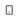
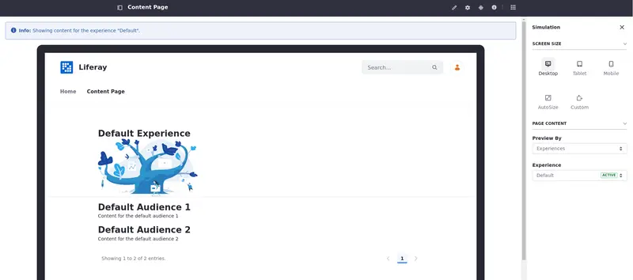

---
taxonomy-category-names:
- Sites
- Accessibility
- Liferay Self-Hosted
- Liferay PaaS
- Liferay SaaS
uuid: 4ce30a4a-1d13-4b1d-a48e-dad2594a31ba
---
# Using the Simulation Panel

{bdg-secondary}`Available Liferay DXP 2023.Q4+/Portal GA102+`

You can verify your page's responsiveness by simulating different scenarios.

With Liferay, use the Simulation panel to simulate different [screen sizes](#simulation-panel-screen-size) and combine it with [page content](#simulation-panel-page-content) directed at available [segments](../../personalizing-site-experience/segmentation/creating-and-managing-user-segments.md) or with different [experiences](../../personalizing-site-experience/experience-personalization/creating-and-managing-experiences.md) applied to the page.

## Accessing the Simulation Panel

The Simulation panel () is in the application bar.

Access the page using its address or through the Pages application to use the Simulation panel. To view a page through the Pages application,

1. Open the *Site Menu* () and navigate to *Site Builder* &rarr; *Pages*.

1. Find the page you want to view and click *Actions* () &rarr; *View*.

!!! important
    You need the Preview in Device permission to use the Simulation panel. It's located under Control Panel &rarr; Sites &rarr; Sites &rarr; Resource Permissions &rarr; Site. See [Defining Role Permissions](../../../users-and-permissions/roles-and-permissions/defining-role-permissions.md) to learn more about permissions.

## Simulation Panel: Screen Size

You have five options when simulating the screen size, three pre-defined values (desktop, tablet, or mobile), and two variable ones (autosize and custom). To simulate the content, click *Options* ([Options](../../../images/icon-options.png)).

| Option | Height | Width |
| ---: | :--- | :--- |
| Desktop () | 1050 px  | 1300 px |
| Tablet () | 900 px  | 808 px |
| Mobile () | 640 px  | 400 px |
| Autosize () | Adapts to window[^1] | Adapts to window |
| Custom () | Custom input[^2] | Custom input |

[^1]: The autosize option adapts the simulation to the window's size.

[^2]: Enter a custom value to the height and width of the simulated screen.

## Simulation Panel: Page Content

If you have segments or experiences in place, you can also simulate the content based on segment or experience applied. With the simulation panel, you can visualize how the experiences and segments look in a simulated screen.

1. In the first selector, choose *Segments* or *Experiences* under Preview By to see the available segments and experiences in the second selector.

1. If there are available segments or experiences, select them in the second selector.

!!! note
    A message on top of the simulated content provides information about the applied segment/experience.

## Related Topics

[Building a Responsive Site](../building-a-responsive-site.md)

[Creating and Managing User Segments ](../../personalizing-site-experience/segmentation/creating-and-managing-user-segments.md)

[Creating and Managing Experiences](../../personalizing-site-experience/experience-personalization/creating-and-managing-experiences.md)