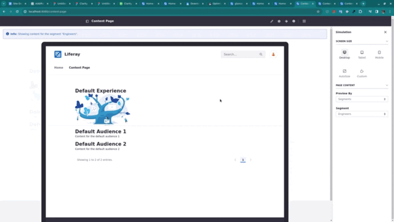

# Using the Simulation Panel

{bdg-secondary}`Available Liferay DXP 2024.Q1+`

```{important}
This feature is currently behind a release feature flag. Read [Release Feature Flags](../../../system-administration/configuring-liferay/feature-flags.md#release-feature-flags) for more information.
```

One of the ways to ensure the page is responsive is by simulating different scenarios (e.g., different screen sizes and different devices) and making necessary adjustments.

With Liferay, you can easily do that with the Simulation panel. Simulate different screen sizes and combine this visualization with page content directed at the available [segments]() or with different [experiences]() applied to the page.

The Simulation panel () is located in the application bar while viewing a page.

```{note}
You need the Preview in Device permission to use the Simulation panel. It's located under Control Panel > Sites > Sites > Resource Permissions > Site. See [Defining Role Permissions](../../../users-and-permissions/roles-and-permissions/defining-role-permissions.md) to learn more about permissions.
```

## Simulation Panel: Screen Size

There are three pre-defined screen size values (desktop, tablet, or mobile) and two variable values (autosize and custom).

| Option | Height | Width |
| :--- | :--- | :--- |
| Desktop () | 1050 px  | 1300 px |
| Tablet &nbsp; () | 900 px  | 808 px |
| Mobile &nbsp; () | 640 px  | 400 px |
| Autosize () | Adapts to window*  | Adapts to window |
| Custom () | Custom input**  | Custom input |

\* The autosize option adapts the simulation to the window's size.

** Enter a custom value to the height and width.

## Simulation Panel: Page Content

If you have segments or experiences in place, you can also simulate the page based on the content directed at those groups.

In the first selector, Select *Segments* or *Experiences* under Preview By to see the available segments and experiences.

If there are availabe segments or experiences, you can select them in the second selector.

```{note}
A message appears on top of the simulated content with information about the segment/experience.
```

With two experiences in place (Engineers and QA Engineers), you can simulate different content shown in a page.

