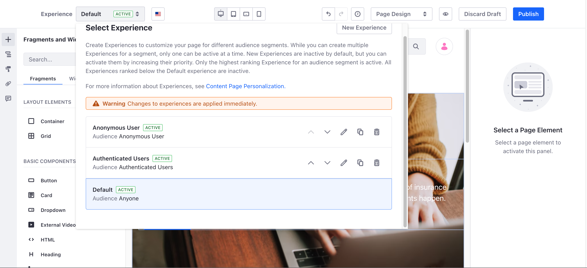

---
taxonomy-category-names:
- Personalization
- Static and Dynamic User Segments
- Liferay Self-Hosted
- Liferay PaaS
- Liferay SaaS
toc:
  - ./personalizing-site-experience/segmentation.md
  - ./personalizing-site-experience/experience-personalization.md
  - ./personalizing-site-experience/migration-from-audience-targeting.md
  - ./personalizing-site-experience/enabling-automated-live-chat-systems.md
  - ./personalizing-site-experience/using-the-accessibility-menu.md
uuid: 7ce0d5f8-e933-4eb3-8fe4-7588d0b00244
---

# Personalizing Site Experience

Liferay DXP provides powerful tools out-of-the-box for understanding and delivering personalized experiences to users.

For example, you can create [user segments](./personalizing-site-experience/segmentation/creating-and-managing-user-segments.md) and map them to different [experiences](./personalizing-site-experience/experience-personalization/creating-and-managing-experiences.md). With experiences in place, [personalize collections](./personalizing-site-experience/experience-personalization/personalizing-collections.md) and customize the way the content or the [pages](./personalizing-site-experience/experience-personalization/content-page-personalization.md) that users see.

!!! tip
    When a user belongs to multiple segments, you can [prioritize a certain personalized variation](./personalizing-site-experience/experience-personalization/personalizing-collections.md#creating-personalized-variations) or [combine collection entries from all segments](./personalizing-site-experience/experience-personalization/personalizing-collections.md#combining-collection-entries-from-all-segments).

## Segmentation

Using the Segment Builder, you can group similar users by user profile attributes, behavior, site role, and more.

See [Creating and Managing a Segment](./personalizing-site-experience/segmentation/creating-and-managing-user-segments.md) to get started.

!!! note
    You can assign roles to user segments. See [Assigning Roles to User Segments](../users-and-permissions/roles-and-permissions/assigning-roles-to-user-segments.md) for more information.

### Tracking Behavior of User Segments with Liferay Analytics Cloud

Supercharge your segments by integrating your Liferay DXP instance with Liferay Analytics Cloud. Analytics Cloud integrates DXP with Salesforce(tm) and other data sources to provide even more ways to understand your user base.

Integration with Analytics Cloud provides in-depth, machine-learning powered, data analytics to understand user behavior and engagement on every page of your DXP site. Analytics Cloud enables you to see user behavior and interaction with both standard and targeted content. See [Getting Analytics for User Segments](./personalizing-site-experience/segmentation/getting-analytics-for-user-segments.md) for more information.

## Personalization

Once you [create user segments](./personalizing-site-experience/segmentation/creating-and-managing-user-segments.md), you can begin tailoring site [experiences](./personalizing-site-experience/experience-personalization/creating-and-managing-experiences.md) specific to a user segment. Content page personalization and content set personalization are two methods you can use to deliver personalized user experiences.

### Content Pages

Content page personalization dynamically changes the page layout and content based on the current user. You can create experiences that provide different text, images, widgets, and even different layouts for any [content page](./creating-pages/using-content-pages.md) based on the current user's user segment criteria. See [Content Page Personalization](./personalizing-site-experience/experience-personalization/content-page-personalization.md) for more information.

### Collections

[Collections](./displaying-content/collections-and-collection-pages/about-collections-and-collection-pages.md) organize and display content. [Collections personalization](./personalizing-site-experience/experience-personalization/personalizing-collections.md) provides a selection of collections based on user segments. This means the content set that appears in a given context is determined by the [user segment](./personalizing-site-experience/segmentation/creating-and-managing-user-segments.md) criteria. For example, you could use a collection to show "featured" articles at the top of a page. Then you could create user segments containing users who should receive more specialized content, rather than the default. Those segments would then see content personalized to their interest rather than the default. See [Personalizing Collections](./personalizing-site-experience/experience-personalization/personalizing-collections.md) for more information.

!!! note
    Collections are named Content Sets in Liferay DXP 7.2.

### Previewing User Experiences

You can preview the different experiences that users can have on a page by clicking the *Simulation* button () at the top of the page and selecting a user segment from the Segments selection to preview the page as a member of that user segment.

Viewing the perspective of a user segment previews any personalizations for content pages or content sets for that User Segment.

