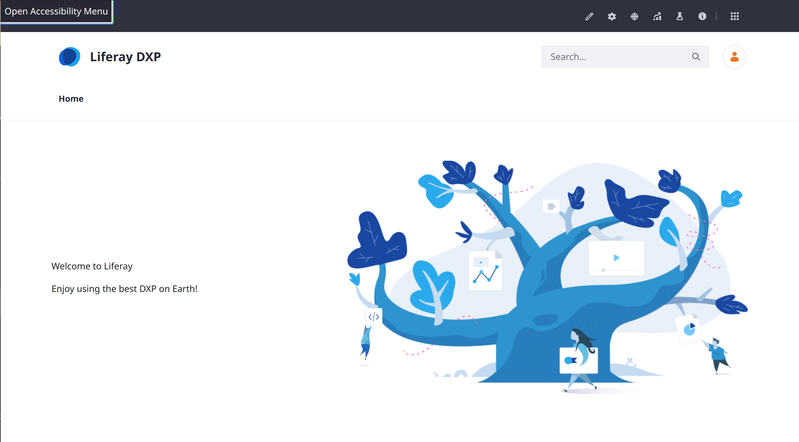

---
taxonomy-category-names:
- Accessibility
- Liferay Self-Hosted
- Liferay PaaS
- Liferay SaaS
- Personalization
- Site Administration
- Site Appearance and Design
uuid: 1e13aa26-d97b-40ac-a78e-d72865e016e9
---
# Using the Accessibility Menu

{bdg-secondary}`Liferay DXP 2024.Q2+/Portal 7.4 GA120+`

When you enable the accessibility menu, the site's users can customize their own experience browsing Liferay sites. Once enabled, users can configure the following behaviors:

**Underlined Links:** Force an underline effect to increase the visibility of links.

**Increased Text Spacing:** Increase horizontal spacing between text characters to increase readability.

**Expanded Text:** Expand all truncated text to show complete messages by default.

**Reduced Motion:** Stop all motion and animations to hide transitions and other movement effects.

<!-- no table, just sentences and screenshots for each. maybe in addition to the table -->
| Setting | When enabled... |
| --- | --- |
| Underlined Links | Force an underline effect for all links to increase their visibility. |
| Increased Text Spacing | Increase horizontal spacing between text characters. |
| Expanded Text | Expand all truncated text. |
| Reduced Motion | Stop all motion and animations. |

## Enabling the Accessibility Menu

You can enable the accessibility menu at the [site or instance scope](../../../system-administration/configuring-liferay/understanding-configuration-scope.md). If you have a self-hosted Liferay you cna also enable it at the system scope.

SCREENSHOT

1. To enable the menu at the site scope, open the Site Menu () &rarr; Configuration &rarr; Site Settings. 

   To enable the menu at the instance scope, open the Global Menu () &rarr; Control Panel &rarr; Instance Settings.

1. Find the Accessibility entry and click *Enable Accessibility Menu*.

1. Click *Save* or *Update*.

## Using the Accessibility Menu

1. Once enabled, refresh the browser window and click the Tab key twice. The option for opening the accessibility menu appears.

   

1. Click Enter to open the menu.

   

1. Toggle the desired options and close the window (click the X or press ESC) when finished.

Menu for configuring accessible features that might impact the default user experience.

One Tab opens the Skip to Content option (useful for navigating with the keyboard, and then tab again to see the Open Accessibility Menu option.

Or click Shift Tab repeatedly to nav bakwards to get to it

It's also an option in the user personal menu

The configurations are per-user, so the experience is customizable for a user's individual preferences

Link to Enabling User Personalization of Widget Pages

We need to document Skip to Content too
