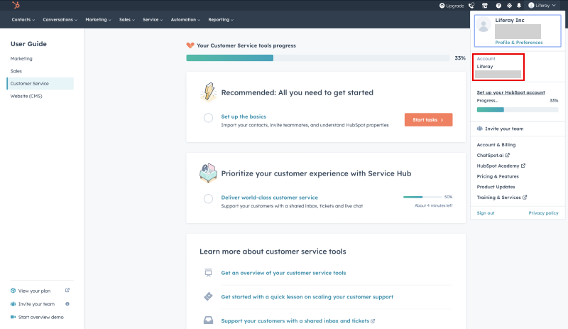

# Hubspot

[Hubspot](https://www.hubspot.com/) is a CRM platform that includes live chat functionality. [Enabling integration](../../enabling-automated-live-chat-systems.md) with Hubspot requires the creation of a live chat and your Hubspot User Account ID.

```{important}
You must have an active live chat to enable integration with Hubspot. To create and configure a live chat, follow the steps in [Hubspot's Knowledge Base](https://knowledge.hubspot.com/chatflows/create-a-live-chat).
```

## Locating Your Hubspot User Account ID

1. Log in to your [Hubspot Account](https://app.hubspot.com/login).

1. Go to your profile in the top right corner.

    Copy the account number that corresponds to the channel you want to use. This number corresponds with the Chat Provider Account ID used when enabling Click to Chat on Liferay Portal.

    