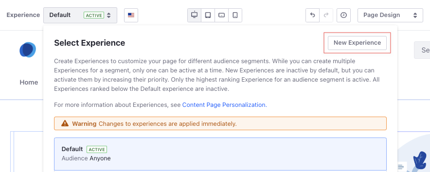
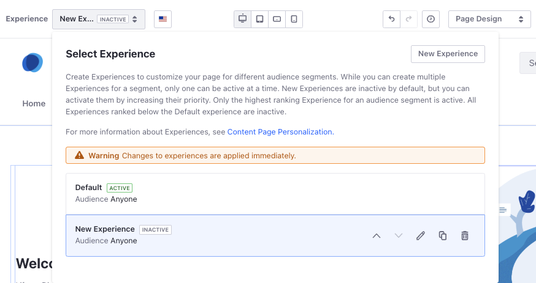

# Creating and Managing Experiences

{bdg-secondary}`Available Liferay 7.4+, 7.3 FP1+, and 7.2 FP11+`

You can customize your content page for different groups of users using *Experiences*. See [Content Page Personalization](./content-page-personalization.md) to learn how experiences can contribute to site personalization.

## Creating Experiences

1. Open the *Site Menu* () and go to *Site Builder* &rarr; *Pages*.

1. Click *Actions* () for an content page and select *Edit*. Alternatively, [create a content page](../../creating-pages/using-content-pages.md).

1. Open the *Experience* drop-down menu and click *New Experience*.

   

1. Enter a name for the experience and select the audience segment you want to target. Alternatively, [create a segment](../segmentation/creating-and-managing-user-segments.md).

   By default, new experiences target the *Anyone* segment (i.e., all site visitors).

1. Design the content page to determine the information and layout that appears for the targeted segment.

1. Open the *Experience* drop-down menu and click the *Up* () or *Down* () buttons to set the experience's priority.

   Site visitors see the highest ranking experience for their segment. See [Understanding How Experiences Work](./content-page-personalization.md#understanding-how-experiences-work) for more information.

1. Click *Publish*.

```{tip}
If users are logged in and have permission to edit the page, and there are multiple experiences in place, they can [view/preview the page](../../creating-pages/adding-pages/adding-a-page-to-a-site.md#previewing-pages) based on the experience they select.
```

## Managing Experiences

When you edit a content page, you can click the experience to manage the options for that page.



1. Open the *Site Menu* () and go to *Site Builder* &rarr; *Pages*.

1. Click *Actions* () for a content page and select *Edit*.

1. Open the *Experience* drop-down menu. From here,

   * Set the experience priority, using the Up () and Down () controls.
   * Edit () the experience's name or the selected segment.
   * Duplicate () the experience.
   * Delete () the Experience.

   ```{important}
   The order of experiences in the drop-down menu determines their priority. See [Understanding How Experiences Work](./content-page-personalization.md#understanding-how-experiences-work) for more information.
   ```

## Related Information

- [Content Page Personalization](./content-page-personalization.md)
- [Personalizing Collections](./personalizing-collections.md)
- [Creating and Managing User Segments](../segmentation/creating-and-managing-user-segments.md)
