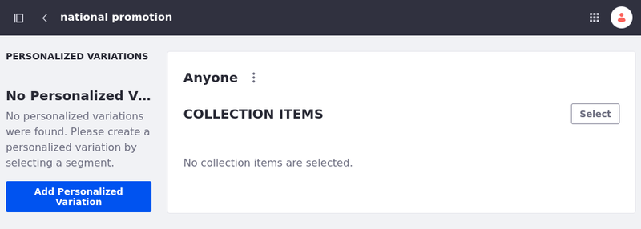
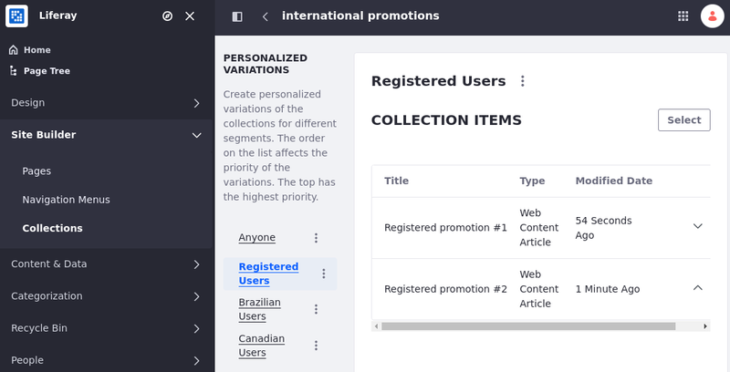

---
taxonomy-category-names:
- Personalization
- Experience Personalization
- Collections
- Liferay Self-Hosted
- Liferay PaaS
- Liferay SaaS
uuid: 5f12dd5f-aceb-4923-b761-bcb2906d8b9a
---
# Personalizing Collections

{bdg-secondary}`Liferay Portal 7.3 GA6 / DXP 7.3+`

By default, any user can see all the collection's content and is part of the Anyone personalized variation. However, you can create a personalized variation of the collection's items using [segments](../segmentation/creating-and-managing-user-segments.md). When you use a personalized variation, the items that are part of your collection don't change, but the collection page, collection display fragment, or asset display widget show the items filtered for the segment.

```{important}
To customize a collection using segments and set personalized variations for collections, you must define segments first. For more information, see [Creating and Managing User Segments](../segmentation/creating-and-managing-user-segments.md).
```



Consider the following example. You want to increase sales in your online Kitchenware Store by offering exclusive promotions to registered users. You create a collection including promotions for registered users and news about your products. You want all users to see the news about your products, but you want to restrict the promotions to registered users. In this example, you can create a new segment for registered users, and link the segment to a new personalized variation that filters the promotional content.

```{tip}
Create multiple personalized variations for a collection, and edit or delete them as needed. You can also edit the Anyone personalized variation, but you cannot delete it.
```

## Creating Personalized Variations

After you create [segments](../segmentation/creating-and-managing-user-segments.md) for your users, you can add personalized variations for collections based on those segments.

1. Open the *Site Menu* (  ) and navigate to *Site Builder* &rarr; *Collections*.

1. Create a [collection](../../../site-building/displaying-content/collections-and-collection-pages/creating-collections.md) or select an existing one.

1. Click *Add Personalized Variation*.

   If you already have a personalized variation in place and you have other available segments, add new personalized variations by clicking *Add* () next to Personalized Variations.

1. Choose a Segment and customize the collection accordingly.

You can now control what users can see by [prioritizing personalized variations](#personalizing-collections) or [combining collection entries from all segments](#combining-collection-entries-from-all-segments).

## Prioritizing Variations

{bdg-secondary}`for Liferay DXP 7.4+`

For situations where a user may belong to multiple segments, you can [combine collections entries](#combining-collection-entries-from-all-segments) from all the segments to which the users belong or prioritize a personalized variation to determine which personalized variation is displayed to a user.

When editing a collection, access a sortable list for the personalized variations and change the rank of a variation by clicking its *Actions* button (  ) and selecting *Prioritize* or *Deprioritize*. You can also drag and drop variations to reorder their priority.

```{note}
Priority is assigned according to the position of each item in the list. The highest priority is the position at the top of the list.
```


## Combining Collection Entries From All Segments

With users that belong to multiple [segments](../segmentation/creating-and-managing-user-segments.md), you can combine and show collection entries from all the segments to which they belong instead of showing only the default entries or the [prioritized](#prioritizing-variations) personalized variation.

1. Open the *Global Menu* (  ) and select the *Control Panel* tab &rarr; *System Settings* under Configuration.

1. Under Content and Data, select *Assets*.

1. Under System Scope, select *Collections*.

1. Enable the feature for Dynamic and Manual Collections.

1. Click *Save*.


Users that belong to multiple segments can now see content from all segments.

For example, there are three segments: Registered Users, Brazilian Users, and Canadian users. If you are a registered user, you see only the content selected for that segment. The same works for Brazilian and Canadian users. However, if you are a Registered User who lives in Brazil, you can see the content selected for both segments. If you don't belong to any segment, you see the content set to Anyone.



## Liferay DXP 7.2

### Content Set Personalization

Now, you'll use [segments](../segmentation/creating-and-managing-user-segments.md) to demonstrate content set personalization. For this example, create a content set to be the default displayed on the Home page. Then you'll modify it to create a personalized variation containing technical articles for members of the American Engineers segment.

If you're not familiar with content sets, see the [Creating Content Sets](../../../site-building/displaying-content/collections-and-collection-pages/creating-collections.md#creating-content-sets) article before you get started here.

#### Creating and Setting the Default Content Set

First create the default content set and configure it on the Home page using the asset publisher.

1. Open the *Site Menu* (  ) and navigate to *Content and Data* &rarr; *Content Sets*.

1. Click *Add* (  ) and choose *Manual Selection*.

1. Name it *Home Page Content*.

1. For the new content set, click *Select* next to Asset Entries and select *Basic Web Content*.

   

1. On the Select Basic Web Content page, select the content you want to add and click *Add*.

1. Navigate to the Home page and add an Asset Publisher widget to the page.

1. Open *Configuration* for the Asset Publisher.

1. Under Asset Selection select *Content Set*.

1. Under Select Content Set click *Select*, choose *Home Page Content*, and click *Save*.

Now the content set you configured appears in the Asset Publisher widget on the home page. Next configure the content set for personalization.

#### Personalizing the Content Set

Now create the content set for engineers and configure its display.

1. Go back to the content set from Site Administration.

1. Click *New Personalized Variation* and select the American Engineers segment

   

1. Click *Select* next to Asset Entries and select *Basic Web Content*.

1. Select articles appropriate to an engineering audience and click *Add*.

Now anytime a member of the American Engineers segment views this content set being displayed, they see the personalized version and not the default. Test this now, using the Simulator.

## Related Information

- [Content Page Personalization](./content-page-personalization.md)
- [Collections and Collection Pages](../../../site-building/displaying-content/collections-and-collection-pages.md)
- [Creating User Segments](../segmentation/creating-and-managing-user-segments.md)
- [Assigning Roles to User Segments](../../../users-and-permissions/roles-and-permissions/assigning-roles-to-user-segments.md)
