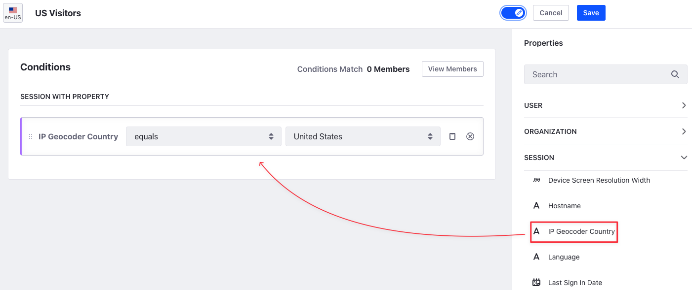
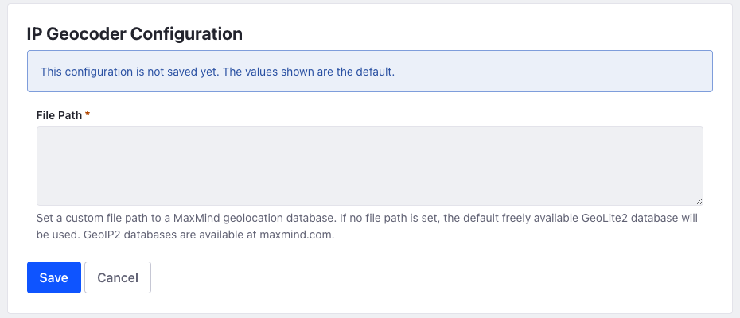

# Segmentation By Geolocation

{bdg-secondary}`Available Liferay DXP 7.4 U44+/GA44+`

You can configure *Segments* by geolocation to display different pages dynamically or content based on the user's country. To display different pages, you can use [Experiences](../experience-personalization/content-page-personalization.md#understanding-how-experiences-work), and to display specific content on the page, you can use [Collections](../experience-personalization/personalizing-collections.md).

## Creating a Segment by Geolocation

First, create a *User Segment* following the steps in [Creating User Segments](./creating-and-managing-user-segments.md#creating-user-segments).

1. Once created, drag and drop the *IP Geocoder Country* session property onto the canvas.

1. Select one of the four conditions from the comparison drop-down: *equals*, *not equals*, *contains*, *not contains*.

   

1. Select a Country from the Country drop-down.

1. Click *Save*.

You can combine multiple properties with conditions. See [Configuring Segment Conditions](./creating-and-managing-user-segments.md#configuring-segment-conditions) to learn more about combining conditions. Once created, you can use this Segment to create personalized experiences for users. See [Content Page Personalization](../experience-personalization/content-page-personalization.md) and [Personalizing Collections](../experience-personalization/personalizing-collections.md) for more information.

## Configuring the Geolocation Database

A geolocation database contains a mapping between IP addresses and their countries of origin. To configure this,

1. Open the *Global Menu* () and go to *Control Panel* &rarr; *System Settings*.
1. Click on *Third Party* from the *Platform* section.

   

1. Click *IP Geocoder Configuration* from the left menu to set the path to a custom geolocation database.

The file path is empty by default. When empty, it uses the free [GeoLite2](https://dev.maxmind.com/geoip/geolite2-free-geolocation-data?lang=en) database to resolve IP addresses. Optionally, you can set the path to a different geolocation database with the `.mmdb` extension on your server to override the default database.

## Additional Information

* [Configuring Segment Conditions](./creating-and-managing-user-segments.md#configuring-segment-conditions)
* [Content Page Personalization](../experience-personalization/content-page-personalization.md)
* [Personalizing Collections](../experience-personalization/personalizing-collections.md)
