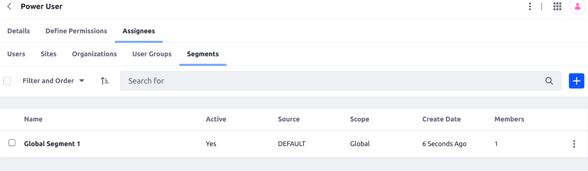

# Segments Admin Settings

{bdg-secondary}`Available Liferay DXP/Portal 7.3+`

You can configure *Segments* behavior at the system or instance level.

<!--
NOTE: It could help to give examples. What sort of things can you configure?
e.g., "These settings determine..."

NOTE: Also, it might help to clarify how the scopes relate.
e.g., "When you enable settings at the system level, you can still disable them at the instance level. However, if you disable settings at the system level, you cannot enable them at the instance level."
-->

To access segment settings,

1. Open the *Global Menu* , click the *Control Panel* tab, and go to *System Settings* or *Instance Settings*.

   ```{note}
   Beginning with Liferay DXP 7.4 U38+/GA38+, you can configure segment settings at the instance level.
   ```

1. Click *Segments* in the Content and Data section.

## Analytics Cloud Segments


[Analytics Cloud segments](https://learn.liferay.com/analytics-cloud/latest/en/people/segments/segments.html) aggregate individuals based on common attributes and behavior. You can integrate this data with Liferay DXP's segments to deliver content of interest to both known and anonymous users.

These Liferay DXP settings are available for Analytics Cloud segments:

**Anonymous User Segments Cache Expiration Time**: Set a time limit (in seconds) for how long the anonymous segment cache is stored. When the time expires, the cache is cleared.

**Interest Terms Cache Expiration Time**: Set a time limit (in seconds) for how long the interest terms cache is stored. When the time expires, the cache is cleared. See [Understanding Interests](https://learn.liferay.com/analytics-cloud/latest/en/workspace-data/definitions/managing-interest-topics.html#understanding-interests) for more information.

**Update Interval**: Set the interval (in minutes) for receiving updates from Analytics Cloud segments. This setting is only available under system settings.

## Session Property Vocabularies

<!--NOTE: This section could use more info/context; cf. with the Analytics Cloud Segments section-->

Add session property vocabularies that you can use in the segments editor. See [Session Property Vocabularies](../../../content-authoring-and-management/tags-and-categories/session-property-vocabularies.md) for more information.

## Segments Service


<!--NOTE: This section could use an intro; cf. with the Analytics Cloud Segments section-->

**Enable Segmentation**: Enable or disable segmentation. While disabled, personalized variations of collections and experiences are not displayed to the end user.

**Enable Assign Roles by Segment**: Enable or disable the ability to assign roles to users dynamically using global segments. While enabled, you can assign roles automatically to groups of changing individuals. <!--NOTE: I think the following steps should be in a separate roles article (e.g., "Using Segments to Assign Roles Dynamically"). This would give the content more visibility. If such an article (or section in an article) already exists, this line should just link to the article.-->

To do this,

1. Open the *Global Menu*  and navigate to *Control Panel* &rarr; *Users*.

1. Click on *Roles*, and select a role of your choice.

1. Click the *Assignees* tab and click *Segments*.

1. Select a global segment of your choice. Users from that segment get assigned to the selected role dynamically.

   

**Compound Segments Interval**: Set the interval (in minutes) for checking and refreshing compound segments based on its rules. This setting is only available under system settings.

## Additional Information

* [Analytics Cloud Segments](https://learn.liferay.com/analytics-cloud/latest/en/people/segments/segments.html)
* [Session Property Vocabularies](../../../content-authoring-and-management/tags-and-categories/session-property-vocabularies.md)
