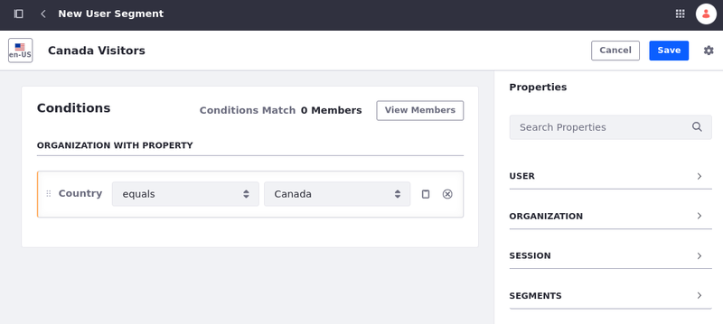

# Segments Editor UI Reference

You can use segments to organize users into different groups with common sets of properties. Follow these steps to access the segments editor UI.

1. Go to *Site Administration* and select the site that you wish to create segments for.

1. Open the *Site Menu* (), and navigate to *People* &rarr; *Segments*.

1. Click *Add* () to add new user segment.

At the top of the editor you can set the name, choose to *Save* the segments, or *Cancel* to discard the changes. In the Conditions section, you can view the current members of the segment as it is defined.

On the right side of the page, there's a *Properties* menu with these options:

- User
- Organization
- Session
- Segments

Operations and conjunctions are combined with the properties to define criteria.

## Operations and Conjunctions

Several types of information can be collected by the User Segment interface. Some data is entered in text boxes, while others use selectors to select specific criteria or tools like a date picker. Some fields use an operator, which, depending on the specific context lets you select the relationship between the user or agent data and the criteria.

* *equals*

* *not equals*

* *greater than*

* *greater than or equals*

* *less than*

* *less than or equals*

* *contains*

* *does not contain*

Depending on the nature of the criteria, the operator selection may contain different combinations. For example, the *Date* selection described below contains all the previously listed options except *contains* and *does not contain*, whereas the *Email Address* selection has *equals*, *not equals*, *contains* and *does not contain*.

In between each criteria and each category, you can define an *And/Or* conjunction. For *And*, all criteria must be true for the criteria to be satisfied. With *Or*, it is true if any of the defined criteria are true. You can also mix operators to create complex cases.

## User Properties

User properties are user attributes you want to capture. This is made up of user metadata as defined in their accounts, but also contains certain group memberships (like roles and user groups) as well as information like the date the user profile was last modified. These user properties are available:

| Property      | Description                                                                                                   |
|:--------------|:--------------------------------------------------------------------------------------------------------------|
| Date Modified | Provides a date picker and a relationship selector to select the date that user information was last changed. |
| Email Address | Provides a text box to enter the email provided in the user's profile.                                        |
| First Name    | Enter the first name provided in the user's profile.                                                          |
| Job Title     | Enter the job title provided in the user's profile.                                                           |
| Last Name     | Enter the last name provided in the user's profile.                                                           |
| Regular Role  | Select a role that the user is a member of.                                                                   |
| Screen Name   | Enter the users' screen name.                                                                                 |
| Site          | Select a site that the user is a member of.                                                                   |
| Team          | Select a team that the user is a member of.                                                                   |
| User          | Select a specific user from a list.                                                                           |
| User Group    | Select a user group that the user is a member of.                                                             |
| User Name     | The full name of the user.                                                                                    |

!!! note
    To display content for guest users through segments, select the *Signed In* session property and set its value to *False*. This action effectively represents an anonymous user, fulfilling the same purpose as the guest role.

Since Liferay DXP 7.2 SP2+, these properties are also available for users:

| Property      | Description                                                                                 |
|:--------------|:--------------------------------------------------------------------------------------------|
| Date of Birth | Provides a date picker and a relationship selector to select the date of birth of the user. |
| Tag           | Enter the tags that apply to the users.                                                     |

## Organization Properties

Organization properties is a selectable list of organizations to include in your segment. They contain similar criteria as the user selection, like *Name* and *Date Modified*. These organization properties are available:

| Property            | Description                                                               |
|:--------------------|:--------------------------------------------------------------------------|
| Date Modified       | Enter the date that the organization information was last modified.       |
| Hierarchy Path      | Enter the name of an ancestor organization.                               |
| Name                | Enter the name of the organization.                                       |
| Organization        | Select a specific organization.                                           |
| Parent Organization | Select a specific parent organization.                                    |
| Type                | Select the type of organization, if organization types have been defined. |

Since Liferay DXP 7.2 SP2+, these properties are also available for organizations:

| Property | Description                                                      |
|:---------|:-----------------------------------------------------------------|
| Country  | Select a specific country connected to the organization. |
| Region   | Select a specific region connected to organization.  |
| Tag      | Enter the tags that apply to the organization.                   |

## Session Properties

Session properties contains criteria based on the user's activity, browser, and system information. You can use this to target the user's device or OS, or for activity-based criteria like if a user entered the website through a specific campaign driven landing page. These session properties are available:

| Property                        | Description                                        |
|:--------------------------------|:---------------------------------------------------|
| Browser                         | Enter a property from the browser.                 |
| Cookies                         | Enter the name of a browser cookie.                |
| Device Brand                    | Enter the brand name of the device being used.     |
| Device Model                    | Enter the model name of the device being used.     |
| Device Screen Resolution Height | Enter the screen resolution height value.          |
| Device Screen Resolution Width  | Enter the screen resolution width value.           |
| Language                        | Select the current language.                       |
| Last Sign In Date               | Select the date of the user's last sign in.        |
| Local Date                      | Select the current date where the user is located. |
| Referrer URL                    | Enter the URL that the user last visited.          |
| Signed In                       | Select whether the user is signed in.              |
| URL                             | Enter the current URL.                             |
| User Agent                      | Enter a user agent property.                       |

Since Liferay DXP 7.2 SP2+, these properties are also available for the session:

| Property           | Description                                      |
|:-------------------|:-------------------------------------------------|
| Hostname           | Enter a virtual host name.                       |
| Request Parameters | Enter the name and value of a request parameter. |

Starting from Liferay DXP 7.4 U42+/GA42+, the following property is also available for the session:

| Property            | Description                                           |
|:--------------------|:------------------------------------------------------|
| IP Geocoder Country | Select a country to match with the user's IP address. |

## Segments Property

> Available: Liferay DXP/Portal 7.3+.

With the segments property, you can combine existing segments into a new compound segment. The compound segment inherits the properties from the segments it is based on, and updates the members automatically. For more information, see [Compound Segments](./creating-and-managing-user-segments.md#compound-segments).

## Related Topics

* [Creating and Managing User Segments](./creating-and-managing-user-segments.md)
* [Segmentation By Geolocation](./segmentation-by-geolocation.md)
* [Creating and Managing Experiences](../experience-personalization/creating-and-managing-experiences.md)
