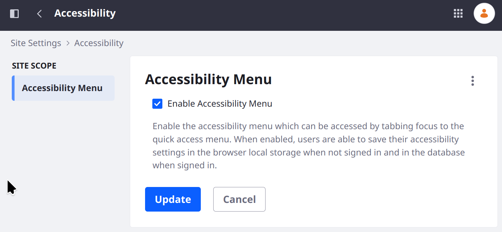
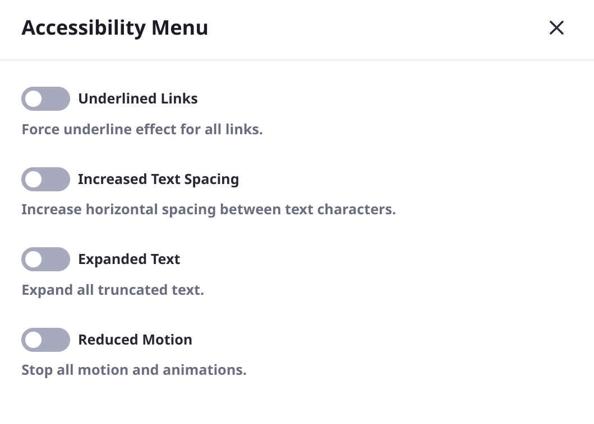
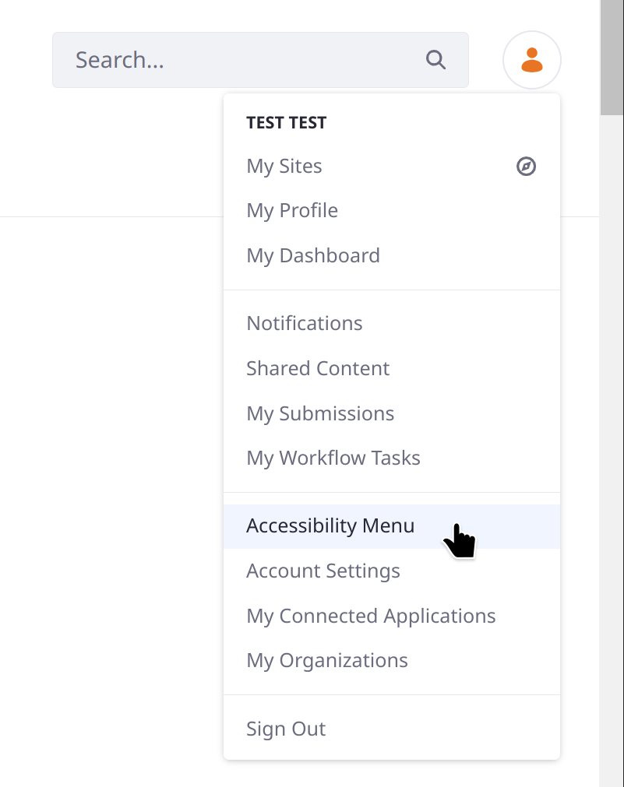
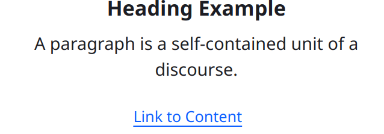
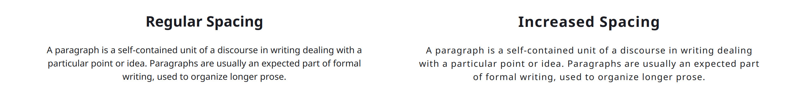

---
taxonomy-category-names:
- Accessibility
- Liferay Self-Hosted
- Liferay PaaS
- Liferay SaaS
- Personalization
- Site Administration
- Site Appearance and Design
uuid: 1e13aa26-d97b-40ac-a78e-d72865e016e9
---
# Using the Accessibility Menu

{bdg-secondary}`Liferay DXP 2024.Q2+/Portal 7.4 GA120+`

Most enhancements to accessibility in Liferay are propagated across the entire platform by default, so all your users can benefit from accessibility improvements. However, certain behaviors are better decided by the individual browsing the site. Beginning in Liferay DXP 2024.Q2/Portal 7.4 GA120, these settings are available in the accessibility menu.

When you enable the accessibility menu, the site's users can customize their experience with these settings:

| Setting | When enabled... |
| --- | --- |
| Underlined Links | Force an underline effect for all links to increase their visibility. |
| Increased Text Spacing | Increase horizontal spacing between text characters. |
| Expanded Text | Expand all truncated text. |
| Reduced Motion | Stop all motion and animations. |

## Enabling the Accessibility Menu

You can enable the accessibility menu at the [site or instance scope](../../system-administration/configuring-liferay/understanding-configuration-scope.md). If you have a self-hosted Liferay you can also enable it at the system scope.

1. To enable the menu at the site scope, open the Site Menu () &rarr; Configuration &rarr; Site Settings. 

   To enable the menu at the instance scope, open the Global Menu () &rarr; Control Panel &rarr; Instance Settings.

1. Find the Accessibility entry and click *Enable Accessibility Menu*.

1. Click *Save* or *Update*.

## Using the Accessibility Menu

1. Once enabled, refresh the browser window and click the Tab key twice. The option for opening the accessibility menu appears.

   

1. Click Enter to open the menu.

   

1. Alternatively, open the user menu and click *Accessibility Menu*.

   

1. Toggle the desired options and close the window (click the X or press Esc) when finished.

You can use Tab (forward navigation through UI elements) or Shift+Tab (for backwards navigation) to return to the menu. You may have to repeat the keystrokes several times depending on where your context is when you begin searching for the accessibility menu.

## Settings Reference

**Underlined Links:** Force an underline effect to increase the visibility of links.

**Increased Text Spacing:** Increase horizontal spacing between text characters to increase readability.

**Expanded Text:** Expand all truncated text to show complete messages by default.

**Reduced Motion:** Stop all motion and animations to hide transitions and other movement effects.

## Related Topics

* [Site Settings](../site-settings.md)
* [Analyze SEO and Accessibility on Pages](../../content-authoring-and-management/page-performance-and-accessibility/analyze-seo-and-accessibility-on-pages.md)
