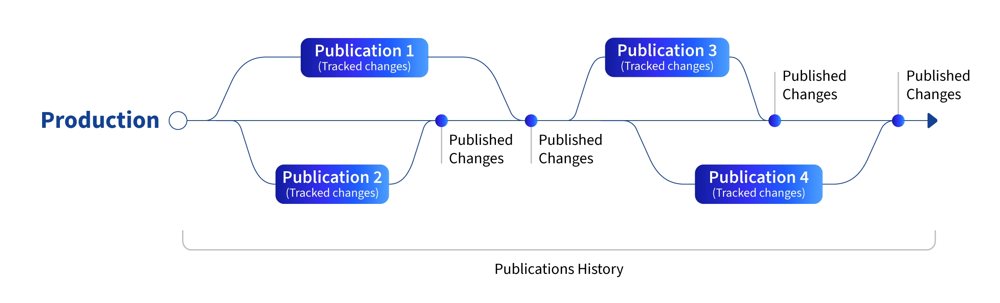

---
taxonomy-category-names:
- Platform
- Publishing Tools
- Liferay Self-Hosted
- Liferay PaaS
- Liferay SaaS
uuid: 3f178831-336f-42d9-9d64-cc360c7b1211
---

# Comparing Publishing Tools

Liferay provides two publishing tools for content creation and site building: Publications and Staging. Publications is recommended over Staging in nearly all use cases because it provides a superior collaboration experience and greater integration with other Liferay features. The one exception is if you must host your working and production environments on separate servers. For this you must use Remote Live staging.

<!-- [$LIFERAY_LEARN_YOUTUBE_URL$]=https://www.youtube.com/embed/xPVWyMrTa3k -->

## Publications

Publications is a change-tracking tool for editing sites and content. With it, contributors can create working environments called *publications* where they make edits without affecting the production environment's published site. Each publication is company-scoped and can group changes across multiple sites and asset libraries. You can create as many publications as needed for your projects and teams.

By default, access to a publication is limited to its creator. However, creators can invite other members and assign them roles specific to each publication. Since publications are independent, contributors can make and publish their changes without affecting one another. Contributors to a publication can work on their own timelines and publish their changes when ready.

During the publishing process, Liferay checks for conflicts with production and prompts the user to review and resolve them. Some conflicts can be resolved automatically, while others require manual resolution. Once published, the changes are propagated to other publications if there are no conflicts. Publications maintains a detailed history of published changes so you can quickly review and revert changes if needed.

Together, these features provide a superior editing and collaboration experience. See [Enabling Publications](./publications/enabling-publications.md) to set up Publications for your instance.

!!! important
    Beginning with Liferay 7.4 U44/GA44, Publications is fully integrated with [Workflow](../../process-automation/workflow.md), so you can enable workflows for entities tracked by Publications.

## Staging

With Staging, contributors work in a shared *staging* environment before publishing their changes to a *live* environment. Users enable staging for sites and asset libraries individually. When enabled, Liferay creates a separate copy of the original site or library and hosts them on either the same server ([Local Live](./staging/configuring-local-live-staging.md)) or on separate servers ([Remote Live](./staging/configuring-remote-live-staging.md)).

All changes are site- or asset library-scoped. Within the site or asset library, you can determine the exact pages and application data you want to stage. Only changes to explicitly staged data are tracked. Publish your changes when ready, either individually or all together, while the live environment handles incoming user traffic.

While Publications is recommended over Staging, Remote Live staging is necessary if you use a multi-tier architecture for your deployment model or have different security requirements for your working and production environments. This is because Publications does not currently offer a remote option. In all other use cases, use Publications.

!!! important
    If you must use Staging, you should enable it at the beginning of development. When enabled, Staging immediately begins copying data between your environments, which can cause errors if a lot of data already exists. Staging works best by publishing data frequently in small blocks. Publishing changes incrementally helps avoid publishing errors.

## Feature Comparison

| Feature                                                                                | Publications | Staging  |
|:---------------------------------------------------------------------------------------|:-------------|:---------|
| Host your working and production environments on the same server                       | &#10004;     | &#10004; |
| Host your working and production environments on separate servers                      | &#10008;     | &#10004; |
| Supports Asset Libraries                                                               | &#10004;     | &#10004; |
| Create and manage separate working environments for different projects and teams       | &#10004;     | &#10008; |
| Comment on blocks of changes                                                           | &#10004;     | &#10008; |
| Use custom workflows                                                                   | &#10004;     | &#10004; |
| Preview changes before publishing                                                      | &#10004;     | &#10004; |
| Review differences between working and production environments                         | &#10004;     | &#10008; |
| Include changes from multiple sites or asset libraries in the same working environment | &#10004;     | &#10008; |
| Schedule when to publish changes                                                       | &#10004;     | &#10004; |
| Automatically send notifications/alerts for publishing events                          | &#10004;     | &#10004; |
| Maintain a detailed history of all published changes                                   | &#10004;     | &#10008; |
| Revert published changes to pages                                                      | &#10004;     | &#10004; |
| Revert published changes to content                                                    | &#10004;     | &#10008; |

### Supported Pages and Content Types

{bdg-secondary}`Liferay 7.4 U86+/GA86+`

Liferay's publishing tools support the following types of pages and content:

| Feature                      | Publications | Staging  |
|:-----------------------------|:-------------|:---------|
| Accounts (Contact Info Only) | &#10004;     | &#10008; |
| Blogs                        | &#10004;     | &#10004; |
| Commerce Entities            | &#10008;     | &#10008; |
| Content Pages                | &#10004;     | &#10008; |
| Custom Objects               | &#10008;     | &#10008; |
| Documents and Media          | &#10004;     | &#10004; |
| Forms                        | &#10004;     | &#10004; |
| Knowledge Base               | &#10004;     | &#10004; |
| Message Boards               | &#10004;     | &#10004; |
| Organizations                | &#10004;     | &#10008; |
| Page Templates               | &#10004;     | &#10004; |
| Site Templates               | &#10004;     | &#10008; |
| Users (Contact Info Only)    | &#10004;     | &#10008; |
| Web Content                  | &#10004;     | &#10004; |
| Widget Pages                 | &#10004;     | &#10004; |
| Wiki                         | &#10004;     | &#10004; |

!!! important
    Content pages do not support Staging's [page variations](./staging/page-versioning.md) feature.

## Related Topics

- [Publishing Tools](../publishing-tools.md)
- [Publications](./publications.md)
- [Staging](./staging.md)
