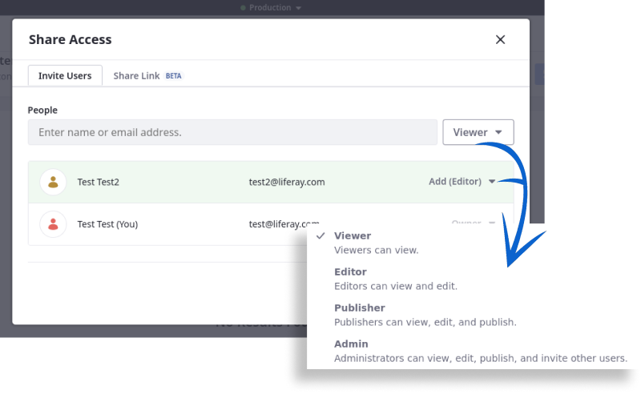
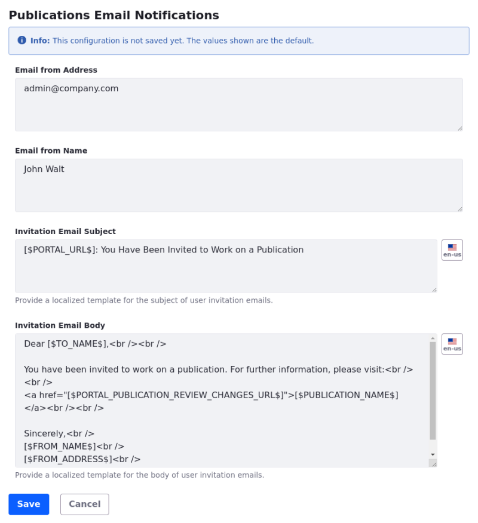
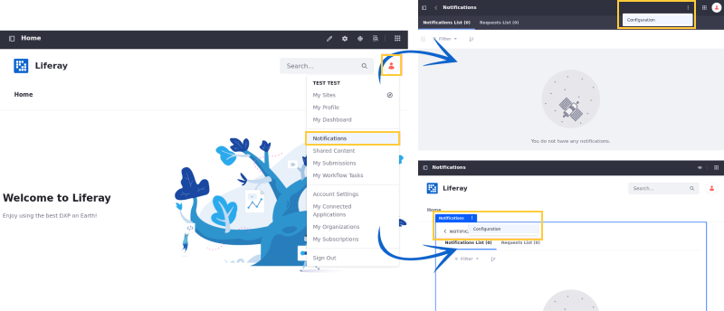
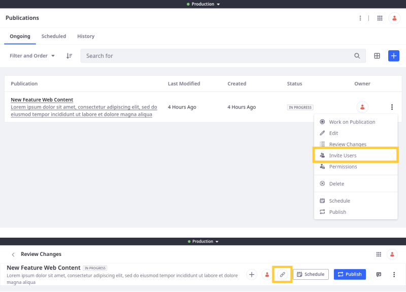

---
taxonomy-category-names:
- Platform
- Publications
- Liferay Self-Hosted
- Liferay PaaS
- Liferay SaaS
uuid: e5ba6aa2-4c56-4e68-b515-32f05f9d4e93
---

# Collaborating on Publications

{bdg-secondary}`Liferay 7.4+`

By default, a publication can only be accessed by its creator. However, publication creators can invite other users to view, edit, and publish their publications. Users can be added to any ongoing, scheduled, and published publications.

[$LIFERAY_LEARN_YOUTUBE_URL$]=https://www.youtube.com/embed/n790hDkDenI

Once users are invited to a publication, you can use the integrated comments feature to facilitate collaboration between contributors.

## Inviting Users to a Publication

1. Open the *Global Menu* (), click the *Applications* tab, and go to *Publications*.

1. Click the *Actions* button () for the desired publication and select *Invite Users*.

   

   Alternatively, begin reviewing the publication's changes and click *Invite Users* ().

   

   !!! note
       This is the only way to invite users to a published publication.

1. Use the drop-down menu to grant *view*, *edit*, *publish*, and *invite* permissions.

   

1. Search for and select the desired *users*.

   Each user is assigned the selected permissions, though you can edit their permissions before and after sending invitations.

   

1. Click *Send* to add the users to the publication.

Invited users are notified and can begin collaborating on the publication.

## Commenting on a Publication

Collaborating users can add comments to a publication via its Changes page. Each comment is scoped to the publication in which they're made.

1. Open the *Global Menu* (), click the *Applications* tab, and go to *Publications*.

1. Click the desired *publication*.

1. Click the *Comments* button ().

1. In the chat window, type your comment, and click *Reply*.

   

All collaborating users are notified of your comment and can reply as well.

## Removing Users from a Publication

1. Open the *Invite User* modal window for the desired publication.

1. Click the drop-down menu for the desired user, and select *Remove*.

   

1. Click *Save*.

## Sharing Publications Via Link

{bdg-link-primary}`[Beta Feature](../../../system-administration/configuring-liferay/feature-flags.md#beta-feature-flags)`

{bdg-secondary}`Liferay 7.4 2023.Q3+/GA92+`

If you need to share publication changes with people who are not site users, you can enable link sharing for the publication.

1. Click *Actions* () for the desired publication, select *Invite Users*, and go to the *Share Link* tab.

   

   Alternatively, begin reviewing the publication's changes and click *Share* ().

   

1. Toggle the switch to enable sharing.

1. Copy the link.

   

Anyone with the link can view the publication's changes.

## Related Topics

- [Creating and Managing Publications](./creating-and-managing-publications.md)
- [Making and Publishing Changes](./making-and-publishing-changes.md)
- [Resolving Conflicts](./resolving-conflicts.md)
