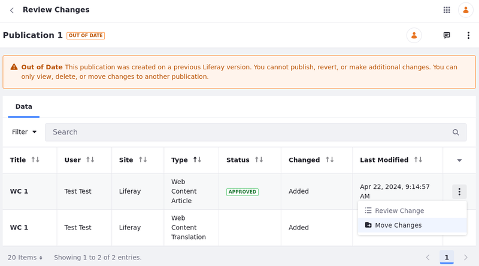

---
taxonomy-category-names:
- Platform
- Publications
- Liferay Self-Hosted
- Liferay PaaS
- Liferay SaaS
uuid: 065ba9d2-8610-4dc8-b8d8-0f68dadda5d5
---

# Creating and Managing Publications

{bdg-secondary}`Liferay DXP/Portal 7.3+`

With Publications, users can create instance-scoped blocks of changes. Because each publication is instance-scoped, they can be accessed anywhere in the Liferay UI and include changes from multiple Sites. By default, users can only view and manage publications they've created. However, users can invite each other to collaborate on their publications. See [Collaborating on Publications](./collaborating-on-publications.md) for more information.

[$LIFERAY_LEARN_YOUTUBE_URL$]=https://www.youtube.com/embed/QifaRHHuoX8

Once Publications is [enabled](./enabling-publications.md), you can create, edit, publish, or remove a publication via the Publications application page or the Publications drop-down menu.

!!! important
    Before upgrading your Liferay version, ensure you've published all active publications. After upgrading, active publications are marked as `out-of-date` and cannot be published, changed, or reverted.

    After {bdg-secondary}`Liferay DXP 2024.Q2+/Portal 7.4 GA120+`, only unreconcilable differences (e.g., schema changes) make [publications go out of date](#managing-out-of-date-publications). Additionally, you can move changes from out-of-date publications to other publications.

<!-- This needs to be adjusted once 2024.Q2 is released -->

## Creating a Publication

1. Click the *Publications* drop-down menu, and select *Create New Publication*.

   

   Alternatively, open the Publications application and click *Add* () in the *Ongoing* tab.

1. Enter a *name* and *description* for the publication.

   Alternatively, select a [publication template](./using-publication-templates.md) to auto-populate these fields.

   !!! note
       Publication names do not need to be unique. However, using unique names is recommended for organization.

1. Click *Create*.

Once the publication is created, you can begin adding changes to it. See [Making and Publishing Changes](./making-and-publishing-changes.md) to learn more about the editing and publishing process.

!!! note
    After creation, each publication is automatically updated with changes made in production, provided they don't conflict with any changes made in the publication.

## Managing Ongoing Publications

In the *Ongoing* tab, you can view a table of all active, unpublished publications that you have permission to view. The table is ordered by *Modified Date* and includes each publication's name, description, time of last modification, time of creation, and owner.

From here, you can click a publication's Actions button (  ) to perform the following actions:

**Work on Publication**: Select the publication to add changes to it. Once selected, you can easily toggle between the publication and production via the Publications drop-down menu. See [Making Changes in a Publication](./making-and-publishing-changes.md#making-changes-in-a-publication) for more information.

**Edit**: Modify the publication's name or description.

**Review Changes**: View all changes included in the publication. See [Reviewing Publication Changes](./making-and-publishing-changes.md#reviewing-publication-changes) for more information.

**Invite Users**: Invite users to collaborate on the publication. See [Collaborating on Publications](./collaborating-on-publications.md) for more information.

**Publish**: Begin the publishing process for the publication. This redirects users to the publishing page, where they can resolve conflicts. If there are no conflicts, they can click *Publish* to make their changes live. See [Publishing Changes](./making-and-publishing-changes.md#publishing-changes) and [Resolving Conflicts](./resolving-conflicts.md) for more information.

**Schedule**: Schedule the publication's changes to be applied to production. See [Publishing Changes](./making-and-publishing-changes.md#publishing-changes) for more information.

**Permissions**: Assign publication-specific permissions to User roles. Permissions configured in this way are scoped to the individual publication. <!--TASK: Link to the permissions article once finished.-->

**Delete**: Remove the publication from your instance. When selected, you are prompted to confirm your choice.

!!! warning
    Deleting a publication permanently removes all of its changes from your database and cannot be undone. Before deleting a publication, ensure you've saved any data you want to preserve.

## Managing Scheduled Publications

In the *Schedule* tab, you can view a table of all scheduled publications that you have permission to view. By default, scheduled publications are listed by *Name*, though you can order them by modified date or when each publication is scheduled for Publishing.

Once scheduled, changes cannot be added to a publication. However, you can click its Actions button () to perform the following actions:

**Unschedule**: Cancel the scheduled publishing and return the publication to the *In Progress* status.

**Reschedule**: Set an alternative date and time for publishing the changes to production.

**Review Changes**: View all changes included in the publication.

## Managing Out-of-date Publications

{bdg-secondary}`Liferay DXP 2024.Q2+/Portal 7.4 GA120+`
{bdg-link-primary}`[Beta Feature](../system-administration/configuring-liferay/feature-flags.md#beta-feature-flags)`

After an [upgrade](../../../installation-and-upgrades/upgrading-liferay.md) in Liferay, publications created in older versions become out of date, serving only as references and no longer being modifiable, revertible, or publishable. However, users can still view, delete, or move compatible changes to another publication.

To manage out-of-date publications,

1. Open the *Global Menu* (), navigate to the *Applications* tab, and click *Publications* under Publications.

1. Click *Actions* () next to the out-of-date publication you want to manage.

1. Choose an available action: select *Review Changes* to view more information about the change and move it to another publication, or select *Delete* to delete your out-of-date publication.

To move changes to a new publication,

1. (Optional. Skip this step if you already have one) Follow the steps to [create a new publication](#creating-a-publication) to house the new changes.

1. Click *Actions* () next to the out-of-date publication you want to manage and select *Review Changes*.

   Conversely, click on the name of the publication to review its changes.

1. Click *Actions* () next to the change you want to move and select *Move Changes*. You are redirected to a page displaying the author of the changes along with a summary of the alterations made.

   

1. Select the target publication at the bottom of the page and click *Move Changes* to complete the process.

   

The changes are moved to the target publication and you can now schedule/publish it.

## Managing History of Publications

In the *History* tab, you can view a table of all published publications for the DXP instance, including those published by other users. By default, publications are ordered by *Published Date*, though you can order them by name.

From here, you can click *Revert* for a publication to automatically create a new publication that reverts its changes. You can also make additional changes to your DXP instance as part of your Revert publication. See [Reverting Changes](./reverting-changes.md) for more information.

!!! note
    While all published publications on an instance are listed in the History tab, only publication owners and collaborators can view the publication's list of changes or revert it.

## Related Topics

- [Publications Overview](../publications.md)
- [Enabling Publications](./enabling-publications.md)
- [Making and Publishing Changes](./making-and-publishing-changes.md)