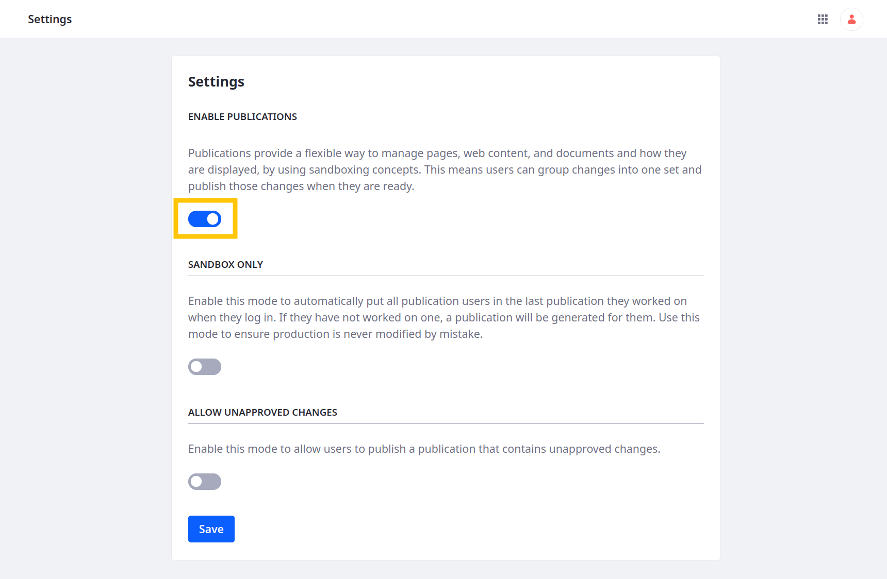
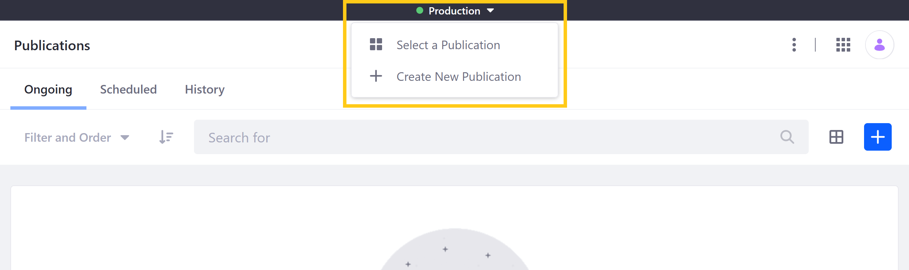

---
taxonomy-category-names:
- Platform
- Publications
- Liferay Self-Hosted
- Liferay PaaS
- Liferay SaaS
uuid: 441c07d0-8ab3-4a39-82e6-3702dcf45e22
---

# Enabling Publications

{bdg-secondary}`Available Liferay 7.3+`

Publications provides a convenient and flexible way for you and your teams to develop, track, and publish changes. When enabled, Publications is activated globally and can be accessed anywhere to edit supported entities.

<!-- [$LIFERAY_LEARN_YOUTUBE_URL$]=https://www.youtube.com/embed/8N6djs7Gcs4 -->

!!! important
    Staging and Publications cannot be enabled at the same time. If Staging is enabled on any of your sites, you must first disable Staging before enabling Publications. See [Disabling Local Live Staging](../staging/configuring-local-live-staging.md#disabling-local-live-staging) and [Disabling Remote Live Staging](../staging/configuring-remote-live-staging.md#disabling-remote-live-staging) for more information.

    [Workflow](../../../process-automation/workflow/introduction-to-workflow.md) cannot be used with Publications in Liferay 7.3.

## How to Enable Publications

1. Open the *Global Menu* (), go to the *Applications* tab, and click *Publications*.

1. Toggle *Enable Publications*.

   

1. (Optional) Toggle *Sandbox Only* mode. While enabled, users are directed automatically to their last working publication when they log in. If they don't have one, a new publication is generated for them using the `screen.name - date` naming pattern. You can use publication templates to set default values for these auto-generated publications. See [Using Publication Templates](./using-publication-templates.md) for more information.

   !!! tip
       Using Sandbox Only can help reduce accidental edits to production.

1. (Optional) Enable *Allow Unapproved Changes* to let users publish unapproved changes to production.

1. Click *Save* to save your configuration. You're redirected to the Publications application page.

Once enabled, you can access the drop-down Publications bar menu from anywhere in your Liferay instance.

You can use this menu to create new publications, select which publication you want to work on, switch between edit and production modes, and review and publish the current publication's changes. See [Creating and Managing Publications](./creating-and-managing-publications.md) to learn about creating, editing, and removing individual publications.

!!! note
    If you modify the contents of a publication with headless API calls, the publication remains in effect. Modifications made through headless API calls are recorded and can be reviewed in the Publications application.

## How to Disable Publications

If desired, you can disable Publications at any time via the Publications application page.

1. Open the *Global Menu* (), go to the *Applications* tab, and click *Publications*.

1. Click *Actions* () in the Application Bar, and select *Settings*.

   

1. Toggle the switch to disable Publications.

1. Click *Save*.

!!! important
    Once disabled, all active publications are deactivated, scheduled publications are canceled, and you can no longer access your publication history. However, Liferay retains your instance's publication history, so you can access it again if you re-enable Publications.

## Enabling Publications for 7.3.x

1. Open the *Global Menu* (), go to the *Applications* tab, and click *Settings* under Publications.

   

1. Toggle the switch to *Yes*.

1. Click *Submit* to save your configuration.

   Alternatively, you can click *Save and Go to Overview*, which saves your configuration and redirects you to the Publications overview page.

   

## Disabling Publications for 7.3.x

If desired, you can disable Publications at any time via the Publications *Settings* page.

1. Open the *Global Menu* (), go to the *Applications* tab, and click *Settings* under Publications.

1. Toggle the switch to *No*.

1. Click *Submit*.

!!! important
    Once disabled, all active publications are deactivated, scheduled publications are canceled, and you can no longer access your publication history. DXP, however, retains your instance's publication history, so you can access it again if you re-enable Publications.

## Related Topics

- [Publications Overview](../publications.md)
- [Creating and Managing Publications](./creating-and-managing-publications.md)
- [Making and Publishing Changes](./making-and-publishing-changes.md)
