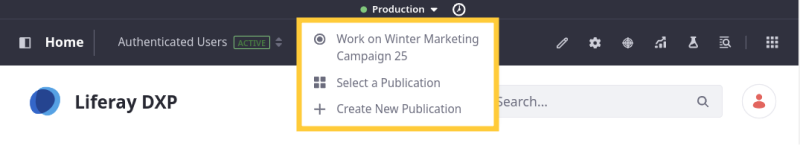
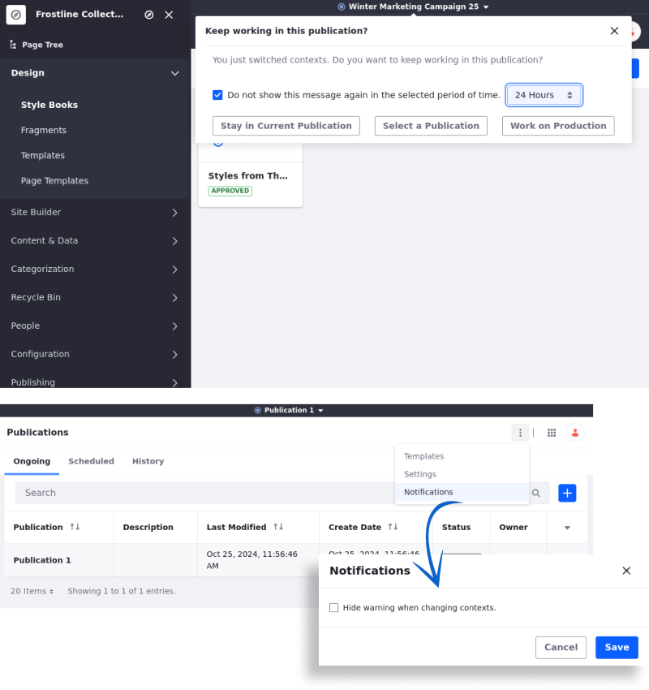
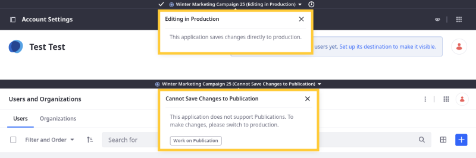
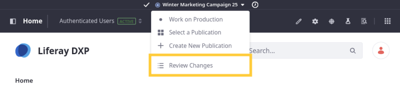
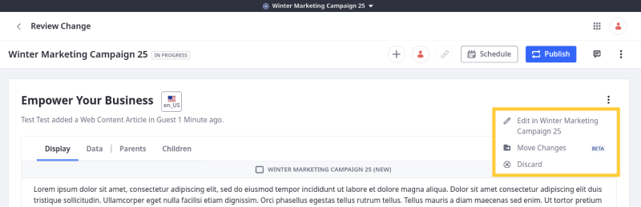
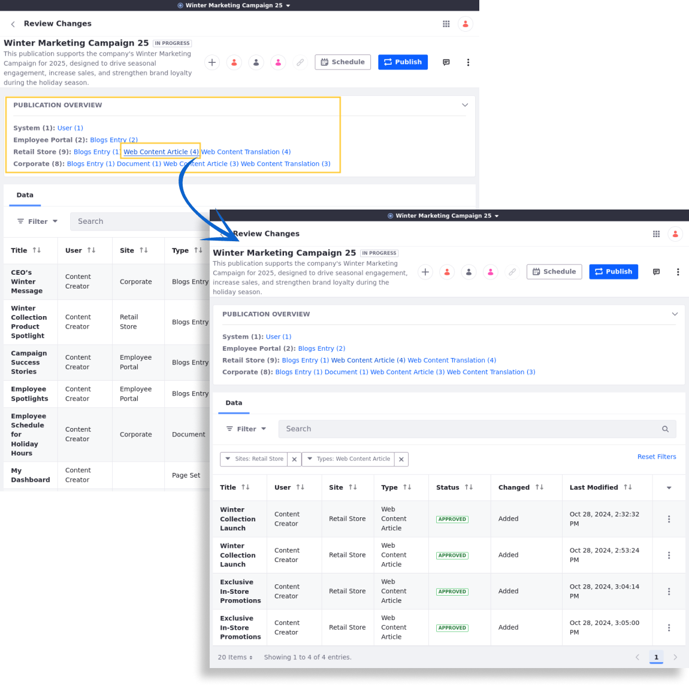
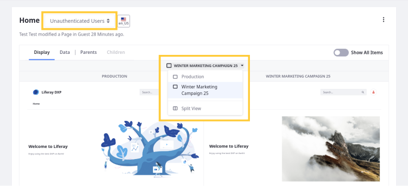
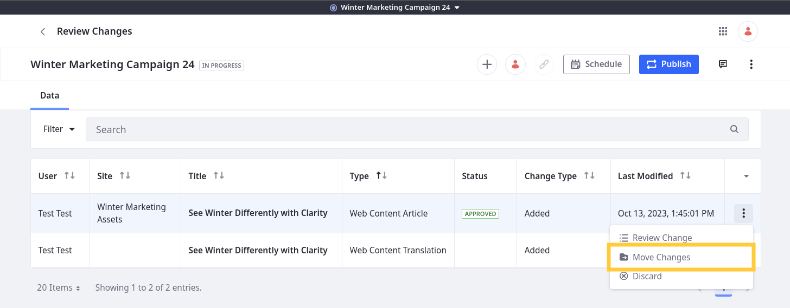

---
taxonomy-category-names:
- Platform
- Publications
- Liferay Self-Hosted
- Liferay PaaS
- Liferay SaaS
uuid: 1411549b-f2fd-473e-b4ef-5f67aa7fdb5e
---

# Making and Publishing Changes

{bdg-secondary}`Liferay 7.3+`

Publications provides a convenient way to manage changes to your Liferay instance. With it, you and your team can create and collaborate on blocks of changes called 'publications'. You can then publish those changes to production when ready.

<!-- [$LIFERAY_LEARN_YOUTUBE_URL$]=https://www.youtube.com/embed/YNOLwu19oBk -->

!!! note
    By default, users can only contribute to publications they've created. However, they can invite other users to collaborate on their publications. See [Collaborating on Publications](./collaborating-on-publications.md) for more information.

If you haven't already created a publication to track changes, see [Creating a Publication](./creating-and-managing-publications.md#creating-a-publication) for more information.

Once created, a publication is updated automatically with changes made to production, provided they don't conflict with changes made in the publication. This ensures you and your team are working on the latest version of production.

!!! important
    After upgrading your Liferay version, existing publications cannot be changed, published, or reverted. All active publications are marked as out of date and can only be viewed or deleted. {bdg-secondary}`Liferay DXP 2024.Q2+/Portal 7.4 GA120+` But you can move compatible changes to a publication. See [Managing Out-of-date Publications](./creating-and-managing-publications.md#managing-out-of-date-publications) to learn more. Also, the *Revert* option is removed for publications published before your upgrade.

## Making Changes in a Publication

Before making changes to your instance, ensure you're working on the correct publication. You can confirm this via the Publications bar. If you're not currently in a publication, you can create one or select an existing one.

When you add, edit, or remove assets in a publication, your changes are only visible in the publication where they're made. When you delete an asset in a publication, DXP marks it for deletion and hides it when viewing the publication. The asset remains viewable to production and other publications, since its removal is only a logical deletion.

While working on a publication, changes made to supported Liferay components are tracked in the publication. This includes changes across multiple sites.

!!! important
    When editing different sites in the same publication, keep in mind that all tracked changes are applied to production when the publication is published.

{bdg-secondary}`Liferay DXP 2024.Q4+`
{bdg-secondary}`Release Feature Flag (LPD-20131)`

When you change the site context while using a publication, a warning appears to prevent unintentional changes. This safeguard enhances user safety when navigating and interacting within the Portal with Publications enabled.

Upon context change, you can choose to *Stay in Current Publication*, *Select a Publication*, or *Work on Production*. Additionally, you can check the *Do not show this message again* option and select a duration from the list: *1 hour*, *4 hours*, *24 hours*, or *Forever*.

To reactivate the warning,

1. Open the *Global Menu* (), go to the *Applications* tab, and click *Publications*.

1. Click *Options* () at the top right corner, uncheck the *Hide warning when changing contexts* options, and click *Save*.

### Navigating to Unsupported Applications

{bdg-secondary}`Liferay 7.4 2023.Q3+/GA92+`

If you navigate to an application that does not support Publications, Liferay indicates that changes in the application cannot be saved to a publication.

For some applications, you can directly edit production while in a publication.

For other applications, you must switch to production before you can make changes.

## Making Changes in Parallel Publications

Users can have multiple active publications at the same time. Changes made in these parallel publications create alternative edit histories for your instance's entities. These changes can be compatible or conflicting, depending on whether they modify the same or related content.

### Compatible Changes

If parallel publications include compatible changes, they can be published without issue. In this case, the tracked changes of both publications are applied to production.

### Conflicting Changes

If parallel publications include incompatible changes and one of the publications is applied to production first, then the other publication displays publishing conflicts. These conflicts can also be caused when production is updated directly. See [Resolving Conflicts](./resolving-conflicts.md) for more information on this process.

## Reviewing Publication Changes

Before publishing, you can review a publication's tracked changes to ensure it only includes the desired edits. To do this, open the Publications drop-down menu and select *Review Changes*.

Alternatively, you can review any publication's tracked changes via the Publications application. Navigate to the *Ongoing* tab, click on the *Actions* button () for the desired Publication, and select *Review Changes*.

When reviewing changes, all tracked changes appear in a list that you can order by User, Site, Title, Type, Status, Change Type, or Last Modified.

By default, Publications only displays some changes, but you can view all system changes as well. Click *Actions* () for the publication and select *Show System Changes*. This displays all changes included in the publication.

During review, you can select a change to view more details and access additional actions (e.g., edit, discard). Available actions depend on the entity's type.

{bdg-secondary}`Liferay DXP 2024.Q4+`
{bdg-secondary}`Release Feature Flag (LPD-20131)`

The Publication Overview provides a summary of changes at the top of the page, organized by system or site instances. Each component shows the number of modified entities for easy tracking across instances and components.

Click on any entity to filter the changes specific to that entity and instance.

### Previewing Changes to Pages

{bdg-secondary}`Liferay 7.4 2023.Q3+/GA92+`

If a publication includes edits to a page, you can preview those changes alongside the original version of the page.

When reviewing changes to a page with alternate [user experiences](../../personalizing-site-experience/experience-personalization/creating-and-managing-experiences.md), you can use the Experiences drop-down menu to switch between them.

Once selected, you can view each page version individually or select Split View to review them side by side.

### Accessing and Analyzing Change Data

{bdg-secondary}`Liferay DXP 2024.Q4+`
{bdg-secondary}`Release Feature Flag (LPD-20131)`

Publication administrators can access detailed information about changes in the publication through the Data tab, which includes the following fields:

| Field                       | Description                                               |
|-----------------------------|-----------------------------------------------------------|
| `Entity Type`               | Type of content modified (e.g., blog entry, web content). |
| `Title`                     | Title of the modified entity for reference.               |
| `Author`                    | Name of the user who made the changes.                    |
| `Modification Date`         | Date of the last changes made.                            |
| `Status`                    | Current status of the entity (e.g., approved, pending).   |
| `Views`                     | Number of views the entity has received.                  |
| `Status Date`               | Date and time of the last status update.                  |
| `Small Image ID`            | ID for any small image associated with the entity.        |
| `Small Image`               | Indicates if a small image is associated (true/false).    |
| `Trackbacks`                | Any trackbacks linked to the entry.                       |
| `Cover Image URL`           | URL for the cover image (if available).                   |
| `Group ID`                  | ID of the group associated with the content.              |
| `Description`               | Brief description of the content.                         |
| `UUID`                      | Unique identifier for the entry.                          |
| `External Reference Code`   | Code for external reference to the entry.                 |
| `Entry ID`                  | Unique identifier for the content entry.                  |
| `Last Publish Date`         | Date when the content was last published.                 |
| `CT Collection ID`          | Collection ID linked to the content type.                 |
| `Create Date`               | Date and time when the content was created.               |
| `Status by User ID`         | ID of the user who set the current status.                |
| `Allow Trackbacks`          | Indicates if trackbacks are allowed (true/false).         |
| `Allow Pingbacks`           | Indicates if pingbacks are allowed (true/false).          |
| `Small Image URL`           | URL for any small image (if available).                   |
| `URL Title`                 | User-friendly URL title for the content.                  |
| `Small Image File Entry ID` | File entry ID for the small image (if applicable).        |
| `User Name`                 | Name of the user who created or modified the content.     |
| `User ID`                   | Unique ID for the user linked to the content.             |
| `Cover Image File Entry ID` | File entry ID for the cover image (if applicable).        |
| `Company ID`                | ID of the company associated with the content.            |
| `Cover Image Caption`       | Caption for the cover image (if applicable).              |
| `Subtitle`                  | Subtitle for the content (if applicable).                 |
| `Display Date`              | Date and time when the content is set to display.         |
| `Modified Date`             | Date and time of the last content modification.           |
| `Status by User Name`       | Name of the user who set the current status.              |
| `MVCC Version`              | Version number for the content entry.                     |

!!! important
    Without the administrator role, users can only see the change's title, author, create date, display date, status, and views.

## Moving Changes Between Publications

{bdg-secondary}`Liferay 7.4 2023.Q3+/GA92+`

While reviewing changes, you can move them to different publications. This provides greater flexibility when managing content:

1. Click the *Actions* button () for the desired change and select *Move Changes*.

   

1. Select the desired *publication*.

1. Click *Move*.

This moves the change into the selected publication along with its children. It also removes the change and its children from the current publication.

## Publishing Your Changes

When you've finished making your changes, you can publish them immediately or schedule them to be published at a later time. Once published, a publication appears in the *History* tab of the Publications application. This maintains a clear audit trail that you can use review and revert site changes when needed. See [Reverting Changes](./reverting-changes.md) for more information.

When you begin the publishing process, Liferay performs a compatibility check to determine if there are any conflicts between the publication and production. If there are conflicts, DXP notifies you. While some conflicts are resolved automatically, others require manual resolution. Resolving all conflicts is necessary for publishing changes. See [Resolving Conflicts](./resolving-conflicts.md) for more information.

### Publishing Now

Follow these steps to publish changes immediately:

1. Open the Publications drop-down menu, and select *Review Changes*.

   Alternatively, open the Publications application, and click on the desired publication.

1. Click *Publish*.

1. If necessary, manually resolve any detected conflicts. Once all conflicts are resolved, you can proceed.

   

1. Click *Publish*.

The publication's changes are immediately applied to production, and you are redirected to the History tab. From here, you can view publishing details (e.g., date, publisher, status) and [revert](./reverting-changes.md) a publication's changes if desired.

### Scheduling for Later

Follow these steps to schedule publishing for a later time.

1. Open the Publications drop-down menu, and select *Review Changes*.

   Alternatively, open the Publications application, and click on the desired publication.

1. Click *Schedule*.

1. If necessary, manually resolve any detected conflicts. Once all conflicts are resolved, you can proceed.

   !!! important
       At the time of the publication, DXP performs a second conflict detection to ensure there are no new conflicting changes. The publish fails if DXP detects new conflicts that cannot be automatically resolved. If the conflicts can be resolved automatically, DXP proceeds with publishing.

1. Enter a date and time to determine when the changes are published to production.

1. Click *Schedule* to complete the process.

This redirects you to the Scheduled tab where you can view and [manage scheduled publications](./creating-and-managing-publications.md#managing-scheduled-publications).

## Removing Unnecessary Publication Data

When reviewing publication changes, file and page previews can accumulate in the document library. If desired, you can remove this data.

1. Open the *Global Menu* (), go to *Control Panel*, and click *System Settings*.

1. Click *Upgrades* under Platform.

1. Go to the *Data Removal* tab.

1. Select *Remove DL Preview Change Tracking Store Content Data*.

   

1. Click *Save*.

Liferay immediately removes the unnecessary data.

## Related Topics

- [Publications Overview](../publications.md)
- [Enabling Publications](./enabling-publications.md)
- [Creating and Managing Publications](./creating-and-managing-publications.md)
