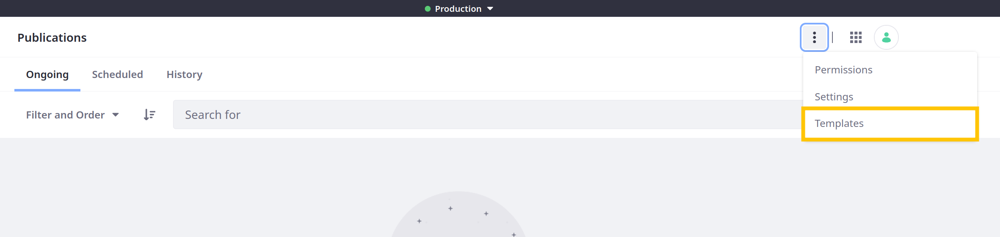
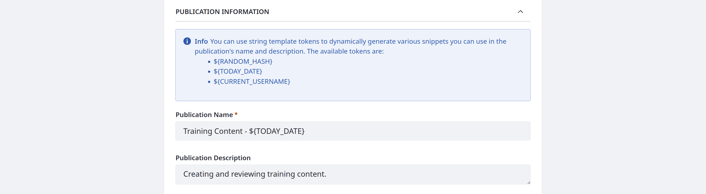
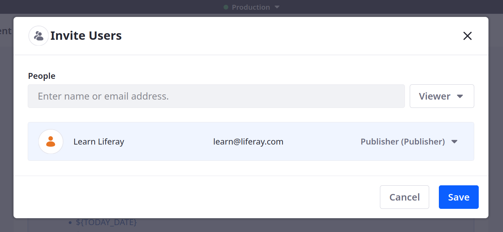
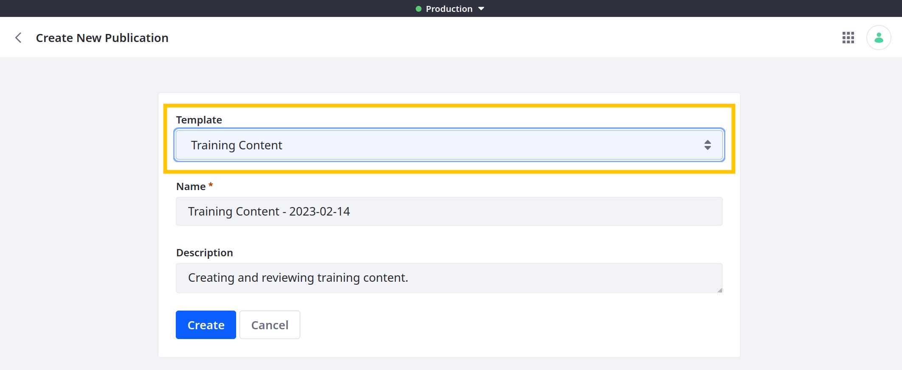

---
taxonomy-category-names:
- Platform
- Publications
- Liferay Self-Hosted
- Liferay PaaS
- Liferay SaaS
uuid: 50898f75-135c-4b46-ae9d-b32ce3c80351
---

# Using Publication Templates

{bdg-secondary}`Liferay 7.4 U73+/GA73+`

To simplify creating publications with shared details and contributors, use publication templates. You can create a list of users to invite and assign roles and use tokens to auto-populate names and descriptions.

To create a publication template,

1. Open the *Global Menu* (), go to the *Applications* tab, and click *Publications*.

1. Click *Actions* () in the Application Bar and select *Templates*.

   

1. Click *Add* ().

1. Enter a name and description for the template.

   

1. (Optional) Set this template as the default for new publications.

   **Default Template**: Manually created publications use this template by default, but you can select an alternative template during publication creation. When [Sandbox Only mode](./enabling-publications.md#how-to-enable-publications) is enabled, automatically created publications use the template if a Default Sandbox Template isn't set.

   **Default Sandbox Template**: Automatically created publications use this template when [Sandbox Only mode](./enabling-publications.md#how-to-enable-publications) is enabled. You can still create publications manually using an alternative template.

   !!! note
       You can only have one default template and one default sandbox template at a time.

1. Enter a name and description to use for publications created with the template.

   You can use string template tokens to generate values dynamically:

   - `${RANDOM_HASH}`

   - `${TODAY_DATE}`

   - `${CURRENT_USERNAME}`

   

1. Click *Invite Users* to specify the default users and role assignments for publications created with the template.

   

   To add contributors, search for users and select a role. See [Collaborating on Publications](./collaborating-on-publications.md) for more information.

   

   !!! note
       If you invite users without permission to access the Publications application, Liferay automatically assigns them the [Publications User](./publications-permissions.md#publications-user-role) role.

1. Click *Save*.

The new template appears in the Publication Templates page.

Users can select the template when [creating a publication](./creating-and-managing-publications.md#creating-a-publication). Selecting the template automatically populates the name and description fields and invites the default contributors.

## Related Topics

- [Creating and Managing Publications](./creating-and-managing-publications.md)
- [Collaborating on Publications](./collaborating-on-publications.md)
- [Publications Permissions](./publications-permissions.md)
