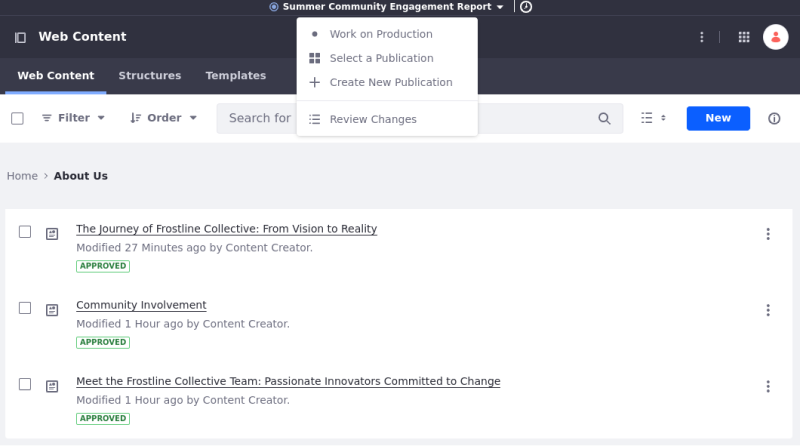
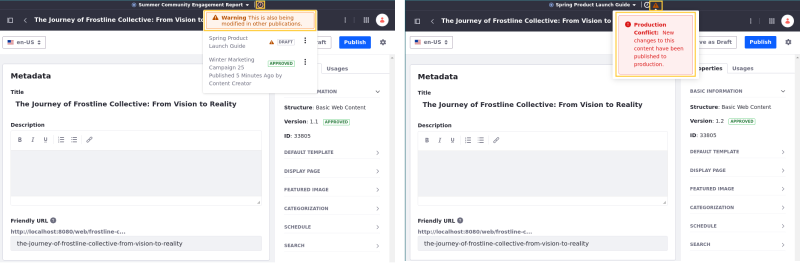
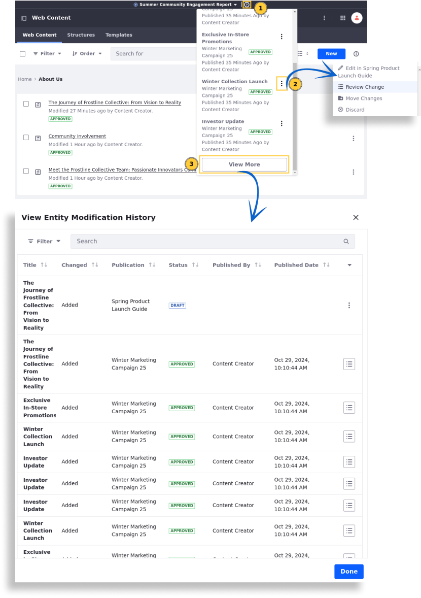
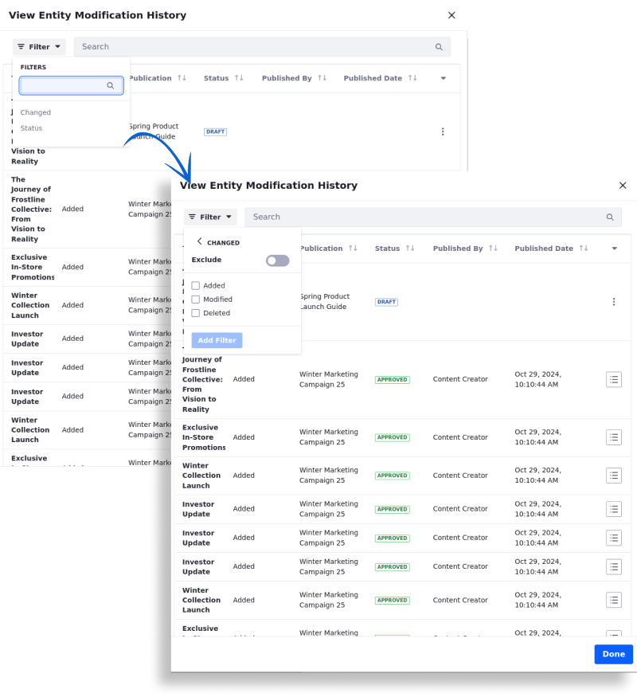
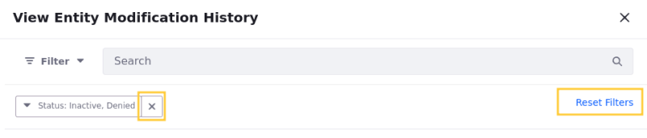

---
taxonomy-category-names:
- Platform
- Publications
- Liferay Self-Hosted
- Liferay PaaS
- Liferay SaaS
uuid: c0a45f7b-5e86-4a5a-b4a5-1f099e3085f0
---

# Using the Publications Toolbar

The Publications Toolbar provides essential information for Publications users, including the name of the current publication or *Production* if working in the production environment.

The toolbar appears at the top of the screen after [enabling Publications](./enabling-publications.md), where you can navigate between publications, access production, create new publications, and review changes made in the current publication.

## Displaying Warnings

{bdg-secondary}`Liferay DXP 2024.Q4+`

!!! important
    Currently, this feature is behind a release feature flag (LPD-20556). Read [Release Feature Flags](../../../system-administration/configuring-liferay/feature-flags.md#release-feature-flags) for more information.

When working with [web content articles](../../../content-authoring-and-management/web-content/web-content-articles.md), the Publications Toolbar displays warnings to manage updates and prevent conflicts.

<!-- TODO: Currently, it's just working with WC articles, but the team will probably expand this functionality to other components. When it does, this part needs to be rewritten to reflect the new components. Eric -->

Warnings appear next to the toolbar in the following scenarios:

**Concurrent Edits**: When a user edits an article in one publication and another user simultaneously edits the same article in a different publication, the timeline icon appears yellow, indicating a potential conflict.

**Production Modifications**: If a user in a publication edits an article that was modified and published in production, the timeline icon appears red, indicating a production conflict.

## Using the Publication Timeline

To view a list of modifications made to entities, click the *Publication Timeline* () icon (1).

!!! note
    The publication’s timeline displays all pertinent web content articles, including those stored in folders.

With the appropriate permissions, access the *Actions* menu () for a specific modification. The available actions include Edit the Article in Another Publication, Review Changes, Move Changes, or Discard Changes (2).

!!! important
    For articles modified in publications, only users with `Edit` permissions can access the "Edit in Publication", "Discard Change", "Move Change", and "View Change" options. Users with `View` permissions can only access the "View Change" option. Users without any permissions can't access any of those actions.

    For articles modified in production, only the "View Change" option is available.

When several modifications exist, click *View More* (3) at the bottom of the publication's timeline to open the View Entity Modification History page, where you can view all modifications, and access the options to Discard Changes, Edit in Publication, Move Changes, or Review Changes.

## Filtering and Sorting Entities in the View Entity Modification History Page

{bdg-secondary}`Liferay DXP 2024.Q4+`

{bdg-secondary}`[Release Feature Flag](../../../system-administration/configuring-liferay/feature-flags.md#release-feature-flags) (LPD-20556)`

To filter modifications, click *Filter* on the top left of the View Entity Modification History page and select a filter type.

Refine your results by toggling *Exclude* to specify entries you want to remove from the filter.

Choose filter values such as `Added`, `Modified`, or `Deleted` and click *Add Filter*.

To remove filters, click *Remove Filter* () or select *Reset Filters* to see all entries.

You can sort entries by clicking the sorting icon () next to the desired field.

Additionally, adjust the number of items displayed at the bottom of the page by clicking *10 Items* and selecting some items: 4, 8, 20, 40, or 60.

## Viewing Changes While Working on the Sandbox Mode

{bdg-secondary}`Liferay DXP 2024.Q4+`

{bdg-secondary}`[Release Feature Flag](../../../system-administration/configuring-liferay/feature-flags.md#release-feature-flags) (LPD-20556)`

In [Sandbox Only mode](./enabling-publications.md#how-to-enable-publications), users placed into a publication automatically can select *View on Production* in the Publications Toolbar to access a read-only production version of a page and compare it with publication changes without affecting production.

View on Production is only available for pages that already exist in production.

A *Viewing Production* indicator appears in the toolbar. To return to the publication, open the toolbar and select *Work on [Publication's name]*.

## Related Topics

- [Making and Publishing Changes](./making-and-publishing-changes.md)
- [Creating and Managing Publications](./creating-and-managing-publications.md)
