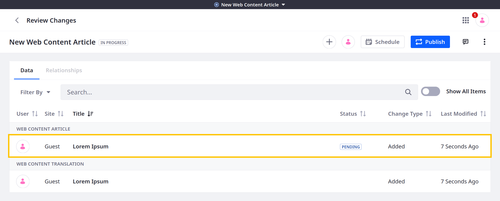
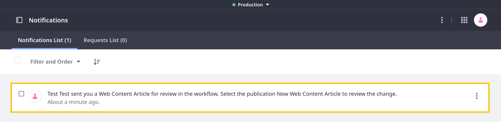
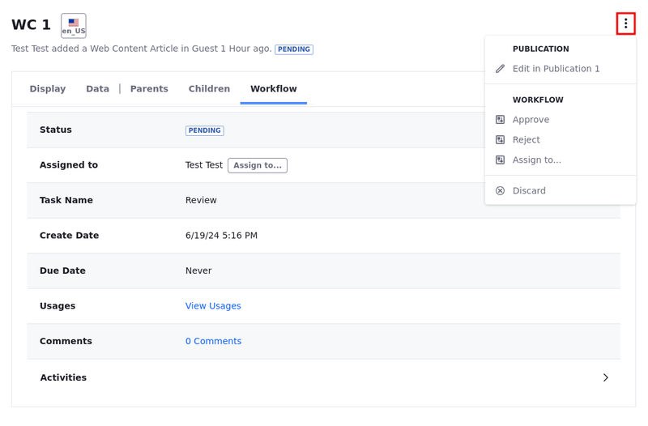

---
taxonomy-category-names:
- Platform
- Publications
- Workflow
- Liferay Self-Hosted
- Liferay PaaS
- Liferay SaaS
uuid: 49935b09-39cf-4f23-b8e0-aad6cc621a44
---

# Using Workflow with Publications

{bdg-secondary}`7.4 U44+/GA44+`

Publications is integrated with Liferay's [Workflow](../../../process-automation/workflow/introduction-to-workflow.md) framework, so you can continue to use custom workflows for reviewing content and pages while Publications is enabled. This ensures all tracked changes go through the desired approval process before publishing them to production.

With Publications, changes are scoped to the environment where they are made (i.e., production or a publication). Content reviewers must have access to the appropriate environment to review and approve changes. For example, if site contributors make changes in a publication, the workflow reviewers must also have access to that publication. See [Collaboration on Publications](./collaborating-on-publications.md) for more information about inviting users to a publication and assigning them permissions.

When contributors submit changes for approval, the workflow notification includes the environment where the changes were made. Reviewers must then switch to the appropriate environment before viewing and approving the changes.

{bdg-secondary}`Liferay DXP 2024.Q3+/Portal 7.4 GA125+` Alternatively, the changes can be reviewed through the [Workflow tab while reviewing publication changes](#using-the-workflow-tab-while-reviewing-publication-changes).

!!! important
    Reviewers must approve all changes before publishing them to production. Attempting to publish unapproved changes displays an error message.

Once changes are approved, additional edits to the same entities are tracked as separate changes in the publication, each with its own workflow status.

## Using the Workflow Tab While Reviewing Publication Changes

{bdg-secondary}`Liferay DXP 2024.Q3+/Portal 7.4 GA125+`

!!! important
    Currently, this feature is behind a release feature flag (LPD-10703). Read [Release Feature Flags](../../../system-administration/configuring-liferay/feature-flags.md#release-feature-flags) for more information.

<!-- It's still a dev ff, but LPD-28560 is supposed to change it to release. I'm skipping a step here... Eric -->

An alternative to switching environments before viewing and approving changes is to use the Workflow tab while reviewing changes in publications. Within this tab, you can access information and perform actions such as assigning, approving, and rejecting tasks, similar to using the [Workflow application](../../../process-automation/workflow/using-workflows/reviewing-assets.md).

To access and use the Workflow tab,

1. Click the *Publications* drop-down menu and select *Review Changes*.

1. Select the *Workflow* tab.

   Task-related information appears in the tab: the workflow task's status, assignee, name, creation date, due date, usages, comments, and activities.

1. Click *Assign to...* to assign the workflow task to an available user.

1. Click *View Usages* to see where the element is used throughout the site.

1. Click *[number] Comments* to view comments in the workflow task's page.

1. Expand the *Activities* drop-down to view a list of task-related activities.

In addition, you can use the Actions menu to access the following publication and workflow-related actions:

| Action                       | Description                                                         |
| :--------------------------- | :------------------------------------------------------------------ |
| Edit in [Publication's name] | Edit the element in the publication.                                |
| Approve                      | Approve the workflow task.                                          |
| Reject                       | Reject the workflow task.                                           |
| Assign to...                 | Assign the workflow task to an available user.                      |
| Discard                      | Discard the change. You are redirected to the Discard Changes page. |

## Related Topics

- [Introduction to Workflow](../../../process-automation/workflow/introduction-to-workflow.md)
- [Creating and Managing Publications](./creating-and-managing-publications.md)
- [Collaborating on Publications](./collaborating-on-publications.md)
