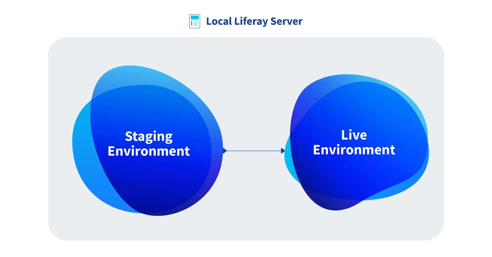

---
taxonomy-category-names:
- Platform
- Staging
- Liferay Self-Hosted
- Liferay PaaS
- Liferay SaaS
uuid: 5e770ae2-ffb6-4d25-9be2-00770fed680d
---

# Configuring Local Live Staging

With Local Live staging, both your staging and live environments are hosted on the same Liferay server. When enabled, Liferay DXP creates a local clone of your site or asset library that serves as the staging environment, while the original becomes your live environment. Both environments share the same JVM, database, selected application data, and configurations (e.g., portal properties).

## Setting Up Local Live Staging for Sites

1. Go to *Site Menu* &rarr; *Publishing* &rarr; *Staging*.

   

1. Select *Local Live*, which reveals additional fields for *Page Versioning* and *Staged Content*.

   

1. (For Sites Only) Select whether you want *Page Versioning* enabled.

   

1. Select the data and content types you want to stage.

   

   !!! warning
       When applications are checked, their data is copied to the staging environment, and it may not be possible to edit them directly in the live environment. When unchecking an application, first make sure that any changes in staging are published, since they may be lost. See [Managing Data and Content Types in Staging](./managing-data-and-content-types-in-staging.md) for more information.

1. Click on *Save* to initiate the cloning process. The duration of this process depends on the size of your site.

   !!! tip
       Stage your site early on to reduce cloning time and record a more complete history of your site's update history, since updates are only recorded once you enable page versioning.

Once the process is complete, you are ready to use Local Live staging. See [Site Staging UI Reference](./site-staging-ui-reference.md) for information about navigating the staging environment's publishing features.

## Setting Up Staging for Asset Libraries

1. Open the *Global Menu* () and click *Asset Libraries* in the Applications tab.

1. Open the desired asset library and click *Staging* under Publishing.

1. Select *Local Live*.

   

1. Select the application data you want to stage.

   For Asset Libraries, you can stage data for *Documents and Media* and *Web Content*.

   

1. Click *Save* to initiate the cloning process. The duration of this process depends on the size of the asset library.

   Once the process is complete, you are ready to use Local Live staging in your asset library.

## Disabling Local Live Staging

If for any reason you must disable staging for your site or asset library, you can do that from your staging environment. However, be aware that disabling Local Live staging deletes the staging environment, along with all unpublished content. For this reason, ensure all necessary information is published or preserved elsewhere before disabling staging.

!!! tip
    This process may take some time, depending on the size of your staging environment. It's best not to disable staging when your Liferay instance is busy.

Follow these steps to disable Local Live staging:

1. Open the Staging application in your site or asset library.

1. Click *Actions* (  ) in the Application bar and select *Staging Configuration*.

   

1. Select *None* for your configuration and click *Save*.

!!! important
    For most content types, staging only publishes the latest approved version of each content item. For this reason, disabling Local Live staging results in the loss of older content versions (e.g., documents). Once staging is disabled, only the latest published version in the live environment is preserved. Web content is the only exception.

## Related Topics

- [Staging Overview](../staging.md)
- [Site Staging UI Reference](./site-staging-ui-reference.md)
- [Managing Data and Content Types in Staging](./managing-data-and-content-types-in-staging.md)
- [Managing Staging Permissions](./managing-staging-permissions.md)
