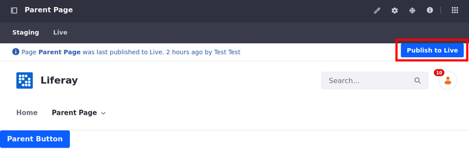
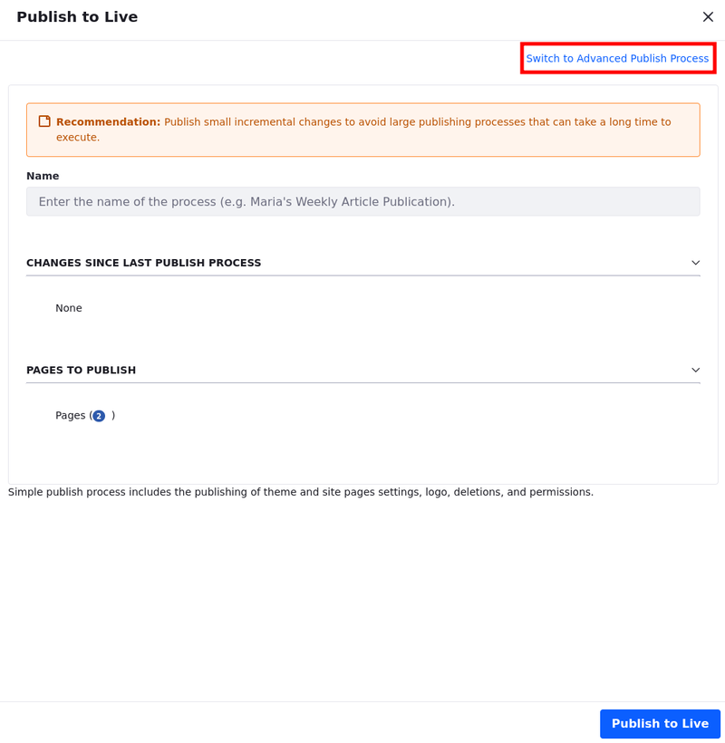
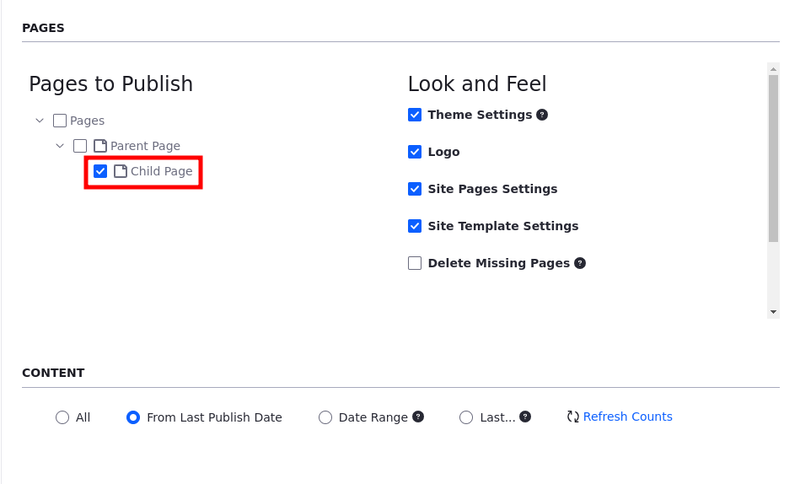

---
taxonomy-category-names:
- Platform
- Staging
- Liferay Self-Hosted
- Liferay PaaS
- Liferay SaaS
uuid: 05580c2e-64a1-4fed-a212-aaaaa811ed6d
---

# Configuring Page Publishing

By default, publishing a child page to Live also publishes its parent pages. This prevents orphaned pages. Always publishing parent pages to Live, however, can affect performance and prematurely publish the changes to parent pages. If desired, you can configure this behavior to only publish your selected pages, instead of always including parent pages.

!!! note
    {bdg-secondary}`Liferay DXP 2024.Q2+/Portal 7.4 GA120+` This configuration also affects manually exporting a site to an LAR file.

Follow these steps to configure child/parent publishing for your system:

1. Open the *Global Menu* (), click the *Control Panel*, and go to *System Settings* &rarr; *Infrastructure*.

1. Click *Staging* under Virtual Instance Scope in the left menu.

1. Check or uncheck *Publish Parent Pages by Default*.

   If checked, parent pages are always published to Live.

   If unchecked, the parent page is only published if it doesn't exist in Live yet. If the parent page was already published, only a reference element is added, which is used for the validation to make sure the parent is already in the Live site.

1. Click *Save*.

## Publishing/Exporting Child Pages

Once the *Publish Parent Pages by Default* option is unchecked, you can select and publish/export only child pages.

To publish only a child page,

1. With the parent, the child page, and the selected staging process in place, visit your page and select the *Staging* tab at the top left corner.

1. Make alterations to the page and publish it.

1. Visit your page again and click *Publish to Live* to publish the changes you just made into Live.

   

1. Click *Switch to Advanced Publish Process* at the top right corner to see advanced options.

   

1. Under Pages to Publish, select the child page(s) you want to publish.

   

1. Configure the process and click *Publish to Live*.

Only the alterations to the selected child pages are published.

{bdg-secondary}`Liferay DXP 2024.Q2+/Portal 7.4 GA120+` To export a site manually and select only alterations from the child page,

!!! important
    Currently, this feature is behind a release feature flag (LPS-199086). Read [Release Feature Flags](../../../system-administration/configuring-liferay/feature-flags.md#release-feature-flags) for more information.

1. With the parent and the child page in place, open the *Site Menu* (), expand *Publishing*, and select *Export*.

1. Click *New*.

1. Under Pages to Export, select the child page(s) you want to export.

   

1. Configure the process and click *Export*.

Only the alterations to the selected child pages are exported.

## Related Topics

- [Understanding the Publishing Process](./understanding-the-publishing-process.md)
- [Page Versioning](./page-versioning.md)
