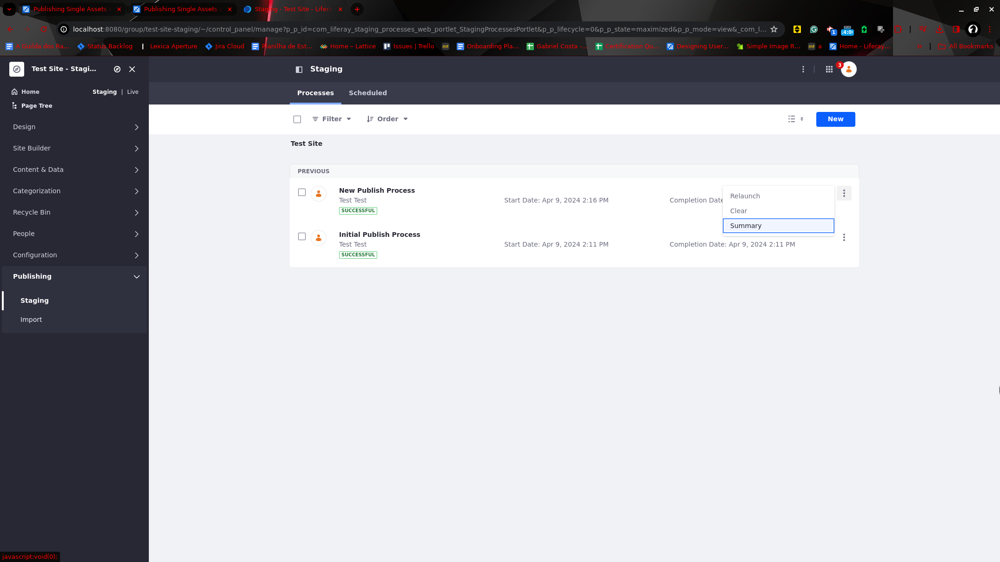
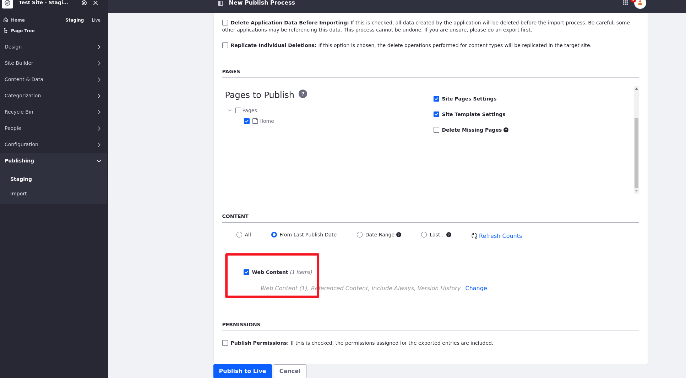
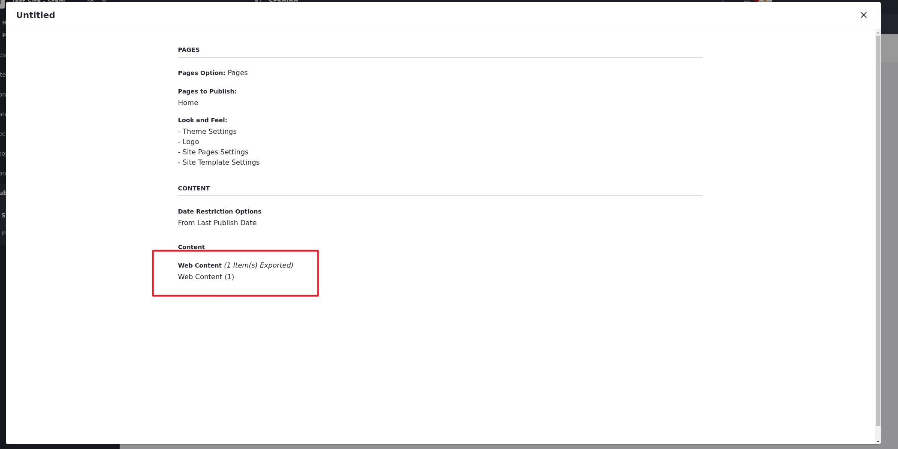

---
taxonomy-category-names:
- Platform
- Staging
- Widgets
- Liferay Self-Hosted
- Liferay PaaS
- Liferay SaaS
uuid: 221b8182-7251-4a9a-ac11-2c4a6ca93d20
---
# Publishing Single Assets and Widgets

You can publish single assets and widgets when needed without going through the entire publishing process. This is much faster than publishing all content at once.

## Publishing Single Assets

To publish assets in this way, Users must have the following permissions: *Export/Import Application Info* and *Publish Staging*. See [Managing Staging Permissions](./managing-staging-permissions.md) for more information.

1. Go to *Content & Data* in the *Product* menu and select the content or data type you want to publish.

1. Click on the *Actions* button (  ) for the asset you want to publish and select *Publish to Live*.

   

Once you confirm, you're directed to a process page where you can see the publishing status.

Similar to the standard process, single asset publishing includes associated dependencies: images, custom templates, or folders.

It is also possible to manually choose and publish multiple assets at the same time.

1. Select your assets by checking the box

1. Click on the *Actions* button (  ) from the toolbar above the elements and then click *Publish Selected Elements*

   

!!!{note}
Single asset publishing is not supported for page-scoped content.
!!!

## Publishing Single Widgets

> Only Available for Widget Pages

Although Staging is typically used to publish content, you can also publish widgets. For example, you can modify a widget's title and publish the change to Live. This is possible because widget configurations are always staged. To publish a widget that is on a Page, you must publish the Page first.

After changing a widget, you can publish the widget by clicking on the *Actions* button (  ) for the widget and selecting *Staging*.

   

## Verifying Published Content

It is possible to the user to see assets after it was published, so it can obtain a better overview of past publications. The title of the assets are displayed on the summary page. Based on the previous examples, we will be using a Basic Web Content Content to assert this functionality.

1. After publishing to live a Basic Web Content asset, Click the Product Menu () and navigate to *Publishing* &rarr; *Staging*

1. Create a New Publish Process layout.

1. Make Sure the Web Content checkbox is selected.

                           

1. Press the *Publish to Live* button.

1. After successfully publishing the layout, click on the *Actions* button (  ) next to the process of your new layout and select *Summary*.

                          

On the summary page, you can verify your previous published Web Content assets.

    

## Related Topics

* [Staging Overview](../staging.md)
* [Managing Staging Permissions](./managing-staging-permissions.md)
* [Page Versioning](./page-versioning.md)
* [Site Staging UI Reference](./site-staging-ui-reference.md)