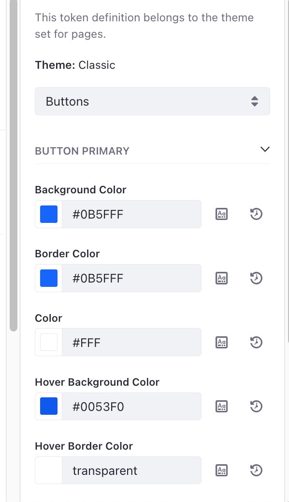

---
taxonomy-category-names:
- Sites
- Style Books
- Site Appearance and Design
- Liferay Self-Hosted
- Liferay PaaS
uuid: 28fd229f-2eb5-4c12-bc0b-cc33b2a0e859
---

# Frontend Token Definitions

{bdg-secondary}`Liferay DXP/Portal 7.3+`

Style books have options grouped into categories defined per theme. Each option is defined with a token. The collection of all tokens defined for a theme is a _token definition_.

When you assign a theme to your site's pages, the token definition included with that theme is used when creating a style book for the site.

## Defining Tokens for Your Style Book

Since the token definition is tied to your theme, token definitions must correspond to a CSS variable contained within your theme module. Specify the token definitions in a `.json` file within your theme module's `src/WEB-INF/` folder, named `frontend-token-definition.json`.

### Token Categories

Tokens defining the options for configuring your style book are grouped into categories. Each category appears in the drop-down menu when editing your style book.


Use a `frontendTokenCategories` field to define each of these categories in your theme's `src/WEB-INF/frontend-token-definition.json` file:

```json
{
 "frontendTokenCategories": [
  {
   "frontendTokenSets": [],
   "label": "buttons",
   "name": "buttons"
  }
 ]
}
```

Define a `label` and a `name` for each of your token categories. The `label` value is interpreted as a language key and displayed as the option in the drop-down menu for your category. <!-- Add link to article explaining localization when it is available. -->

### Token Sets

Each category is further organized into _token sets_ which correspond to the collapsible groups of options that appear when editing a style book.

For example, using the default Classic theme, the Button Primary token set (within the Buttons category) includes all tokens for standard button color options:



Define each token set inside a category's `frontendTokenSets` field:

```json
{
 "frontendTokenCategories": [
  {
   "frontendTokenSets": [
    {
     "frontendTokens": [],
     "label": "primary-buttons",
     "name": "primaryButtons"
    }
   ],
   "label": "buttons",
   "name": "buttons"
  }
 ]
}
```

Define a `label` and `name` for each token set just like with each category.

### Token Definitions

Define the tokens within each token set's `frontendTokens` field. Here's a list of all the properties you can use for your tokens:

| Property       | Description                                                                                                                                                                                                                                                                                                                     |
| :------------- | :------------------------------------------------------------------------------------------------------------------------------------------------------------------------------------------------------------------------------------------------------------------------------------------------------------------------------ |
| `defaultValue` | The default value displayed for the option. This field must match the default value used in the CSS.                                                                                                                                                                                                                            |
| `editorType`   | Use this field if you want to use a color picker editor for the field. The only supported value is `ColorPicker`. If no value is set, a text input is used. If you need a select input, use the `validValues` property instead (these two properties cannot be used together).                                                |
| `mappings`     | The mapping between the token definition name to the corresponding CSS variable name (must contain `type` and `value` as nested fields). Use `cssVariable` as the `type` and define the `value` as the CSS variable name.                                                                                                     |
| `label`        | The language key that appears for the option when editing a Style Book.                                                                                                                                                                                                                                                         |
| `name`         | The token's name.                                                                                                                                                                                                                                                                                                               |
| `type`         | The type of data the token displays. Use `Integer`, `Float`, or `String` to display a text field holding those types of values. Use `Boolean` to display a checkbox. Use `Length` to provide customizable units of measurement (e.g. pixels, ems, percentages).                                                       |
| `validValues`  | Optional property that lists available options for the User in the UI. This field must contain a nested list of `label` and `value` pairs (`value` is the field's value in CSS). This property cannot be used together with `editorType`. Defining a value for `validValues` makes the input type automatically a select input. |

The JSON schema for token definitions is publicly available in [Liferay's repository](https://github.com/liferay/liferay-portal/blob/master/modules/apps/frontend-token/frontend-token-definition-api/src/main/resources/com/liferay/frontend/token/definition/frontend-token-definition.schema.json).

Here's an example list of tokens within a token set:

```json
"frontendTokens": [
    {
        "defaultValue": "#0B5FFF",
        "editorType": "ColorPicker",
        "label": "primary",
        "mappings": [
            {
                "type": "cssVariable",
                "value": "primary"
            }
        ],
        "name": "primaryColor",
        "type": "String"
    },
    {
        "defaultValue": "sans-serif",
        "label": "font-family",
        "mappings": [
            {
                "type": "cssVariable",
                "value": "fontFamily"
            }
        ],
        "name": "fontFamily",
        "type": "String",
        "validValues": [
            {
                "label": "sans-serif",
                "value": "sans-serif"
            },
            {
                "label": "monospace",
                "value": "Courier New"
            }
        ]
    }
]
```

## Matching CSS Variables to Style Book Tokens

The `frontend-token-definition.json` file containing your token definition must be in the `src/WEB-INF/` folder of your theme module folder. Every token defined in your token definition must represent a style (color, spacing, font, etc.) in the CSS of your theme.

All styles that your tokens represent must be coded as CSS variables. For example, take this definition of a token (giving an option to configure a font):

```json
{
 "defaultValue": "sans-serif",
 "label": "font-family-base",
 "mappings": [
  {
   "type": "cssVariable",
   "value": "font-family-base"
  }
 ],
 "name": "fontFamilyBase",
 "type": "String"
}
```

This token may represent a style in your CSS like this:

```css
:root {
 --font-family-base: 'sans-serif';
}

body {
 font-family: var(--font-family-base);
}
```

The value in the token definition's `mappings` (`font-family-base`) matches the variable name in the CSS. Use two hyphens to precede the CSS variable name (in this example, `--font-family-base`).

```{important}
If a value for `defaultValue` is included in your token definition, it must match the default value defined in the matching CSS variable definition.
```

## Related Topics

- [Using a Style Book to Standardize Site Appearance](../using-a-style-book-to-standardize-site-appearance.md)

<!-- Add link to token definition tutorial when available -->
