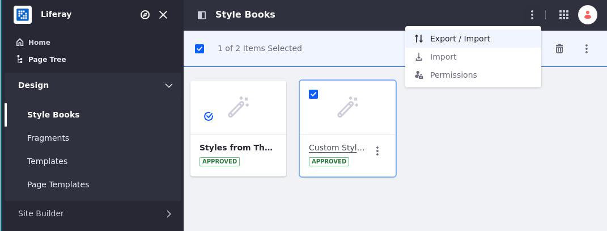
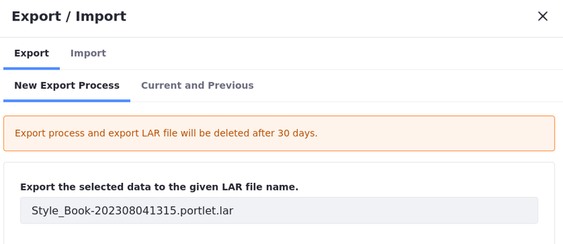
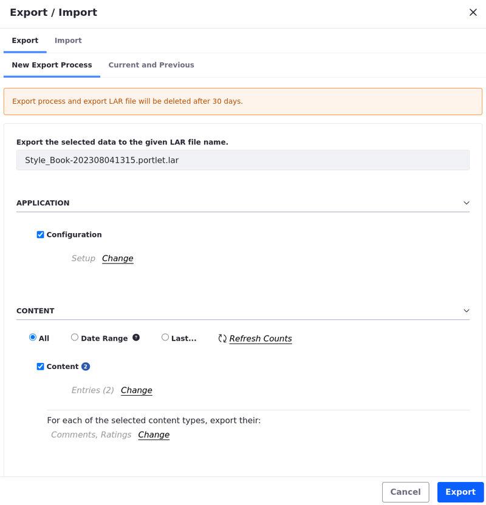

---
taxonomy-category-names:
- Sites
- Style Books
- Site Appearance and Design
- Liferay Self-Hosted
- Liferay PaaS
- Liferay SaaS
uuid: 616640a4-732c-4cf3-b735-c66ffe1a15c1
---
# Exporting and Importing Style Books

You can export and import style books to share them between Liferay installations as [ZIP files](#exporting-style-books-as-a-zip-file) or as [Liferay Archive (LAR) files](#exporting-style-books-as-a-lar-file).

## Exporting a Style Book as a ZIP File

1. Open the *Site Menu* (  ) and navigate to *Design* &rarr; *Style Books*.

1. Find the style book you want to export and click *Actions* (  ) &rarr; *Export*.

1. A ZIP file is downloaded to your machine. It contains two files:

   `style-book.json` contains the name of the style book and the path to `frontend-token-values.json`.

   `frontend-token-values.json` contains a list of the token values of the style book. Each token references the CSS variable name and the value mapped to it.

You can now share and import your ZIP file.

## Importing Style Books from a ZIP File

1. Open the *Site Menu* (  ) and navigate to *Design* &rarr; *Style Books*.

1. On the Applications bar, click *Options* (  ) &rarr; *Import*.

1. Choose the ZIP file you want to import.

   Check *Overwrite Existing Style Books* to overwrite existing style books with the same name. With the option unchecked, importing a style book with the same name as an existing one renders an error message.

1. Click *Import*.

You can now use your imported style guide.

## Exporting Style Books as a LAR File

1. Open the *Site Menu* (  ) and navigate to *Design* &rarr; *Style Books* .

1. Select the style book you want to export. On the Applications bar, click *Options* (  ) &rarr; *Export / Import*.

   

1. In the Export / Import modal, select *Export*.

1. Start a *New Export Process*.

   ```{note}
   You can select the *Current and Previous* tab to view a list of previous processes and download exported LAR files.
   ```

1. When starting a new export process, you can name the LAR file and [configure the process](#configuring-export-and-import-processes-as-a-lar-file).

   

1. Click *Export* to begin the export process.

You can now share and import your LAR file.

## Importing Style Books as a LAR File

1. Open the *Site Menu* (  ) and navigate to *Design* &rarr; *Style Books*.

1. Select the style book you want to import. On the Applications bar, click *Options* (  ) &rarr; *Export / Import*.

1. In the Export / Import modal, select *Import*.

1. Start a *New Import Process*.

   ```{note}
   You can select the *Current and Previous* tab to view a list of previous processes.
   ```

1. Upload the LAR file and click *Continue*.

1. [Configure the process](#configuring-export-and-import-processes-as-a-lar-file).

1. Click *Import* to begin the import process.

You can now use your imported style book.

## Configuring Export and Import Processes as a LAR File

Liferay provides settings for configuring export and import processes.

| Setting | Description |
| :--- | :--- |
| Application | When checked, your style book’s configuration settings are exported/imported to the LAR file. |
| Content | Select a date range of content that you want to export. Content added to your style book within your specified date range is included in the LAR file. |
| Deletions | When checked, the delete operations performed for content types are exported/imported to the LAR file. |
| Delete Application Data Before Importing (Import) | When checked, all data created by the application is deleted before the import process. Be careful: other applications may reference this data. This process cannot be undone. If you are unsure, do an export first. |
| Permissions | When checked, permissions assigned for your exported/imported entries are included.|
| Update Data (Import) | Choose one of these options to define what happens to the data once it is updated: <br/>**Mirror**: All data and content inside the imported LAR is newly created the first time while maintaining a reference to the source. Subsequent imports from the same source updates entries instead of creating new entries.<br/> **Mirror with Overwriting**: Same as mirroring, but if a document or an image with the same name is found, it is overwritten. <br/>**Copy as New**: All data and content inside the imported LAR is created nas new entries with the current site every time the LAR is imported. |
| Authorship of the Content (Import) | Choose one of these options to define the authorship of the content: <br/>**Use the Original Author**: Keep authorship of imported content whenever possible (this option uses the current user as author if the original one is not found). <br/>**Use the Current User as Author**: Assign the current user as the author of all imported content. |



## Related Topics

[Using a Style Book to Standardize Site Appearance](./using-a-style-book-to-standardize-site-appearance.md)

[Frontend Token Definitions](./developer-guide/frontend-token-definitions.md)
