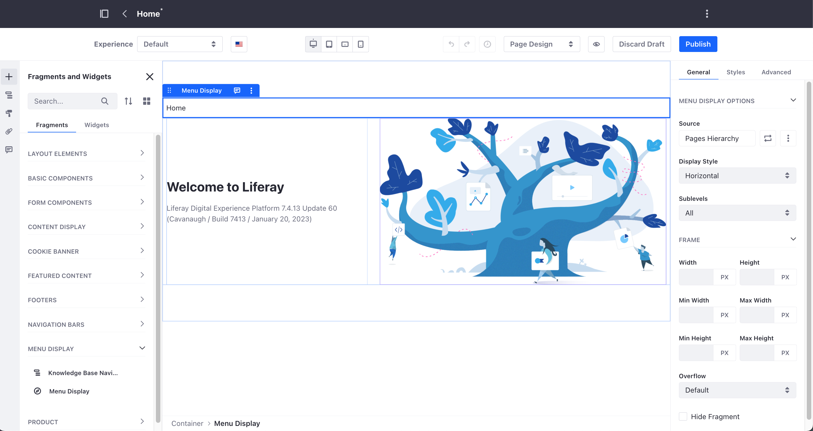

---
taxonomy-category-names:
- Sites
- Site Navigation
- Fragments
- Widgets
- Liferay Self-Hosted
- Liferay PaaS
- Liferay SaaS
uuid: e7769e8b-2afa-411c-bb53-413bddea507e
---
# Configuring Menu Displays

To display and configure a [menu display](./using-the-navigation-menus-application.md), you can use the [Menu display fragment](#configuring-the-menu-display-fragment) or a [menu display widget](#configuring-the-menu-display-widget). With either of these two options, you can define the menu display options, levels, and behavior for your site.
```{tip}
If you are new to Liferay, use the menu display fragment to get started with building your site's navigation menus. The menu display fragment provides preview options that work with [master page templates](../creating-pages/defining-headers-and-footers/creating-a-master-page-template.md) and ease of configuration that menu display widgets do not provide.
```

## Configuring the Menu Display Fragment

{bdg-secondary}`Available 7.4+`

You can create a navigation menu anywhere in your content page. This navigation menu is based on your site's pages hierarchy or any other hierarchy you define using Liferay's [navigation menus application](./using-the-navigation-menus-application.md). You can also define the menu display style options and the number of sub-levels to include in the navigation.

The Menu Display fragment appears under the Fragments and Widget section of your content page. You add and configure this fragment as with other fragments in your content pages. For more information, see [Adding Elements to Content Pages](../creating-pages/using-content-pages/adding-elements-to-content-pages.md) and [Configuring Fragments](../creating-pages/page-fragments-and-widgets/using-fragments/configuring-fragments.md).



You can build the hierarchy of pages and subpages in the Menu Display fragment using two methods:

- **Site Navigation Menus** (A) uses the menus you define using the Liferay DXP navigation menu for site navigation. By default, Liferay DXP provides two site menus based on the pages hierarchy in your site.
- **Contextual Menus** (B) shows a menu that is based on the page context. For example, you can create a more advanced navigation by combining a first-level Menu Display fragment linked to one of your site menus with a second-level Menu Display fragment that only shows the child pages. This way, when the user clicks through the different pages in the first-level menu, the second-level menu changes dynamically to show the children pages.


## Configuring the Menu Display Widget

Below are all the options possible in the Menu Display widget. To access the configuration menu, click *Options* (  ) at the top of the Menu Display widget.


### Navigation Menu

Select the desired navigation menu type; the desired navigation menu type appears in the preview box.

| Navigation Menu Type | Description |
| :--- | :--- |
| **Pages Hierarchy** | Pages Hierarchy is based on the default hierarchy in the site builder. |
| **Primary Navigation** | Primary Navigation is the main navigation for a page. |
| **Secondary Navigation** | Secondary Navigation is a second level of navigation, possibly a sidebar or a separate menu within a page. |
| **Social Navigation** | Social Navigation is for menus that contain links for sharing content on social media or similar tasks. |

Alternately, you can choose an existing navigation menu by selecting *Choose Menu* and clicking the *Select* button (you can choose a navigation menu from a parent site using this option).


### Display Templates

You can select a [widget template](../displaying-content/additional-content-display-options/styling-widgets-with-widget-templates.md) for navigation menus:


| Display Template | Description |
| :--- | :--- |
| **List Menu** | Displays all the items in a vertical list. |
| **Pills Horizontal** | Displays the items horizontally and uses a button style for highlighting. |
| **Pills Justified** | Like Pills Horizontal, but pads the items to fill out the horizontal space. |
| **Pills Stacked** | A vertical version of the pills style. |
| **Tabs** | Displays the items like navigation tabs. |
| **Tabs Justified** | Navigation tabs that fill horizontal space. |
| **Bar Minimally Styled** | A lightweight version of the default display that you see in the embedded menu on your page. |
| **Bar Minimally Justified Styled** | Like Bar Minimally Styled with horizontal padding. |
| **Bar Default Styled** | The default embedded menu. |
| **Split Button Dropdowns** | Displays each item as a button with a dropdown  for multiple navigation levels. |

### Menu Items to Show

You can configure which pages at what level from the menu appear in the widget. You can choose the starting level, how many levels deep to display, and how to display sub-levels.


| Field | Description |
| :--- | :--- |
| **Start with Menu Items In** | Select the type of Level: *Level*, *Level Relative to the Current Menu Item*, or *Select Parent*. Read more about these options below. |
| **Number of Levels** | Select the level number to display, from 0 to 4. Level 0 represents the parent page, Level 1 represents the first level child page, and so forth. |
| **Levels to Display:** | Select the number of levels to display in the navigation, from 1 down to Unlimited. |
| **Expand Sublevels:** | Select *Auto* or *All* from this dropdown menu; this determines if hovering the mouse over the navigation reveals navigation levels one at a time automatically or all the levels at once. |

These are the three options under the Start with Menu Items In field:

1. **Level**: Level 0 starts at the root level and levels 1-4 are for subsequent levels leading up to the current page if any exists. Since it's not possible to determine which path to follow from there, further levels are not displayed.

1. **Level Relative to the Current**: Here, the order is reversed. Level 0 represents the current page and levels 1-4 represent parent levels starting with the immediate parent (1) up to the furthest possible parent page or the root page.

1. **Select Parent**: Manually select the page you want to use as your starting point for the menu.

## Related Topics

- [Using the Navigation Menus Application](./using-the-navigation-menus-application.md)
- [Adding Elements to Content Pages](../creating-pages/using-content-pages/adding-elements-to-content-pages.md)
- [Content Page Editor User Interface Reference](../creating-pages/using-content-pages/content-page-editor-ui-reference.md)
