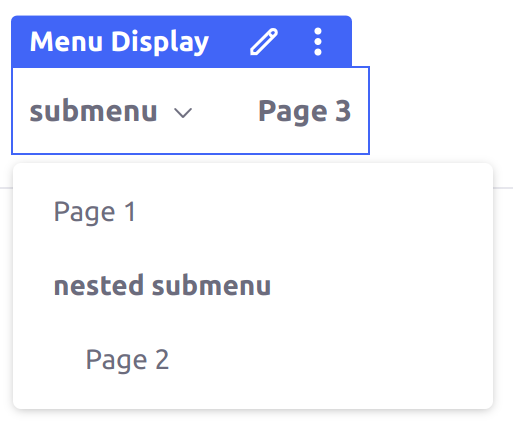
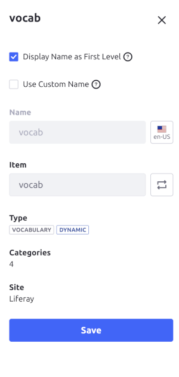
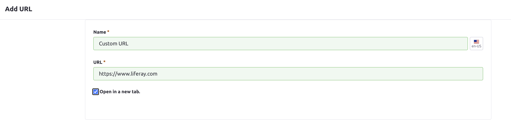

---
taxonomy-category-names:
- Sites
- Site Navigation
- Liferay Self-Hosted
- Liferay PaaS
- Liferay SaaS
uuid: 6a18b45c-ab65-4f88-ba22-8af68c3158d8
---
# Navigation Menu Element Types

Navigation Menus have a variety of element types that you can add and arrange in your desired hierarchy. These types include [specific pages](#pages), [Vocabularies](#vocabularies), Display Pages for specific content types, or custom [placeholders](#submenus) or [URLs](#urls). See [here](./using-the-navigation-menus-application.md) for more information on adding Navigation Menus with these elements.

## Pages

Specific pages are some of the most common elements used for Navigation Menus. You can add any published page from your Site's Page Sets to the menu.

## Submenus

Submenus are placeholder elements you can add to Navigation Menus to group additional menu elements under them without, needing a specific page or content for it. When used on a page, submenu elements do not have clickable links, but expand to show their child elements when users hover over them.



Using the default Application Display Template for Navigation Menus, if a submenu has no other elements organized under it, then it does not appear in the Navigation Menu for user.

## Blogs Entries

You can add a [blog entry](../../content-authoring-and-management/blogs/adding-blog-entries.md) as an independent menu element that links to the entry's [Display Page](../displaying-content/using-display-page-templates/publishing-content-with-display-pages.md). Using the default Application Display Template for Navigation Menus, if a blog entry without a Display Page is added, then it does not have a link, so it is hidden from users on the menu. This behavior can change if you use a different Application Display Template.

## Web Content Articles

You can add a [web content article](../../content-authoring-and-management/web-content/web-content-articles/creating-web-content-articles.md) as an independent menu element that links to the article's [Display Page](../displaying-content/using-display-page-templates/publishing-content-with-display-pages.md). Using the default Application Display Template for Navigation Menus, if a web content article without a Display Page is added, then it does not have a link, so it is hidden from users on the menu. This behavior can change if you use a different Application Display Template.

## Documents

You can add a [document](../../content-authoring-and-management/documents-and-media.md) as an independent menu element that links to the document's [Display Page](../displaying-content/using-display-page-templates/publishing-content-with-display-pages.md). Using the default Application Display Template for Navigation Menus, if a document without a Display Page is added, then it does not have a link, so it is hidden from users on the menu. This behavior can change if you use a different Application Display Template.

## Categories

You can add a [Category](../../content-authoring-and-management/tags-and-categories/defining-categories-and-vocabularies-for-content.md#defining-categories) as a menu element that links to the Category's [Display Page](../displaying-content/using-display-page-templates/publishing-content-with-display-pages.md). Using the default Application Display Template for Navigation Menus, if a category without a Display Page is added, then it does not have a link, so it is hidden from users on the menu. This behavior can change if you use a different Application Display Template.

From Liferay 7.4 versions U9+ and GA13+, you can select multiple Categories at once. Adding a Category together with Subcategories under it places them in the Navigation Menu in the correct hierarchy.

```{note}
If a Category added as a Navigation Menu element contains Subcategories, changes to the Subcategories do not automatically reflect in the Navigation Menu's hierarchy. If you want changes to the Subcategories to automatically update the Navigation Menu, then you can use a dynamic [Vocabulary](#vocabularies) element instead.
```

## Vocabularies

{bdg-secondary}`Liferay Portal 7.4 GA26+, DXP 7.4 U26+`

You can add entire [Vocabularies](../../content-authoring-and-management/tags-and-categories/defining-categories-and-vocabularies-for-content.md#defining-vocabularies) as menu elements. Vocabularies dynamically update so that all changes to the Categories within them and their hierarchies reflect in the Navigation Menu itself. However, this does not allow you to reorder or change the hierarchy of the contained Categories; if you want to create a different hierarchy of Categories, then [add the Categories individually outside of the Vocabulary](#categories) instead.

By default, when you add a Vocabulary as a menu element, the menu replaces that element with all of its top-level Categories when it is displayed on a page. However, when you select the Vocabulary element while editing the Navigation Menu, you can also check the *Display Name as First Level* checkbox to make the Vocabulary itself appear in the menu (as an unclickable element), with the top-level Categories under it.



Using the default Application Display Template for Navigation Menus (which can change if you use a different Application Display Template), each top-level Category in the Vocabulary must have a configured Display Page for it to appear in the Navigation Menu. Categories shown in the menu still display all Subcategories, with or without their own Display Pages. However, Subcategories without Display Pages do not have clickable links and they do not display any of their own Subcategories under them.

## URLs

You can also add a Navigation Menu element with a custom URL, that does not need to be tied to any specific content. When you add a URL element to a Navigation Menu, you must input the display name of the menu element and the URL that the element points to on click. Check the *Open in a new tab* checkbox if you want the URL to open in a separate tab in the user's browser.



## Liferay Portal 7.4 GA4 and Older

In earlier versions of Liferay Portal 7.4 than GA4, there is also a *Display Page* Navigation Menu element type, which is used for any Display Page added to the menu (for any type of content).

In Liferay 7.4 GA5+ and U1+, the Display Page type is replaced with the content types that use Display Pages: [blogs entries](#blogs-entries), [web content articles](#web-content-articles), [documents](#documents), and [Categories](#categories).

## Related Topics

* [Using the Navigation Menus Application](./using-the-navigation-menus-application.md)
* [Publishing Content with Display Pages](../displaying-content/using-display-page-templates/publishing-content-with-display-pages.md)
