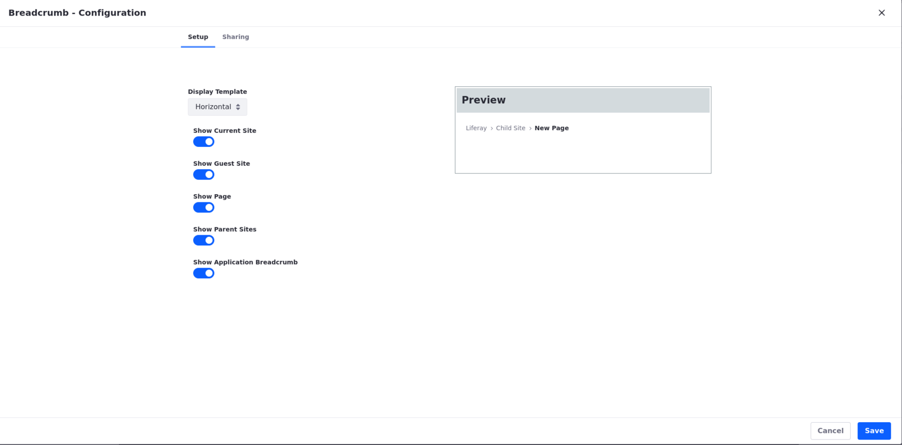

---
taxonomy-category-names:
- Sites
- Site Navigation
- Widgets
- Liferay Self-Hosted
- Liferay PaaS
- Liferay SaaS
uuid: badfa636-ff2c-49b2-9cea-2038e148b86a
---

# Using the Breadcrumb Widget 

This widget provides a way to navigate to related pages or sites through links.

1. From Fragments and Widgets, add the *Breadcrumb* widget to a page. You'll find it in the Content Management category. 

You can configure the widget via its Options button (): 

**Display Template:** Select the desired display alignment for the navigation options.

**Show Current Site:** Toggle to display the current site where this page is. 

**Show Guest Site:** Toggle to display the guest site where the current page is.

**Show Page:** Toggle to display the current page.

**Show Parent Sites:** Toggle to display the current site's parent sites.

**Show Application Breadcrumb:** Toggle to show the Application Breadcrumb.

## Related Topics

* [Using Widgets](../../site-building/creating-pages/page-fragments-and-widgets/using-widgets.md)
